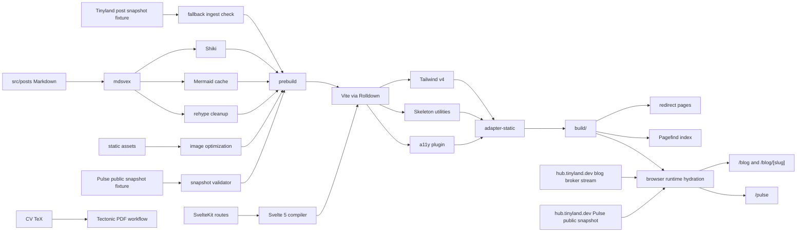
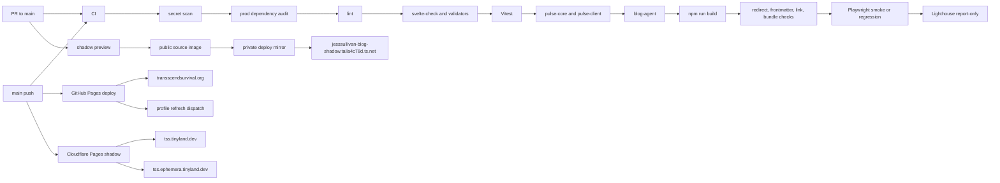
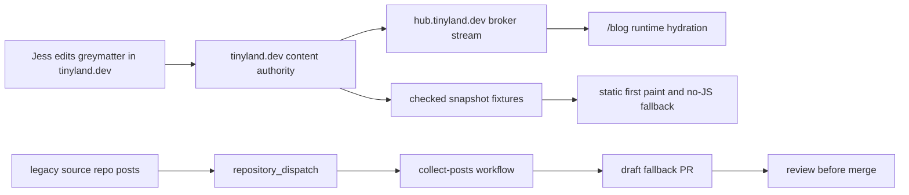
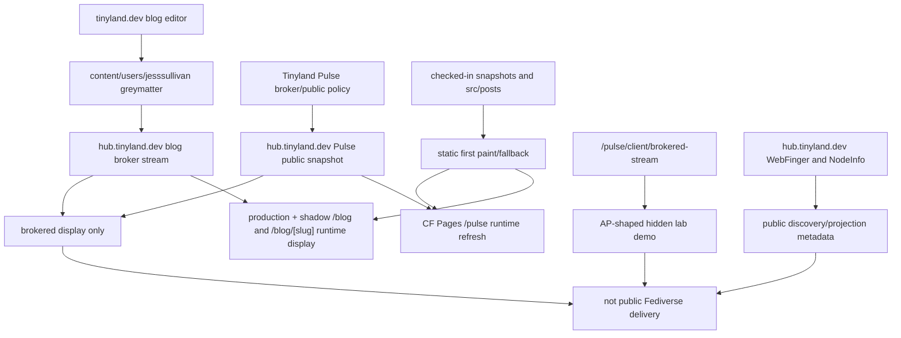
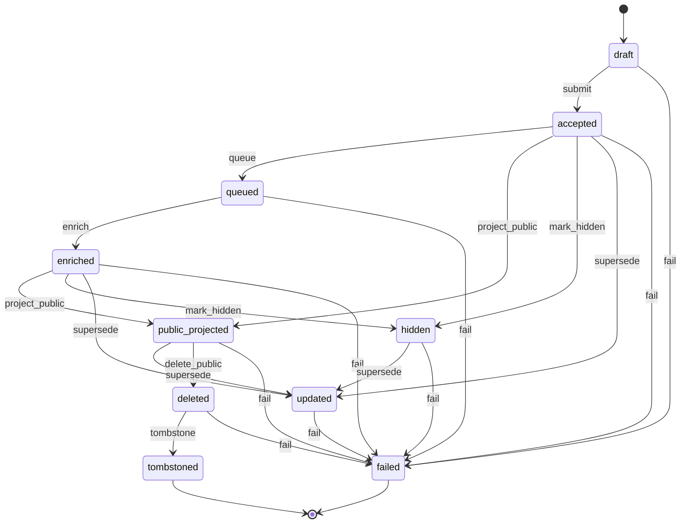

Hi! This is just my boring personal static blog ^w^ 

 

| Surface | Route |
| --- | --- |
| Production | `https://transscendsurvival.org` (Cloudflare Pages via proxied apex CNAME) |
| GitHub Pages rollback | `https://jesssullivan.github.io` / `static/CNAME` |
| Cloudflare Pages shadow | `https://tss.tinyland.dev` (development shadow) |
| Alternate Cloudflare shadow | `https://tss.ephemera.tinyland.dev` |
| Tailnet-only shadow | `https://jesssullivan-blog-shadow.taila4c78d.ts.net` |
| Tailnet vanity target | `https://jesssullivan-blog-shadow.tailnet.tinyland.dev` |

## Build Chain

The build produces a static SvelteKit artifact. Tinyland snapshots and local
Markdown remain first-paint, no-JS, and regression fixtures; canonical blog and
Pulse display hydrates in the browser from the public Tinyland broker when it is
available. `transscendsurvival.org` is the production consumer today and is served
by Cloudflare Pages through the proxied apex CNAME. GitHub Pages stays available
as the rollback publisher.

## Icon Kit

Browser icons are generated from `https://github.com/Jesssullivan.png` by
`npm run icons:generate`. The script pins the fetched source at
`static/icons/favicon-source.jpg`, writes the favicon/Apple/Android/maskable
PNG set, emits the multi-size `favicon.ico`, and keeps the web app manifest,
Safari mask, and Microsoft tile config in `static/`.

## Checks And Deploys

## GloriousFlywheel Bazel Substrate Surface

This repo still uses the npm/SvelteKit workflow for normal local development and deployment. CI also carries a blocking GloriousFlywheel Bazel lane on the `tinyland-dind` ARC runner so check, test, and Chromium e2e coverage are not proven only by local `npm`/`npx` commands.

- `npm run remote:check`, `npm run remote:test`, and `npm run remote:e2e` route through `scripts/bazel-cache-backed.sh`, which refuses to run without a valid `BAZEL_REMOTE_CACHE` and the expected GloriousFlywheel substrate mode.
- Local developer shells attach through the endpoint-free GloriousFlywheel front-door kit (`justfile.flywheel` plus `.bazelrc.flywheel`). The managed Nix/Home Manager profile is the preferred source of `BAZEL_REMOTE_CACHE` and auth metadata; a gitignored `.env.flywheel.local` generated by `just flywheel-enroll ...` is only the fallback fixture, and is sourced by both `.envrc` and `scripts/bazel-cache-backed.sh`.
- GitHub CI runs the Bazel lane on `tinyland-dind` as the `shared-cache-backed` consumer recorded in the GloriousFlywheel registry. Pull requests mint cache-read tokens and disable result uploads; trusted `main` pushes mint cache-write tokens. Generic-runner executor hints are cleared so the workflow cannot silently claim executor-backed behavior.
- Shared-cache CI bounds local Bazel parallelism to four jobs. This protects the ARC pod from cold-graph process storms without changing the independently managed capacity of explicit executor-backed proofs.
- The lane restores one v33 Tectonic resource cache, warms the three public CV targets serially, and explicitly makes that cache writable inside local Bazel sandboxes. This avoids concurrent bundle fetches; the runner-local path is rejected in executor-backed mode.
- Executor-backed mode remains available in the wrapper only as a separate opt-in contract. It requires a reviewed GloriousFlywheel registry promotion plus an explicit executor endpoint; this repository's normal CI does not use it.
- `gf-reapi-cell` endpoints also require scoped Bazel credential-helper auth. `scripts/bazel-cache-backed.sh` attaches `scripts/gf-reapi-bazel-credential-helper.mjs` only for the GF REAPI host, and the helper reads a short-lived JWT from `GF_REAPI_CREDENTIAL_HELPER_TOKEN_FILE`, `GF_REAPI_CREDENTIAL_HELPER_TOKEN`, or the projected-token file at `/var/run/secrets/tokens/gf-reapi-cell-token`.
- The token exchange supplies the repository-scoped `BAZEL_REMOTE_INSTANCE_NAME`. Literal shell placeholders are rejected before Bazel starts.
- `//:sveltekit_check` runs the SvelteKit check path under Bazel.
- `//static/cv:pdfs_synced_test` byte-compares the checked-in resume/CV PDFs against the Bazel-built `spear_resumes` outputs; `.bazelrc` pins `SOURCE_DATE_EPOCH` and `TZ` so Tectonic output stays reproducible across local sync, shared-cache CI, and explicit executor proofs.
- `//:vitest_unit_tests` wraps the root and Pulse Vitest suites through `vitest.bazel.config.ts`.
- `//:blog_agent_node_tests` wraps the blog-agent `node:test` suite through `tsx --test`.
- `//:sveltekit_vite_build_smoke` runs a copied-workdir SvelteKit/Vite production build smoke. It proves the build target class, not the full npm prebuild/postbuild publication chain.
- `//:playwright_chromium_e2e` runs the Chromium Playwright e2e suite through Bazel. Shared-cache CI provisions the package-lock-pinned Playwright browser before Bazel starts and passes its absolute executable path into the local test action.
- `//:playwright_chromium_smoke` remains a narrow diagnostic target for browser runtime authority, not the remote e2e gate.
- `//:puppeteer_chromium_smoke` launches Puppeteer against the same pinned Chromium runtime path. It proves Puppeteer and Playwright consume one explicit browser authority rather than relying on an undeclared host path.
- `package-lock.json` remains the npm dependency authority for the app. `pnpm-workspace.yaml` makes the package importers explicit for Bazel, and `pnpm-lock.yaml` is the generated `rules_js` lock consumed by Bazel.
- Bazel npm lifecycle hooks skip Playwright and Puppeteer browser downloads. Shared-cache CI provisions the lockfile-pinned Playwright browser outside Bazel actions; browser-backed RBE continues to use the pinned worker Chromium path and never downloads a browser inside proof actions.
- GloriousFlywheel proof runs use the external GF REAPI proof harness or the repository `remote:*` scripts against this public repo checkout; remote cache hits, hosted runners, and shared-cache-only execution do not count as RBE.

Current boundary: this gates Bazel check/test/Chromium-e2e and CV PDF sync drift with GloriousFlywheel shared-cache attachment. It does not claim remote action execution. Deployment still publishes the SvelteKit static artifact through the existing Pages workflows.

## Production DNS And Health

`transscendsurvival.org` is served by Cloudflare Pages at the apex and `www`,
with Cloudflare as the registrar, DNS authority, and DNSSEC signer as of
2026-06-23 (the registration moved off DreamHost). The declared Cloudflare zone
keeps both the apex and `www` as proxied CNAMEs to
`transscendsurvival-org.pages.dev`; `www` serves the blog with a canonical link
to the apex. DNSSEC is active — Cloudflare Registrar publishes the parent DS.

`npm run test:production-health` checks delegated authoritative DNS, major public
resolvers, direct HTTPS against resolved IPv4 targets, apex/`www` HTTPS responses
and redirects, live responses for the homepage plus slashless and trailing-slash
blog routes, the Tinyland blog broker contract, and browser hydration on `/blog`.
At the authoritative layer, apex and `www` must both expand to public A/AAAA
answers (Cloudflare anycast) for visitors. The Cloudflare DNS drift workflow
separately asserts the exact apex and `www` CNAME targets and proxy posture.
The static build keeps slashless canonical URLs but emits directory-index aliases
so copied, normalized, or legacy trailing-slash links do not 404. The
`Production Health` workflow runs every 30 minutes and also verifies the latest
`github-pages` deployment SHA matches `main`. When `NTFY_TOPIC_URL` and optional
`NTFY_TOKEN` repository secrets are configured, it mirrors production-health and
stale-deploy failures to the same ntfy topic used by the DNS guard Worker before
failing the job. To prove alert delivery without breaking the site, manually run
`Production Health` with `send_ntfy_smoke=true`; that sends a harmless ntfy smoke
notification and then runs the normal health checks.

This monitoring catches missing A/AAAA records, split-brain authority during
DNS changes, stale Cloudflare proxy targets that fail TLS, broken redirects, and
blog hydration regressions. The DNS drift workflow catches record-level drift
against `infra/cloudflare/zone.json`.

If production-health is red while apex routes and broker hydration pass, do not
weaken the checks. Reconcile live DNS/serving against
[docs/runbooks/dns-cutover-and-rollback.md](docs/runbooks/dns-cutover-and-rollback.md)
or change the desired posture in review first.

Bot-generated stats commits do not naturally trigger recursive GitHub Actions
deploys, so `content-stats.yml` explicitly dispatches `deploy-pages.yml` after
it pushes refreshed generated artifacts.

## Content Authority And Fallback Automation

Cross-repo collection is legacy/static intake for fallback content. It is not the
primary authoring path for Tinyland-managed posts.

## Brokered Display And Federation Boundary

## Pulse Lifecycle

