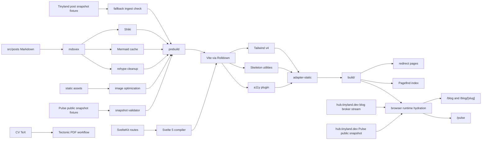
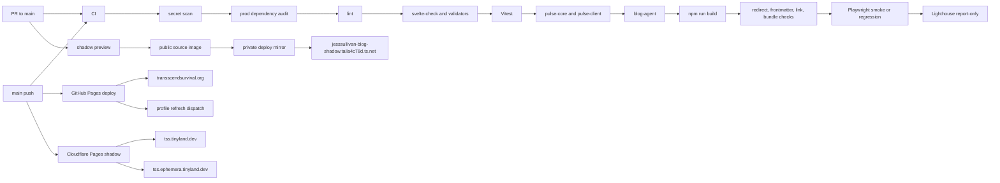
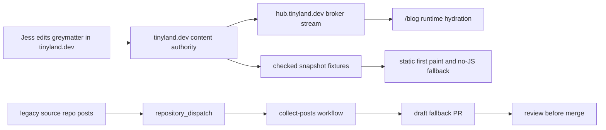
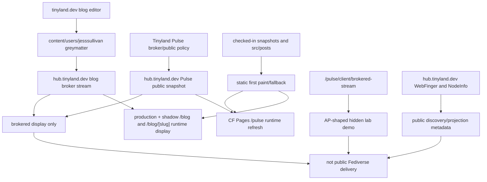
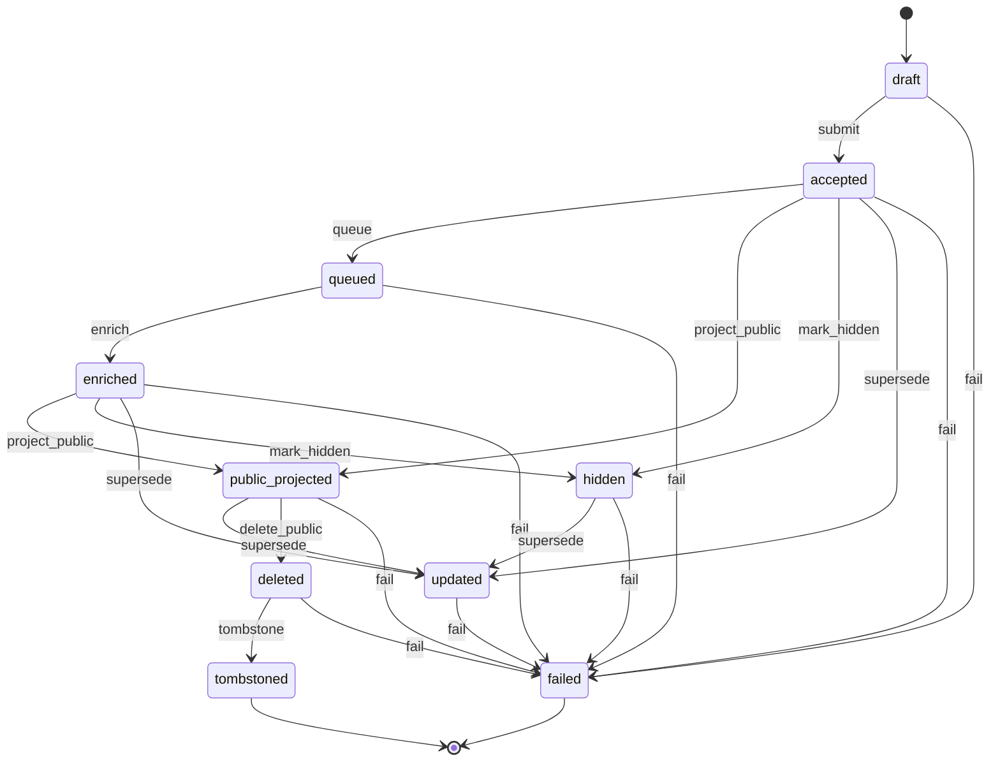

Hi! This is just my boring personal static blog ^w^ 

| Surface | Route |
| --- | --- |
| Production | `https://transscendsurvival.org` (current production, GitHub Pages) |
| Cloudflare Pages shadow | `https://tss.tinyland.dev` (development shadow) |
| Alternate Cloudflare shadow | `https://tss.ephemera.tinyland.dev` |
| Tailnet-only shadow | `https://jesssullivan-blog-shadow.taila4c78d.ts.net` |
| Tailnet vanity target | `https://jesssullivan-blog-shadow.tailnet.tinyland.dev` |

## Build Chain

The build produces a static SvelteKit artifact. Tinyland snapshots and local
Markdown remain first-paint, no-JS, and regression fixtures; canonical blog and
Pulse display hydrates in the browser from the public Tinyland broker when it is
available. `transscendsurvival.org` is the production consumer today even while
it is still served by GitHub Pages; `tss.tinyland.dev` is the Cloudflare Pages
development shadow until the production cutover is explicitly proven.

## Checks And Deploys

## GloriousFlywheel Bazel/RBE Pilot Surface

This repo still uses the npm/SvelteKit workflow for normal local development and deployment. The Bazel files are a narrow GloriousFlywheel consumer proof surface, not a wholesale migration of the blog build.

- `//:types_unit_tests` wraps Vitest through `vitest.bazel.config.ts` and runs the existing `src/lib/types.test.ts` slice.
- `//:sveltekit_vite_build_smoke` runs a copied-workdir SvelteKit/Vite production build smoke. It proves the build target class, not the full npm prebuild/postbuild publication chain.
- `//:playwright_chromium_smoke` launches Playwright against the pinned GloriousFlywheel Chromium runtime path. It is a browser-runtime smoke target, not the full hosted Playwright regression suite.
- `//:puppeteer_chromium_smoke` launches Puppeteer against the same pinned Chromium runtime path. It proves Puppeteer can consume browser runtime authority without lifecycle downloads.
- `package-lock.json` remains the npm dependency authority for the app. `pnpm-lock.yaml` is the generated `rules_js` lock consumed by Bazel.
- Bazel npm lifecycle hooks skip Playwright and Puppeteer browser downloads. Browser-backed RBE must use the pinned worker Chromium path rather than downloading browsers during proof actions.
- GloriousFlywheel proof runs should use the external GF REAPI proof harness against this public repo checkout.

Current boundary: this proves narrow public SvelteKit/Vite/Vitest, SvelteKit/Vite build-smoke, Playwright/Chromium, and Puppeteer/Chromium target classes for remote execution evidence. It does not prove default repo-wide RBE, the full hosted Playwright suite, the full npm prebuild/postbuild publication chain, or deployment.

## Content Authority And Fallback Automation

Cross-repo collection is legacy/static intake for fallback content. It is not the
primary authoring path for Tinyland-managed posts.

## Brokered Display And Federation Boundary

## Pulse Lifecycle

