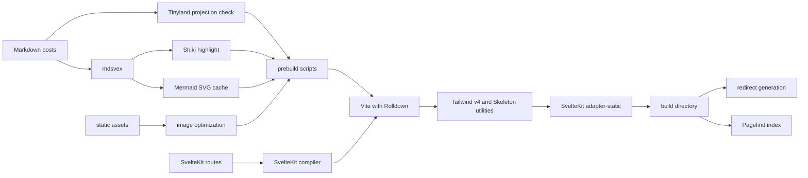
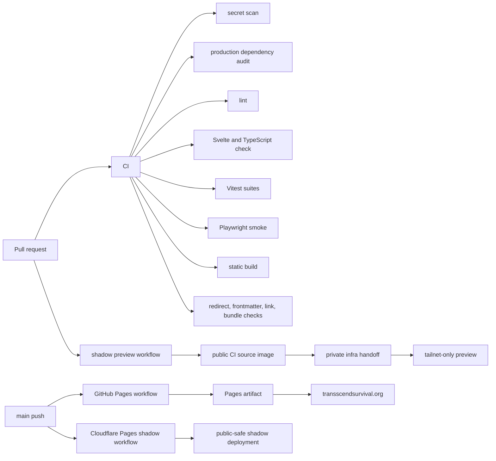
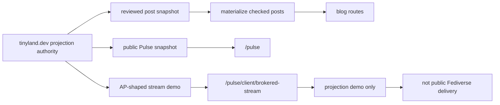

Hi!  This is my blog.  This is a WIP static rewrite / redux of my formerly fairly active wordpress based site.  

## Build Chain

```mermaid
flowchart LR
    Posts["Markdown posts"] --> Ingest["Tinyland projection check"]
    Routes["SvelteKit routes"] --> Kit["SvelteKit compiler"]
    Posts --> Mdsvex["mdsvex"]
    Mdsvex --> Shiki["Shiki highlight"]
    Mdsvex --> Mermaid["Mermaid SVG cache"]
    Static["static assets"] --> Images["image optimization"]
    Ingest --> Prebuild["prebuild scripts"]
    Shiki --> Prebuild
    Mermaid --> Prebuild
    Images --> Prebuild
    Prebuild --> Vite["Vite with Rolldown"]
    Kit --> Vite
    Vite --> Tailwind["Tailwind v4 and Skeleton utilities"]
    Tailwind --> Adapter["SvelteKit adapter-static"]
    Adapter --> Build["build directory"]
    Build --> Redirects["redirect generation"]
    Build --> Pagefind["Pagefind index"]
```

## Checks And Deploys

```mermaid
flowchart LR
    PR["Pull request"] --> CI["CI"]
    CI --> Secrets["secret scan"]
    CI --> StaticAudit["production dependency audit"]
    CI --> Lint["lint"]
    CI --> Typecheck["Svelte and TypeScript check"]
    CI --> Unit["Vitest suites"]
    CI --> E2E["Playwright smoke"]
    CI --> Build["static build"]
    CI --> Audits["redirect, frontmatter, link, bundle checks"]

    Main["main push"] --> Pages["GitHub Pages workflow"]
    Pages --> Artifact["Pages artifact"]
    Artifact --> Production["transscendsurvival.org"]

    PR --> ShadowPreview["shadow preview workflow"]
    ShadowPreview --> SourceImage["public CI source image"]
    SourceImage --> PrivateHandoff["private infra handoff"]
    PrivateHandoff --> TailnetPreview["tailnet-only preview"]

    Main --> CloudflareShadow["Cloudflare Pages shadow workflow"]
    CloudflareShadow --> ShadowDeploy["public-safe shadow deployment"]
```

## Projection Boundary

```mermaid
flowchart LR
    Tinyland["tinyland.dev projection authority"] --> PostSnapshot["reviewed post snapshot"]
    Tinyland --> PulseSnapshot["public Pulse snapshot"]
    Tinyland --> StreamDemo["AP-shaped stream demo"]

    PostSnapshot --> IngestPosts["materialize checked posts"]
    IngestPosts --> Blog["blog routes"]

    PulseSnapshot --> PulseRoute["/pulse"]
    StreamDemo --> HiddenLab["/pulse/client/brokered-stream"]

    HiddenLab --> Boundary["projection demo only"]
    Boundary --> NotFederation["not public Fediverse delivery"]
```
