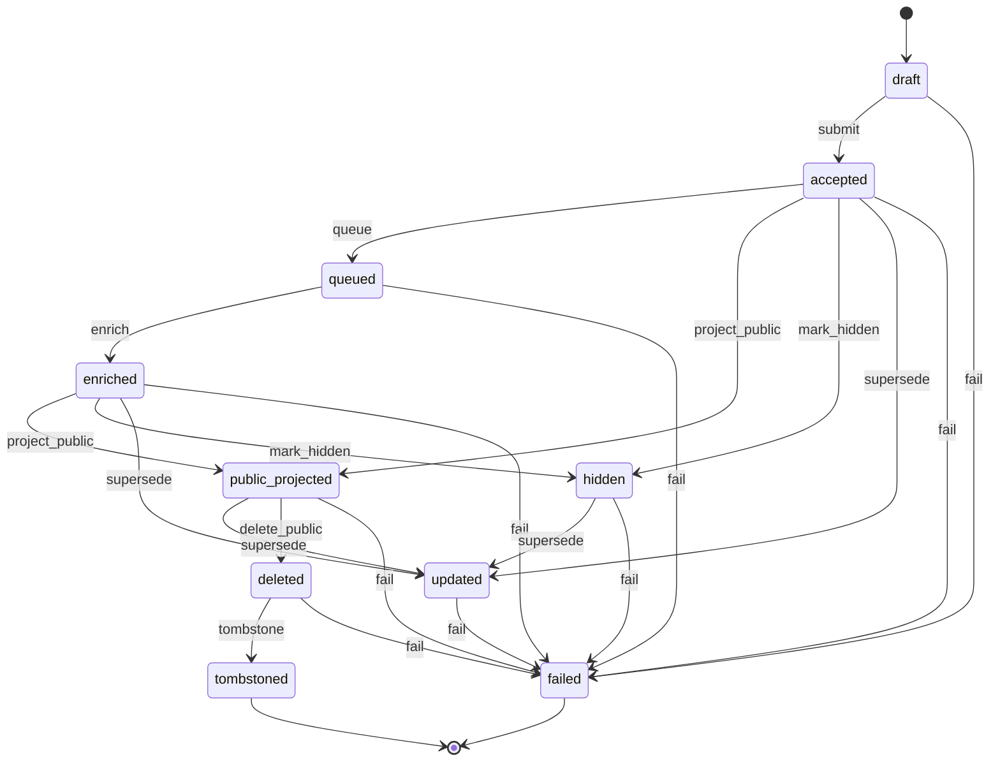
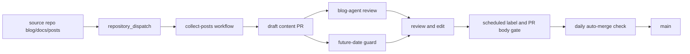
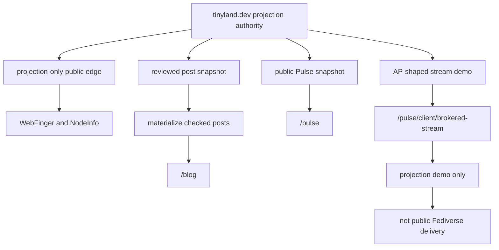
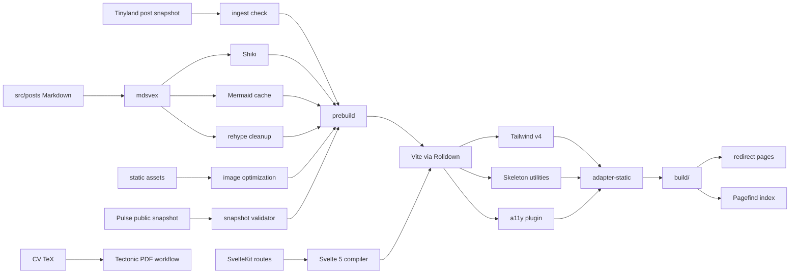
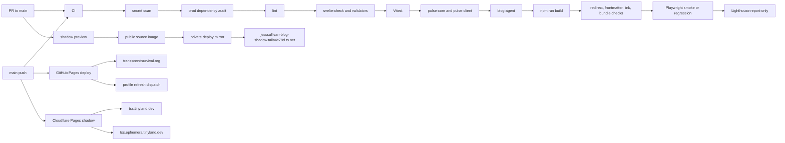

Hi! This is just my personal static github pages blog ^w^ 

| Surface | Route |
| --- | --- |
| Production | `https://transscendsurvival.org` |
| Cloudflare Pages shadow | `https://tss.tinyland.dev` |
| Alternate Cloudflare shadow | `https://tss.ephemera.tinyland.dev` |
| Tailnet-only shadow | `https://jesssullivan-blog-shadow.taila4c78d.ts.net` |
| Tailnet vanity target | `https://jesssullivan-blog-shadow.tailnet.tinyland.dev` |

## Pulse Lifecycle

## Content Automation

## AP Federation Approach

## Build Chain

## Checks And Deploys

