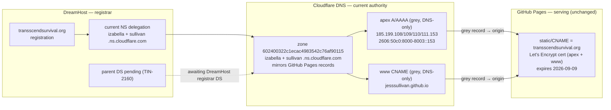
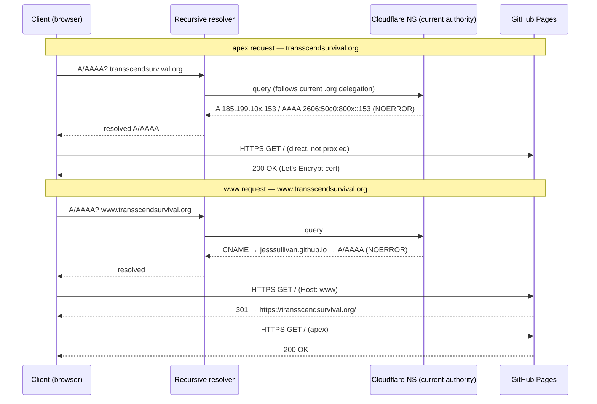
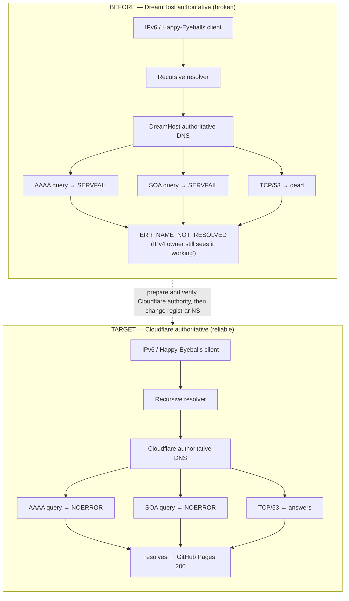
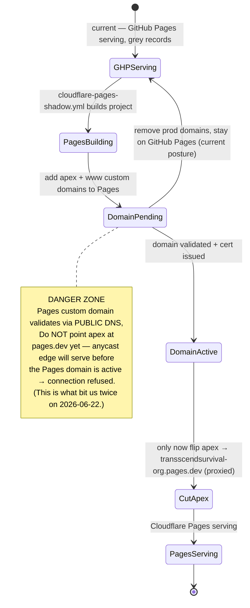

# DNS Architecture — transscendsurvival.org

Current DNS state as of 2026-06-23. The domain (double-s
"tranSScend" — this is the correct spelling, not a typo) is registered at
DreamHost, delegated to Cloudflare nameservers at the `.org` parent, and served
by GitHub Pages. Cloudflare Pages exists as a shadow build only; production apex
and `www` are not attached to the Pages project.

## Current State

| Plane | State |
| --- | --- |
| Registrar | DreamHost. Current parent NS = `izabella.ns.cloudflare.com` + `sullivan.ns.cloudflare.com`. The DreamHost API cannot change NS or DS and exposes only `dns-add_record` / `dns-list_records` / `dns-remove_record`; NS and DS changes are manual in the DreamHost registrar panel. |
| Current DNS authority | Cloudflare zone `602400322c1ecac4983542c76af90115`, nameservers `izabella.ns.cloudflare.com` + `sullivan.ns.cloudflare.com`. This is the public authority. |
| Records | apex `A` = `185.199.108.153` / `.109.153` / `.110.153` / `.111.153`; apex `AAAA` = `2606:50c0:8000::153` / `8001::153` / `8002::153` / `8003::153`; `www` = `CNAME` → `jesssullivan.github.io`. All records are DNS-only (NOT proxied). |
| Serving | GitHub Pages, unchanged. `static/CNAME` = `transscendsurvival.org`. |
| Cloudflare Pages | Shadow only: `tss.tinyland.dev` / `tss.ephemera.tinyland.dev`. Production apex and `www` custom domains were removed from the Pages project after the failed cutover attempts. |
| DNSSEC | Cloudflare zone signing is enabled but parent DS is still pending at DreamHost (TIN-2160). Until the DS is visible at the `.org` parent, production is unsigned from the public chain's point of view. |
| Cert | GitHub Pages-managed Let's Encrypt cert for BOTH apex + `www`. |

The GitHub Pages canonical split is load-bearing: **apex = `A`/`AAAA`, `www` =
`CNAME`**. Modeling `www` as `A`/`AAAA` records breaks the `www` TLS cert
presentation (handshake failure); `www` MUST stay a `CNAME`.

## 1. Topology

DreamHost holds the registration and delegates the zone to Cloudflare
nameservers. Cloudflare answers with DNS-only records that point straight at
GitHub Pages. The Cloudflare proxy edge is intentionally NOT in the request path
for production.

## 2. Request Flow

A client resolves the name through a recursive resolver, which follows the
current `.org` parent delegation to Cloudflare and gets `A`/`AAAA` from the
Cloudflare zone. The client then connects directly to GitHub Pages. The apex
serves `200`; `www` redirects `301` to the apex.

## 3. RCA — Before / After

The 2026-06-22 P0: DreamHost's authoritative DNS platform intermittently
SERVFAILed apex `AAAA` + `SOA` and had dead `TCP/53` — platform-wide, to the point
that `dreamhost.com` itself SERVFAILed `AAAA`. IPv6 / Happy-Eyeballs visitors got
`ERR_NAME_NOT_RESOLVED` while the IPv4 owner saw the site working. This was not
code, not GitHub Pages transport — it was the DNS authority. The durable service
fix was the registrar NS cutover to Cloudflare authority. Production
health checks now prove the delegated Cloudflare authority, public resolver
answers, direct GitHub Pages serving, slash parity, and broker hydration.

The root cause lived purely in the DNS-authority plane: GitHub Pages transport and
the application code were never implicated. Cloudflare authority removes the
failing DreamHost DNS platform from the target resolution path.

## 4. Cloudflare Pages Shadow And Future Serving Cut

A separate Cloudflare Pages project, `transscendsurvival-org`, builds via
`.github/workflows/cloudflare-pages-shadow.yml`. It is intentionally shadow-only:
`tss.tinyland.dev` and `tss.ephemera.tinyland.dev` are allowed, but production
apex + `www` are not attached to the Pages project.

The hard rule: **NEVER flip apex to the proxied `transscendsurvival-org.pages.dev`
CNAME unless the Pages custom domain is active and the operator has explicitly
chosen a new serving cutover.** Flipping apex while the Pages domain was pending
caused TWO transient outages on 2026-06-22: Cloudflare's anycast edge served
requests before the Pages domain was active, returning connection refused /
timeout. A safe future cut must pre-validate the Pages custom domain to active
(cert issued) BEFORE pointing apex DNS at `pages.dev`.

State machine for a *safe* cut:

The same precondition as a sequence — validate first, cut second:

```mermaid
sequenceDiagram
    participant Op as Operator
    participant CFP as Cloudflare Pages
    participant DNS as Cloudflare DNS (authoritative)
    participant Edge as Cloudflare anycast edge
    participant C as Client

    Op->>CFP: add apex + www custom domains
    CFP->>DNS: validate via PUBLIC DNS (lags NS flip)

    rect rgb(60, 20, 20)
        Note over Op,C: WRONG ORDER — the 2026-06-22 double outage
        Op-->>DNS: flip apex → pages.dev (proxied) while domain PENDING
        C->>Edge: HTTPS GET /
        Edge-->>C: connection refused / timeout (Pages domain not active yet)
    end

    rect rgb(20, 40, 20)
        Note over Op,C: CORRECT ORDER — pre-validate, then cut
        CFP-->>Op: custom domain ACTIVE (cert issued)
        Op->>DNS: only now flip apex → pages.dev (proxied)
        C->>Edge: HTTPS GET /
        Edge-->>C: 200 OK (Pages serving)
    end
```

## Monitoring

Monitoring is host-agnostic and already shipped. It lives in
`scripts/check-production-health.mts`,
`.github/workflows/production-health.yml`, and the `workers/dns-guard/` Worker.
It asserts non-empty resolution plus `AAAA`/`SOA`/`TCP` across the current
delegated Cloudflare nameservers and public resolvers, with no hardcoded
public-resolver IP expectations. It also checks direct GitHub Pages serving,
canonical redirects, slash parity, and public blog hydration.
