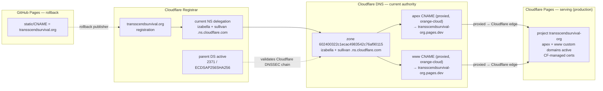
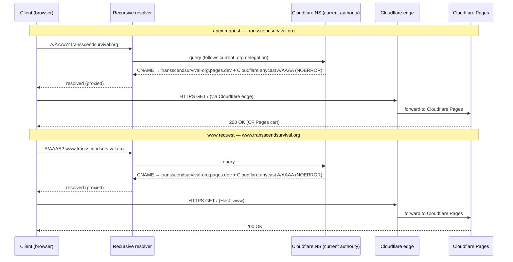
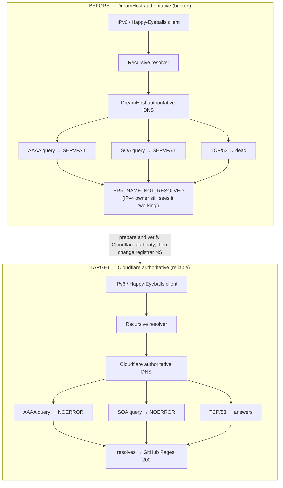
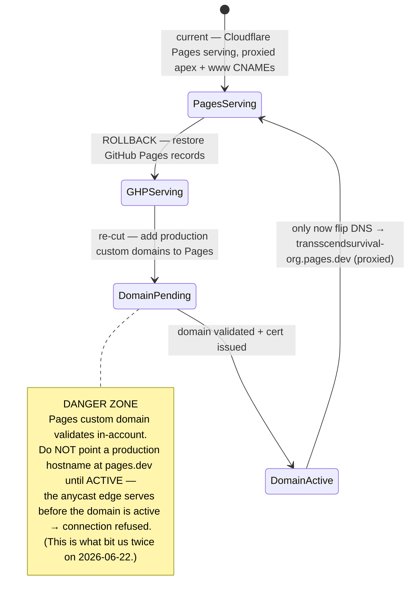

# DNS Architecture — transscendsurvival.org

Current DNS state as of 2026-06-23. The domain (double-s
"tranSScend" — this is the correct spelling, not a typo) is registered at
Cloudflare Registrar, delegated to Cloudflare nameservers at the `.org` parent,
and served by Cloudflare Pages at the apex and `www`. GitHub Pages remains the
rollback publisher.

## Current State

| Plane | State |
| --- | --- |
| Registrar | Cloudflare Registrar. Current parent NS = `izabella.ns.cloudflare.com` + `sullivan.ns.cloudflare.com`. |
| Current DNS authority | Cloudflare zone `602400322c1ecac4983542c76af90115`, nameservers `izabella.ns.cloudflare.com` + `sullivan.ns.cloudflare.com`. This is the public authority. |
| Records | apex `CNAME` → `transscendsurvival-org.pages.dev` (proxied / orange-cloud); `www` `CNAME` → `transscendsurvival-org.pages.dev` (proxied / orange-cloud). |
| Serving | Cloudflare Pages at the apex and `www`. GitHub Pages remains the rollback publisher; `static/CNAME` = `transscendsurvival.org` stays in place for fallback. |
| Cloudflare Pages | Production: the `transscendsurvival.org` and `www.transscendsurvival.org` custom domains on project `transscendsurvival-org` are ACTIVE + serving. Shadow: `tss.tinyland.dev` is served by the dedicated Pages project `tss-shadow` (custom domain moved off `transscendsurvival-org` 2026-07-07 — Pages custom domains always serve a project's *production* deployment, so the shadow build is `tss-shadow`'s production); `tss.ephemera.tinyland.dev` remains on `transscendsurvival-org`. |
| DNSSEC | Active. Cloudflare Registrar publishes the parent DS; Cloudflare signs the zone. |
| Cert | Cloudflare Pages-managed certs for apex and `www`. GitHub Pages-managed cert remains relevant only for rollback. |

The canonical split is now simple: **apex and `www` are proxied CNAMEs to
Cloudflare Pages**. Modeling `www` as raw `A`/`AAAA` records is still wrong; it
must remain a CNAME so Cloudflare Pages owns the TLS and hostname mapping.

## 1. Topology

Cloudflare Registrar holds the registration, and the parent delegates the zone to
Cloudflare nameservers. Cloudflare answers with both apex and `www` as proxied
`CNAME` records to Cloudflare Pages, so the Cloudflare proxy edge is in the
request path for both production hostnames.

## 2. Request Flow

A client resolves the name through a recursive resolver, which follows the
current `.org` parent delegation to Cloudflare. For both apex and `www`,
Cloudflare returns a proxied `CNAME` to `transscendsurvival-org.pages.dev` and
answers with its own anycast addresses; the client connects through the
Cloudflare edge to Cloudflare Pages.

## 3. RCA — Before / After

The 2026-06-22 P0: DreamHost's authoritative DNS platform intermittently
SERVFAILed apex `AAAA` + `SOA` and had dead `TCP/53` — platform-wide, to the point
that `dreamhost.com` itself SERVFAILed `AAAA`. IPv6 / Happy-Eyeballs visitors got
`ERR_NAME_NOT_RESOLVED` while the IPv4 owner saw the site working. This was not
code, not GitHub Pages transport — it was the DNS authority. The durable service
fix was the registrar NS cutover to Cloudflare authority. Production
health checks now prove the delegated Cloudflare authority, public resolver
answers, apex and `www` serving, slash parity, and broker hydration.

The root cause lived purely in the DNS-authority plane: GitHub Pages transport and
the application code were never implicated. Cloudflare authority removes the
failing DreamHost DNS platform from the target resolution path.

## 4. Cloudflare Pages Serving (cut 2026-06-23) And Safe-Cut Procedure

The Cloudflare Pages project `transscendsurvival-org` serves the production apex
and `www` as of 2026-06-23. It builds via
`.github/workflows/cloudflare-pages-shadow.yml`; the shadow domain
`tss.ephemera.tinyland.dev` continues to build there. `tss.tinyland.dev` moved to
the dedicated `tss-shadow` Pages project on 2026-07-07 and goes stale on
shadow-branch pushes until redeployed (`wrangler pages deploy build
--project-name=tss-shadow --branch=main` with the lab admin CF token).

The cut followed the safe order below, which stays load-bearing for any future
rollback-and-recut. The hard rule: **NEVER flip a production hostname to the
proxied `transscendsurvival-org.pages.dev` CNAME unless the matching Pages custom
domain is active.** Flipping apex while the Pages domain was pending caused TWO
transient outages on 2026-06-22: Cloudflare's anycast edge served requests before
the Pages domain was active, returning connection refused / timeout. The
2026-06-23 cut pre-validated Pages custom domains before pointing production DNS
at `pages.dev`, so no outage occurred.

State machine (current = Pages serving; GitHub Pages is the rollback target):

The same precondition as a sequence — validate first, cut second:

## Monitoring

Monitoring is host-agnostic and already shipped. It lives in
`scripts/check-production-health.mts`,
`.github/workflows/production-health.yml`, and the `workers/dns-guard/` Worker.
It asserts non-empty resolution plus `AAAA`/`SOA`/`TCP` across the current
delegated Cloudflare nameservers and public resolvers, with no hardcoded
public-resolver IP expectations. It also checks apex and `www` serving
(Cloudflare Pages), HTTP-to-HTTPS redirects, slash parity, and public blog
hydration.
