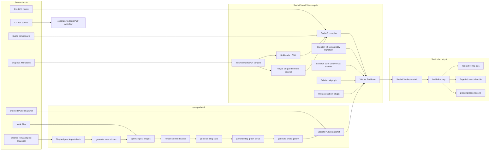
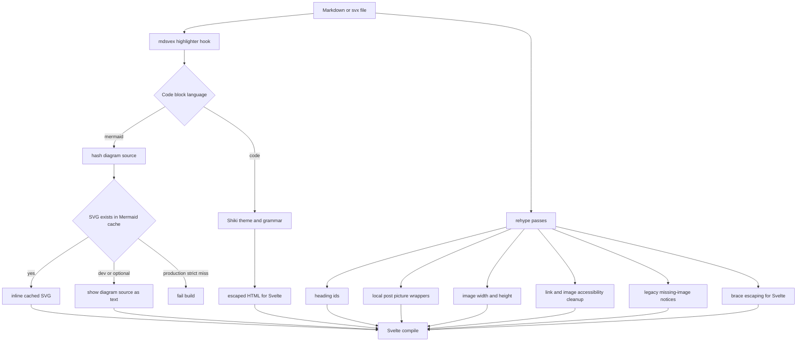
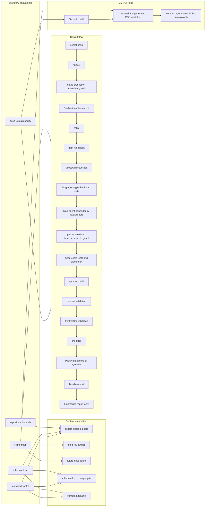
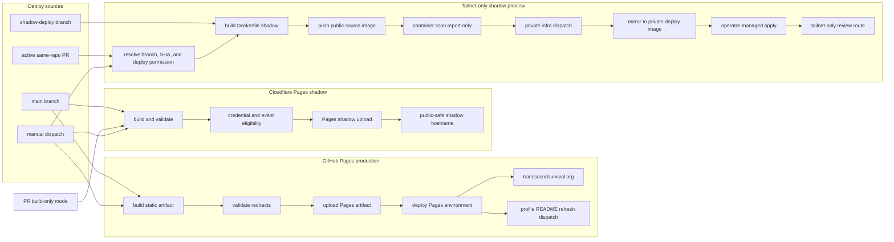
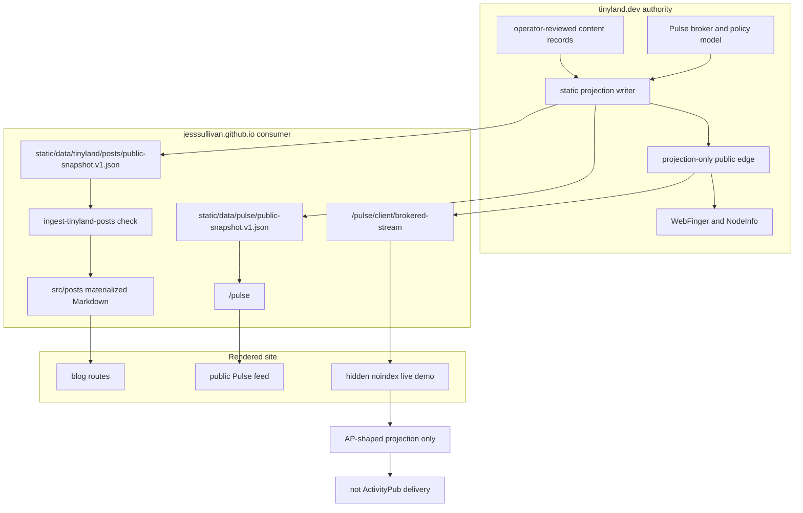
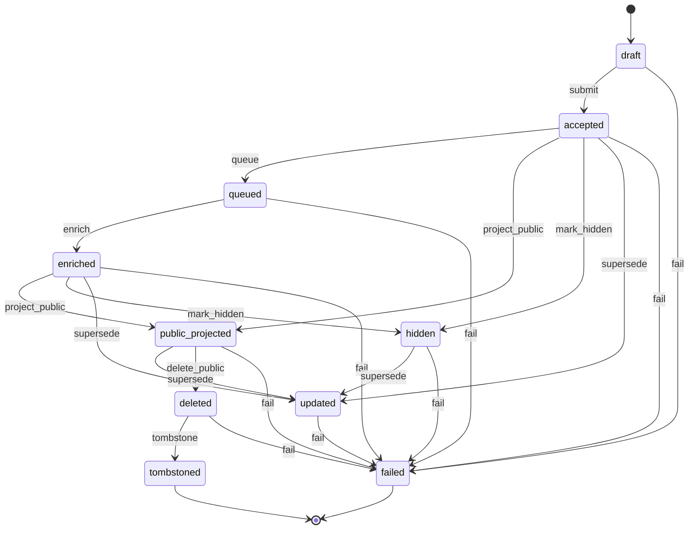
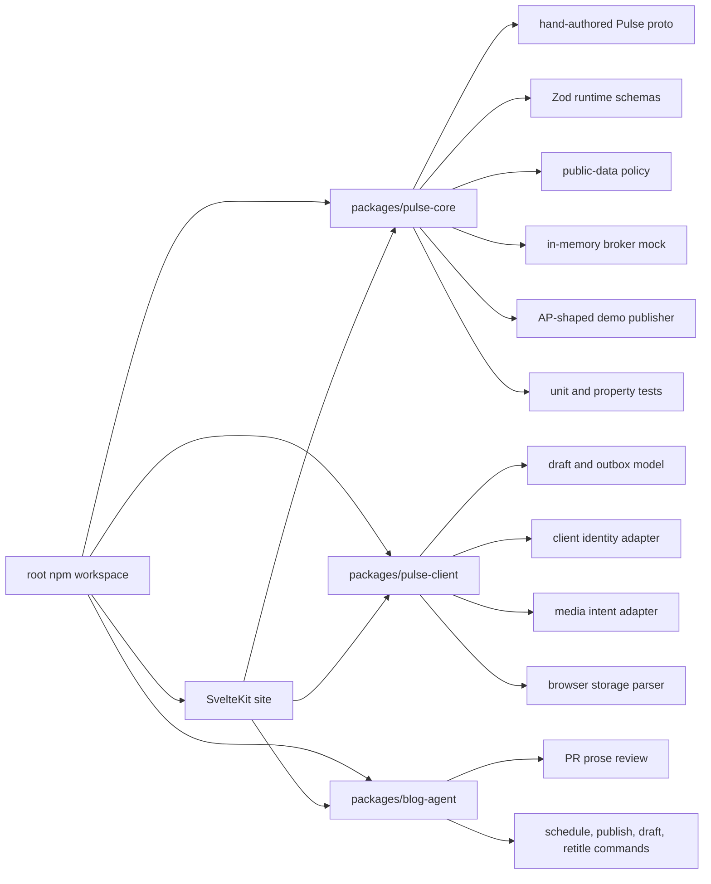

# Site Pipeline Architecture

This is the public-safe map of the repo. It keeps the real public domains and repo concepts, but it deliberately generalizes private runner labels, tailnet hostnames, account identifiers, backend buckets, deployment hashes, and credential names.

## Source To Static Output

## Compiler Details

## CI And Test Pipeline

## Deployment And Preview Targets

## Tinyland Static Spoke And Pulse Boundary

## Pulse Lifecycle

## Package And Workspace Shape

## Public-Safety Notes

- Public repo docs should name public domains and public GitHub workflow concepts.
- Public repo docs should not include private tailnet hostnames, private backend endpoints, cloud account identifiers, credential values, full deployment hashes, or local absolute paths.
- Secret and variable names are generalized here as credential gates unless they are necessary to understand a public workflow behavior.
- The live Pulse/AP demo is described as AP-shaped projection only. It is not described as real Fediverse delivery.
