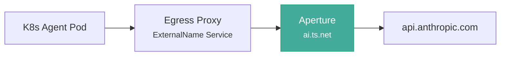
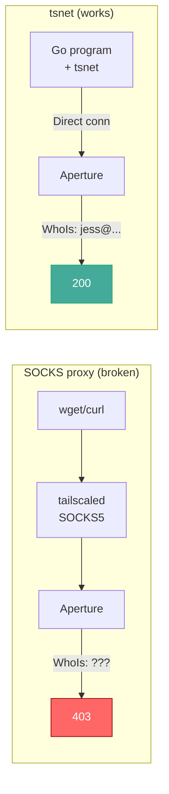
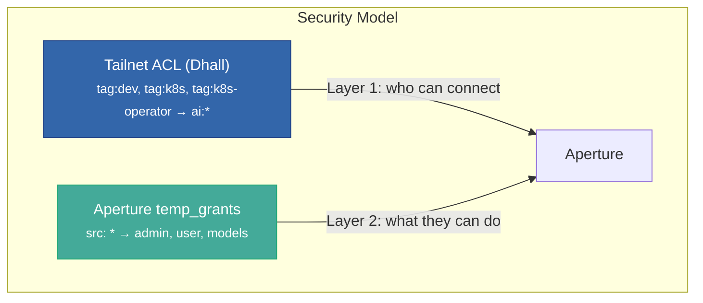

I was setting up [Tailscale Aperture](https://tailscale.com/aperture) to route my K8s agents' LLM calls to Anthropic -- identity-aware metering, dashboards, centralized API key management.  Three agents (IronClaw, PicoClaw, HexStrike).  ACLs in place (managed with [Dhall](https://dhall-lang.org), naturally).  Network connectivity confirmed.

Every request came back **403 Forbidden**: `"access denied: no role granted"`.

This cost me most of an afternoon before I understood what was actually happening.



The Tailscale Operator creates an egress proxy as a K8s Service.  Agents set `ANTHROPIC_BASE_URL` to the in-cluster service, traffic tunnels through the tailnet to Aperture, Aperture adds the real API key and forwards to Anthropic.

---

## Two layers of auth

It took me a while to realize Aperture has **two separate auth layers**, and I was only solving one.

**Layer 1: Tailnet ACL (network)** controls which devices can open TCP connections to Aperture.  Standard Tailscale ACL -- `src` tags, `dst` hosts, port wildcards.  I had this right.  My Dhall config compiled to the correct policy.  Connections succeeded.

**Layer 2: Aperture's internal roles (application)** is where it got interesting.  Aperture uses Tailscale's WhoIs API to identify *who* is connecting, then checks its own `temp_grants` config -- a separate JSON structure managed through Aperture's web UI or config API -- to decide what that identity can do.

These are **not** tailnet grants.  There's no `tailscale.com/cap/aperture` capability domain.  Aperture manages its own authorization independently.

My config looked fine:

```json
{
  "temp_grants": [
    {
      "src": ["jess@sulliwood.org", "jsullivan2@gmail.com", "tagged-devices"],
      "grants": [{"role": "admin"}]
    },
    {
      "src": ["tagged-devices"],
      "grants": [{"role": "user"}, {"providers": ["..."]}]
    }
  ]
}
```

Admin access for my user accounts and `"tagged-devices"`.  User + model access for `"tagged-devices"`.  Should work, right?

## The identity gap

When Aperture does a WhoIs lookup on a connection from a **tagged device**, it sees something like:

```
Machine:
  Name: yoga.example.ts.net
  Tags: tag:dev, tag:dollhouse, tag:qa, ...

(no User field)
```

No `User.LoginName`.  Tagged devices aren't owned by a user -- they're owned by the tailnet itself.  The string `"tagged-devices"` that shows up in `tailscale status` is a **display label**, not an identity field that Aperture matches on.

| Pattern | Matches |
|---------|---------|
| `"jess@example.com"` | User-owned devices with that login |
| `"*"` | Everything |
| `"tagged-devices"` | Nothing (not a real identity) |
| `"tag:dev"` | Nothing (Aperture doesn't check tags) |

My entire fleet of tagged K8s workloads -- every agent, every operator proxy -- was invisible to Aperture's role system.

## Locked out

This created a fun bootstrapping problem:

1. I need to update Aperture's config to use `"*"` (wildcard) instead of `"tagged-devices"`
2. Aperture's config API requires an admin role
3. I don't have an admin role because the config is wrong
4. The web UI also requires a role

I couldn't even fix the config because the broken config prevented me from accessing the API.  Every active device on my tailnet was tagged.  The only user-owned devices (phones, old laptops) were offline.  Locked out of my own AI gateway.

## What didn't work

Curling from my workstation was a non-starter -- it's tagged `tag:dev`, so Aperture sees a tagged identity, finds no matching role, 403.

The clever attempt was a Podman container with an ephemeral auth key that had **no tags** -- so it would register as user-owned.  It worked, sort of.  The node registered correctly, `tailscale whois` showed `jess@sulliwood.org`.  But the SOCKS5 proxy that tailscaled provides in userspace-networking mode doesn't preserve WhoIs identity through the proxy layer.  The connection that reaches Aperture doesn't carry the right node credentials.  Still 403.

I was running out of ideas.

## tsnet

[tsnet](https://pkg.go.dev/tailscale.com/tsnet) embeds a Tailscale node directly in your Go program.  Instead of running `tailscaled` as a separate daemon, your process *is* the node.  When you call `srv.HTTPClient()`, you get an `*http.Client` that makes connections through the embedded Tailscale stack -- full node identity, no proxy stripping, no SOCKS indirection.



About 80 lines of Go:

```go
srv := &tsnet.Server{
    Hostname:  "aperture-bootstrap",
    Ephemeral: true,
    AuthKey:   os.Getenv("TS_AUTHKEY"),
    Dir:       tmpDir,
}
defer srv.Close()

srv.Up(ctx)
client := srv.HTTPClient()

// Now this works -- Aperture sees my real user identity.
resp, _ := client.Get("http://ai/api/config")
```

Read the config, modify `temp_grants` to use `"*"` wildcard, PUT it back with the OCC hash.  The ephemeral node cleans itself up when the program exits.  The auth key must have **no tags** so the node registers as user-owned -- and it expires in 5 minutes:

```bash
curl -u "$TS_KEY:" \
  -X POST "https://api.tailscale.com/api/v2/tailnet/$TAILNET/keys" \
  -d '{
    "capabilities": {
      "devices": {
        "create": {
          "reusable": false, "ephemeral": true,
          "preauthorized": true, "tags": []
        }
      }
    },
    "expirySeconds": 300
  }'
```

The empty `tags: []` is what makes it user-owned.

## After bootstrapping

For ongoing management, I use [Dhall](https://dhall-lang.org) to define the config with types.  `just render` compiles to JSON -- if I typo a field name, Dhall catches it at compile time instead of Aperture returning a cryptic error.  The full workflow is `nix develop && just bootstrap`.

With `"*"` wildcard grants and the network ACL restricting which devices can reach Aperture, the system is secure and functional:



The wildcard in `temp_grants` isn't as scary as it looks.  Aperture only sees connections that pass the tailnet ACL.  If a device isn't in the `src` list of your `aperture.dhall` fragment, it can't reach Aperture at all.  The two layers complement each other -- narrow tag-based network access, broad wildcard application roles.

---

## What I learned

1. **Aperture and tailnet grants are separate systems.**  Don't expect `tailscale.com/cap/aperture` to exist.

2. **`"tagged-devices"` is not an identity.**  It's a display name in `tailscale status`.  Aperture's WhoIs doesn't match on it.  Only user emails and `"*"` wildcard are recognized.

3. **Userspace networking breaks WhoIs.**  The SOCKS5 proxy in containerized Tailscale doesn't preserve node identity.  Use tsnet instead.

4. **Ephemeral tsnet nodes are a great escape hatch.**  Five-minute auth keys, auto-cleanup, no permanent infrastructure.  Perfect for one-off admin tasks on WhoIs-authenticated services.

5. **Type your configs.**  I caught two JSON typos when I moved to Dhall.

The gap between what `tailscale status` shows you and what Aperture's WhoIs actually matches on is small and underdocumented -- the kind of thing that costs you an afternoon if you don't know to look for it.  Hopefully this saves someone else's.

The [aperture-bootstrap](https://github.com/Jesssullivan/aperture-bootstrap) repo has everything: the Go tool, Dhall config types, a Nix flake, and a justfile.

-Jess
