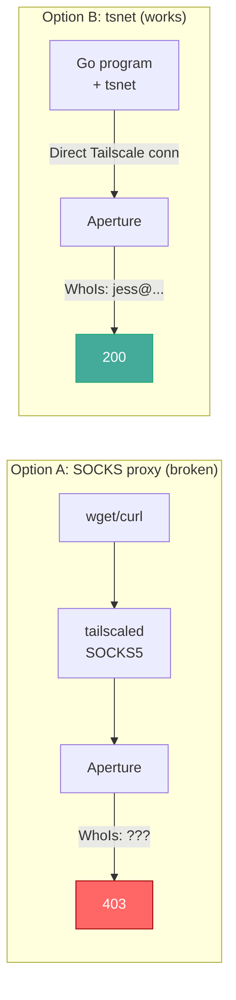
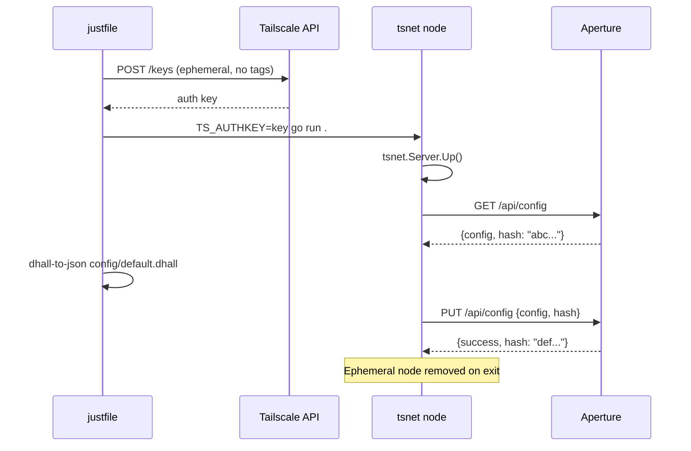
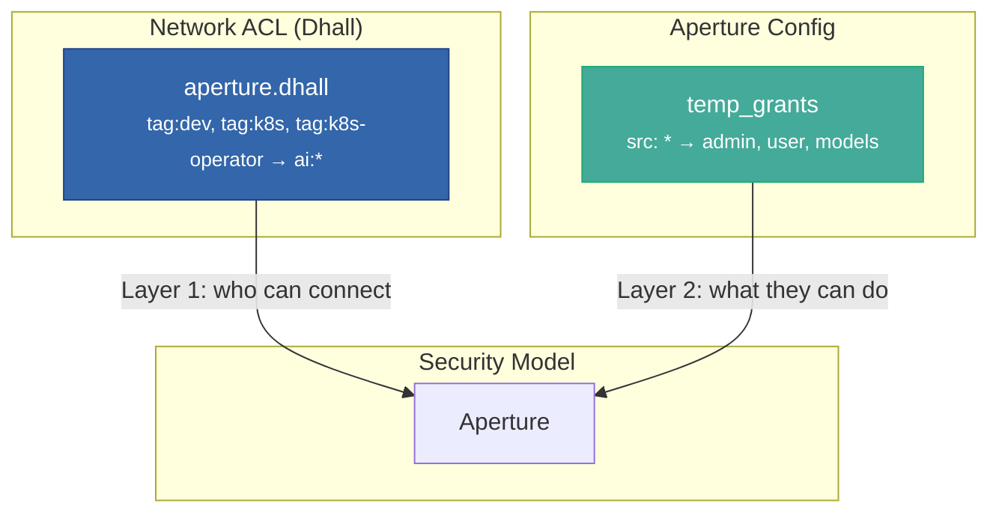

# Part 2: Bootstrapping Aperture Config with tsnet

*A throwaway Go program, an ephemeral node, and a five-minute escape hatch.*

---

## Where we left off

[Part 1](/blog/aperture-and-the-tagged-device-identity-gap) ended with us locked out of Aperture.  Every device on our tailnet was tagged, Aperture's role system doesn't recognize tagged identities, and we couldn't access the config API to fix it.

We needed a way to talk to Aperture as a **user-owned** device — one that presents a real email address in WhoIs.

## What didn't work

### Attempt 1: curl from the host

Our workstation (Yoga) is on the tailnet with `tag:dev`.  Simple curl:

```bash
$ curl http://ai/api/config
{"error":"access denied: no role granted"}
```

Expected failure.  Aperture sees the connection, does WhoIs, gets a tagged identity, finds no matching role.

### Attempt 2: Podman container with Tailscale

We spun up a Tailscale container with an ephemeral auth key that had **no tags** — so it would register as user-owned:

```bash
$ podman run --rm -d \
    --cap-add=NET_ADMIN \
    -e TS_AUTHKEY="$EPHEMERAL_KEY" \
    tailscale/tailscale:latest \
    tailscaled --tun=userspace-networking
```

The node registered correctly.  `tailscale whois` showed it as `jess@sulliwood.org`.  But:

```bash
$ podman exec aperture-bootstrap \
    sh -c 'ALL_PROXY=socks5://localhost:1055 wget -qO- http://ai/api/config'
# HTTP/1.1 403 Forbidden
```

Still 403.  The SOCKS5 proxy that tailscaled provides in userspace-networking mode doesn't preserve the WhoIs identity correctly.  The TCP connection that reaches Aperture doesn't carry the right node credentials through the proxy layer.

### Attempt 3: tsnet

This is the one that worked.

## Why tsnet is different

[tsnet](https://pkg.go.dev/tailscale.com/tsnet) embeds a Tailscale node directly in your Go program.  Instead of running `tailscaled` as a separate daemon, your process *is* the node.  When you call `srv.HTTPClient()`, you get an `*http.Client` that makes connections **through the embedded Tailscale stack**.

The key difference: these connections carry full node identity.  Aperture's WhoIs sees exactly who's connecting — no proxy stripping, no SOCKS indirection.



## The bootstrap tool

The whole program is about 80 lines of interesting code.  Here's the essential structure:

```go
srv := &tsnet.Server{
    Hostname:  "aperture-bootstrap",
    Ephemeral: true,
    AuthKey:   os.Getenv("TS_AUTHKEY"),
    Dir:       tmpDir,
}
defer srv.Close()

// This is the key line. srv.Up() joins the tailnet.
// srv.HTTPClient() returns a client that routes through
// the embedded Tailscale stack with full WhoIs identity.
srv.Up(ctx)
client := srv.HTTPClient()

// Now this works — Aperture sees our real user identity.
resp, _ := client.Get("http://ai/api/config")
```

Read the config, modify `temp_grants` to use `"*"` wildcard, PUT it back with the OCC hash.  The ephemeral node cleans itself up when the program exits.

## Creating the auth key

The auth key is important.  It must have **no tags** so the node registers as user-owned:

```bash
curl -u "$TS_KEY:" \
  -X POST "https://api.tailscale.com/api/v2/tailnet/$TAILNET/keys" \
  -d '{
    "capabilities": {
      "devices": {
        "create": {
          "reusable": false,
          "ephemeral": true,
          "preauthorized": true,
          "tags": []
        }
      }
    },
    "expirySeconds": 300
  }'
```

The empty `tags: []` is what makes it user-owned.  The key expires in 5 minutes.  The node is ephemeral — it disappears when the program stops.

## Making it repeatable with Dhall

Hard-coding JSON configs is fine for emergencies.  For ongoing management, we use [Dhall](https://dhall-lang.org) to define the config with types:

```haskell
-- config/types.dhall
let Grant =
    < Role : { role : Text }
    | Providers : { providers : List ProviderAccess }
    | HookGrant : { hook : Hook }
    >

let TempGrant = { src : List Text, grants : List Grant }
```

The default config template:

```haskell
-- config/default.dhall
let adminGrant = { src = [ "*" ], grants = [ Grant.Role { role = "admin" } ] }
let userGrant  = { src = [ "*" ], grants = [ Grant.Role { role = "user" }, ... ] }
```

`just render` compiles this to JSON.  If we typo a field name, Dhall catches it at compile time instead of Aperture returning a cryptic error.

## The full workflow

```bash
# One-time setup
nix develop                    # Go + Dhall + just + jq
export TS_KEY   # your Tailscale management key
export TAILNET="your-tailnet.ts.net"

# Bootstrap
just bootstrap
```

Under the hood:



## After bootstrapping

With `"*"` wildcard grants and the network ACL restricting which devices can reach Aperture, the system is secure and functional:



The wildcard in `temp_grants` isn't as scary as it looks.  Aperture only sees connections that pass the tailnet ACL.  If a device isn't in the `src` list of your `aperture.dhall` fragment, it can't reach Aperture at all.  The two layers complement each other:

- **Tailnet ACL**: which devices can connect (narrow, tag-based)
- **Aperture grants**: what connected devices can do (broad, wildcard)

## What we learned

1. **Aperture and tailnet grants are separate systems.**  Don't expect `tailscale.com/cap/aperture` to exist.  Check the [app capabilities docs](https://tailscale.com/docs/features/access-control/grants/grants-app-capabilities) for what's actually supported.

2. **`"tagged-devices"` is not an identity.**  It's a display name in `tailscale status`.  Aperture's WhoIs doesn't match on it.

3. **Userspace networking breaks WhoIs.**  The SOCKS5 proxy in containerized Tailscale doesn't preserve node identity for the receiving end's WhoIs lookup.  Use tsnet instead.

4. **Ephemeral tsnet nodes are a great escape hatch.**  Five-minute auth keys, auto-cleanup, no permanent infrastructure.  Perfect for one-off admin tasks on WhoIs-authenticated services.

5. **Type your configs.**  We caught two JSON typos when we moved to Dhall.  The Dhall type checker is faster feedback than "push config, get 500, guess which field is wrong."

## Try it

The [aperture-bootstrap](https://github.com/Jesssullivan/aperture-bootstrap) repo has everything: the Go tool, Dhall config types, a Nix flake for reproducible builds, and a justfile that ties it all together.

```bash
git clone https://github.com/Jesssullivan/aperture-bootstrap
cd aperture-bootstrap
nix develop
just bootstrap
```

---

*This is Part 2 of a two-part series.  [Part 1](/blog/aperture-and-the-tagged-device-identity-gap) covers the identity gap problem.  This post covers the tsnet solution.*
