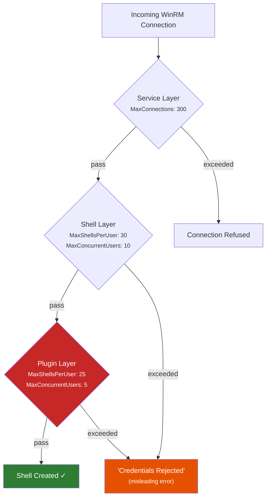
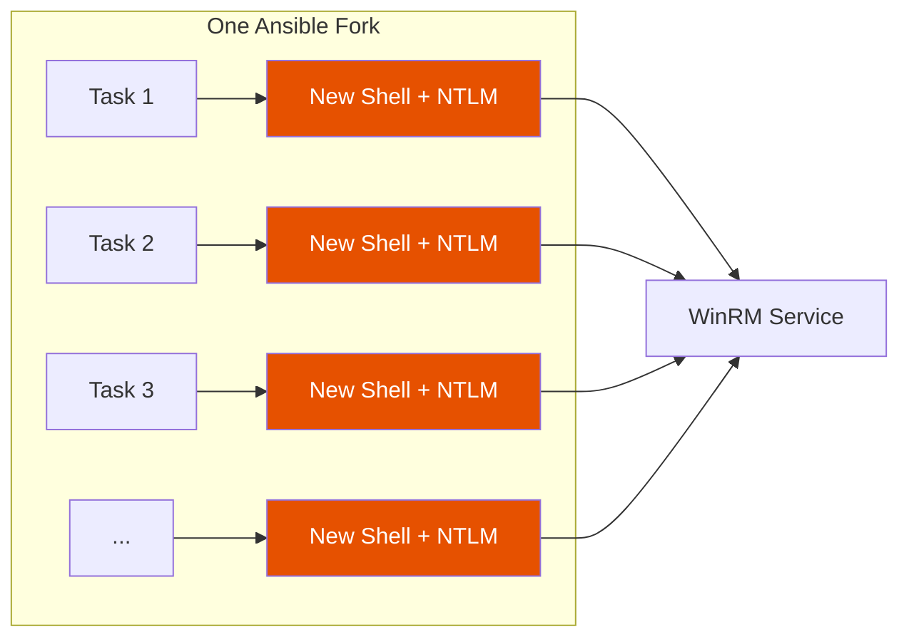

*Ansible. WinRM. Molecule. A shared AD account. What could go wrong.*

---

## So here's the thing-

We'd been running molecule tests against Windows targets for months. Serial execution, one role at a time, `forks=5`- the Ansible default. Everything was fine. Boring, even.

Then we started parallelizing.

Four molecule processes. Same dev box. Standard NTLM auth over WinRM HTTPS. The kind of thing you'd expect to just... work. The first parallel run locked us out of every Windows server on campus.

...And the error message told us our password was wrong.

## The lie

This is what Ansible gives you when WinRM can't handle your connections:

```
fatal: [win-target]: UNREACHABLE! => {
    "msg": "Task failed: ntlm: the specified credentials were rejected by the server"
}
```

"Credentials rejected." Your password is fine. Your account isn't disabled. You haven't fat-fingered anything. What's actually happening is that the Windows Remote Management service ran out of capacity- but the error it sends back through the NTLM handshake is indistinguishable from a real auth failure.

This matters enormously because **Active Directory counts each one as a failed login attempt.** Lockout threshold is typically 5 failures in 15 minutes. We sent 41. In a single burst.

## The three layers nobody talks about

It took us a while to figure out what was going on. WinRM has a quota system- most people know about that. What we didn't know (and I suspect most Ansible-on-Windows shops don't know) is that there are actually **three** quota layers, and the effective limit is the minimum across all of them.



That **plugin layer** at the bottom- `WSMan:\localhost\Plugin\microsoft.powershell\Quotas`- is the one that got us. It has its own set of defaults, and they're *lower* than the shell-level defaults everyone googles:

| Setting | Shell Default | Plugin Default | **Effective** |
|---------|:---:|:---:|:---:|
| MaxShellsPerUser | 30 | 25 | **25** |
| MaxConcurrentUsers | 10 | 5 | **5** |
| MaxProcessesPerShell | 25 | 15 | **15** |

You can raise `MaxShellsPerUser` to 100 at the shell level and still get blocked by the plugin's `MaxConcurrentUsers` of 5. These defaults haven't changed since WinRM 2.0 shipped with Server 2008 R2- [seventeen years](https://transscendsurvival.org/winrm-molecule-forkbomb-demo/winrm-quota-research/#1-default-quota-values-by-windows-version) of the same values across every Windows Server version.

You can see the full [quota behavior research](https://transscendsurvival.org/winrm-molecule-forkbomb-demo/winrm-quota-research/#2-quota-behavior) we put together- including the exact error codes, SOAP faults, and the confusing relationship between `Set-Item WSMan:\` and service restarts.

## The pywinrm problem

Ok so this is the big one- the reason parallelism creates a forkbomb in the first place.

The default `ansible.builtin.winrm` connection plugin uses [pywinrm](https://github.com/diyan/pywinrm), which creates a **new WinRM shell with a fresh NTLM authentication** for every single task. No connection pooling. No session reuse. No buffering. No piping.



The math gets scary fast:

```
parallel_molecule_processes × ansible_forks × tasks_per_role = total_shell_attempts
            4              ×       5        ×       15       = 300
```

Three hundred shell creation attempts against `MaxConcurrentUsers=5`. Five get through. Two hundred ninety-five get "credentials rejected." Each one is a failed NTLM attempt against AD. One shared service account across all your managed Windows hosts means one lockout = everything locked.

This also has implications for any [credential plugin pattern](https://transscendsurvival.org/winrm-molecule-forkbomb-demo/plugin-quota-analysis/#connection-to-keepassxc-credential-plugin-issues)- if you're using KeePassXC, 1Password CLI, or SOPS lookups during execution, each of those per-task connections adds resolution overhead that compounds under load.

## Reproducing it (it's surprisingly tricky)

We put together a [demo repo](https://github.com/Jesssullivan/winrm-molecule-forkbomb-demo) to reproduce this cleanly. One thing that tripped us up initially- Ansible's `forks` setting only controls parallelism *across hosts*. With a single target, you can set `forks=50` and everything still runs serially. (This cost us an embarrassing amount of time to figure out.)

The trick is a pressure test inventory- 50 entries all pointing at the same machine:

```yaml
# ansible/inventory/pressure-test.yml
pressure_targets:
  hosts:
    pressure-01: {}
    pressure-02: {}
    # ... 48 more
    pressure-50: {}
  vars:
    ansible_host: localhost
    ansible_connection: winrm
    ansible_port: 15986
```

With default quotas (`MaxConcurrentUsers=10`):

| | Result |
|--------|--------|
| Total connections | 50 |
| **SUCCESS** | **9** |
| **UNREACHABLE** | **41** |
| AD lockout threshold | 5 |

Nine connections got through- roughly matching `MaxConcurrentUsers=10`. The other 41 went straight to AD as failed auth attempts.

## Better late to the party

So after staring at the [Ansible forks vs WinRM quotas](https://transscendsurvival.org/winrm-molecule-forkbomb-demo/winrm-quota-research/#ansible-forks-vs-winrm-quotas) problem for a while, I stumbled onto [`ansible.builtin.psrp`](https://docs.ansible.com/projects/ansible/latest/collections/ansible/builtin/psrp_connection.html).

From the docs:

> Run commands or put/fetch on a target via PSRP (WinRM plugin). This is similar to the `ansible.builtin.winrm` connection plugin which uses the same underlying transport but instead runs in a PowerShell interpreter.

This solves many of my core qualms with `ansible.builtin.winrm`- specifically, buffering and piping are inherently possible. And critically- **plugin-level connection pooling**. One authenticated connection per fork, multiplexing all commands over a persistent Runspace Pool. No per-task shell creation. No per-task NTLM handshake.

Same pressure test, PSRP:

```bash
$ ansible -i inventory/pressure-test.yml pressure_targets -m win_ping -f 50 \
    -e ansible_connection=psrp -e ansible_psrp_auth=ntlm
```

| | pywinrm | pypsrp |
|--------|:---:|:---:|
| Successes | 9 | 24 |
| UNREACHABLE (auth failure) | 41 | **0** |
| AD lockout risk | **HIGH** | **None** |

Zero authentication failures. The remaining PSRP failures were TCP timeouts from our SSH tunnel (infrastructure bottleneck, not auth). The connection pooling also means credential plugin resolution- KeePassXC, SOPS, 1Password, whatever you're using- happens once per connection rather than once per task.

The `psrp` plugin has been in `ansible.builtin` since [Ansible 2.7](https://github.com/ansible/ansible/pull/41729)- October 2018. Same author as pywinrm ([Jordan Borean](https://github.com/jborean93)). It's been sitting there for seven years.

```yaml
# group_vars/windows.yml
ansible_connection: psrp
ansible_psrp_auth: ntlm
ansible_psrp_protocol: https
ansible_psrp_cert_validation: false
```

The limits are still possible issues (you can still exceed `MaxConcurrentUsers` with enough forks), but given we're admins with service credentials we can [set limits on the fly](https://transscendsurvival.org/winrm-molecule-forkbomb-demo/winrm-quotas/#toggleable-quota-tool) during development time. The auth flood problem- the thing that actually locks you out of AD- that's just gone.

## The other footgun

While we were resetting quotas to Windows defaults for benchmarking, we tried restarting WinRM over WinRM:

```yaml
- name: restart winrm
  ansible.windows.win_service:
    name: WinRM
    state: restarted
```

This is... not great. The service stops (killing your connection), fails to come back up, and you're left with a Windows box that won't accept remote management. `Start-Service WinRM` from RDP also failed. Full OS reboot was the only recovery.

The good news: **WSMan quota changes [take effect immediately](https://transscendsurvival.org/winrm-molecule-forkbomb-demo/winrm-quota-research/#2-quota-behavior) on new connections.** You don't need the restart at all. We removed the handler and documented the finding.

## The repo

Everything we found- the quota research, the benchmark data, the Ansible roles for managing all of this- is in the [demo repo](https://github.com/Jesssullivan/winrm-molecule-forkbomb-demo) with a [companion docs site](https://transscendsurvival.org/winrm-molecule-forkbomb-demo/). A few things that might be useful if you're dealing with similar problems:

- A [`winrm_quota_config` role](https://github.com/Jesssullivan/winrm-molecule-forkbomb-demo/tree/main/ansible/roles/winrm_quota_config) that manages both shell-level and plugin-level quotas idempotently
- A [`winrm_monitoring` role](https://github.com/Jesssullivan/winrm-molecule-forkbomb-demo/tree/main/ansible/roles/winrm_monitoring) that deploys Prometheus metrics for `winrm_active_shells` and quota utilization
- [Dhall-typed benchmark profiles](https://github.com/Jesssullivan/winrm-molecule-forkbomb-demo/tree/main/dhall) for systematic forkbomb reproduction
- The full [quota research](https://transscendsurvival.org/winrm-molecule-forkbomb-demo/winrm-quota-research/) covering defaults by Windows version, GPO override behavior, registry paths, and the DISA STIG/CIS implications

### Upstream references

- [`ansible.builtin.psrp` docs](https://docs.ansible.com/projects/ansible/latest/collections/ansible/builtin/psrp_connection.html)
- [pywinrm#277](https://github.com/diyan/pywinrm/issues/277) — the thread safety issue that makes per-task connections necessary
- [ansible.windows#597](https://github.com/ansible-collections/ansible.windows/issues/597) — community discussion of intermittent WinRM failures at scale
- [ansible#41729](https://github.com/ansible/ansible/pull/41729) — the original PSRP PR from August 2018
- [Microsoft WinRM Quotas](https://learn.microsoft.com/en-us/windows/win32/winrm/quotas) — official quota documentation
- [Plugin quota analysis](https://transscendsurvival.org/winrm-molecule-forkbomb-demo/plugin-quota-analysis/) — the hidden second layer and its implications for credential plugins

---

-Jess
