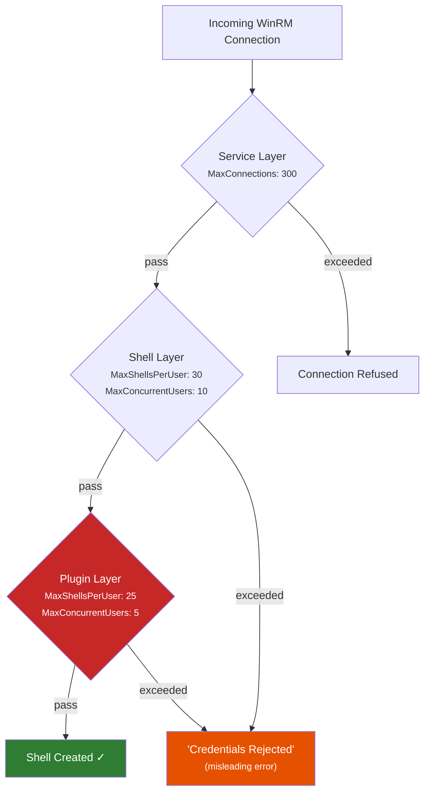
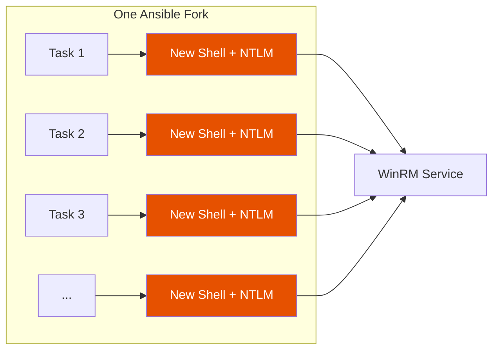

*I accidentally locked myself out of every Windows server on campus by parallelizing molecule tests.*

---

## How it started

I'd been running molecule tests against Windows targets for months at this point- serial execution, one role at a time, `forks=5` (the Ansible default). Everything worked. Boring, even.

Then I started parallelizing. Four molecule processes hitting the same dev box, standard NTLM auth over WinRM HTTPS. The kind of thing you'd expect to just work. The first parallel run locked me out of every Windows server on campus.

...And the error message told me my password was wrong.

## The error that lies to you

This is what Ansible gives you when WinRM runs out of capacity:

```
fatal: [win-target]: UNREACHABLE! => {
    "msg": "Task failed: ntlm: the specified credentials were rejected by the server"
}
```

"Credentials rejected." My password was fine. My account wasn't disabled. I hadn't fat-fingered anything. What's actually happening is that the Windows Remote Management service ran out of room- but the error it sends back through the NTLM handshake looks identical to a real auth failure.

This matters enormously because Active Directory counts each of these as a failed login attempt. The typical lockout threshold is 5 failures in 15 minutes. I sent 41 in a single burst.

## Three quota layers

It took me a while to piece together what was going on. Most people know WinRM has a quota system. What I didn't know- and I suspect most Ansible-on-Windows shops don't know either- is that there are actually three quota layers stacked on top of each other. The effective limit for any connection is the minimum across all of them.



That bottom layer- the plugin layer at `WSMan:\localhost\Plugin\microsoft.powershell\Quotas`- is the one that got me. It sits underneath the shell-level quotas everyone googles, and its defaults are actually *lower*:

| Setting | Shell Default | Plugin Default | **Effective** |
|---------|:---:|:---:|:---:|
| MaxShellsPerUser | 30 | 25 | **25** |
| MaxConcurrentUsers | 10 | 5 | **5** |
| MaxProcessesPerShell | 25 | 15 | **15** |

So you can go raise `MaxShellsPerUser` to 100 at the shell level and still get blocked by the plugin's `MaxConcurrentUsers` of 5. These defaults haven't changed since WinRM 2.0 shipped with Server 2008 R2- [seventeen years](https://transscendsurvival.org/winrm-molecule-forkbomb-demo/winrm-quota-research/#1-default-quota-values-by-windows-version) of the same values across every Windows Server version through 2025.

I put together a fairly thorough [quota behavior writeup](https://transscendsurvival.org/winrm-molecule-forkbomb-demo/winrm-quota-research/#2-quota-behavior) covering the exact error codes, SOAP faults, and the surprisingly confusing relationship between `Set-Item WSMan:\` and service restarts.

## Why pywinrm makes this a forkbomb

Ok so this is the big one.

The default `ansible.builtin.winrm` connection plugin uses [pywinrm](https://github.com/diyan/pywinrm), and pywinrm creates a **new WinRM shell with a fresh NTLM authentication** for every single Ansible task. No connection pooling. No session reuse. No buffering or piping.



The math gets bad fast:

```
parallel_molecule_processes × ansible_forks × tasks_per_role = total_shell_attempts
            4              ×       5        ×       15       = 300
```

Three hundred shell creation attempts against `MaxConcurrentUsers=5`. Five get through, the rest come back as "credentials rejected," and each of those is a real NTLM auth failure against Active Directory. One shared service account across all your managed Windows hosts means one lockout touches everything.

This per-task connection model also means that any [credential plugin](https://transscendsurvival.org/winrm-molecule-forkbomb-demo/plugin-quota-analysis/#connection-to-keepassxc-credential-plugin-issues) you're using during execution- KeePassXC lookups, SOPS decryption, 1Password CLI- has to resolve on every single connection rather than once per session. Under parallel load that overhead compounds quickly.

## Reproducing it

I put together a [demo repo](https://github.com/Jesssullivan/winrm-molecule-forkbomb-demo) to reproduce this in a controlled way. One thing that tripped me up initially (and I am not proud of how long this took)- Ansible's `forks` setting only controls parallelism *across hosts*. With a single target host you can set `forks=50` and everything still runs serially.

The trick is a pressure test inventory with 50 entries all pointing at the same machine:

```yaml
# ansible/inventory/pressure-test.yml
pressure_targets:
  hosts:
    pressure-01: {}
    pressure-02: {}
    # ... 48 more
    pressure-50: {}
  vars:
    ansible_host: localhost
    ansible_connection: winrm
    ansible_port: 15986
```

With the shell-level quotas set to defaults (`MaxConcurrentUsers=10`):

| | Result |
|--------|--------|
| Total connections | 50 |
| **SUCCESS** | **9** |
| **UNREACHABLE** | **41** |
| AD lockout threshold | 5 |

Nine connections got through- roughly matching `MaxConcurrentUsers=10`. The other 41 went straight to AD as failed auth attempts. That's 8x the lockout threshold in a single burst.

## Finding PSRP

After staring at the [forks vs quotas problem](https://transscendsurvival.org/winrm-molecule-forkbomb-demo/winrm-quota-research/#ansible-forks-vs-winrm-quotas) for a while, I stumbled onto [`ansible.builtin.psrp`](https://docs.ansible.com/projects/ansible/latest/collections/ansible/builtin/psrp_connection.html). From the docs-

> Run commands or put/fetch on a target via PSRP (WinRM plugin). This is similar to the `ansible.builtin.winrm` connection plugin which uses the same underlying transport but instead runs in a PowerShell interpreter.

This solves many of my core qualms with `ansible.builtin.winrm`- specifically, buffering and piping are inherently possible with PSRP. And critically for this problem- it allows for plugin-level connection pooling. One authenticated connection per fork, multiplexing all commands over a persistent PowerShell Runspace Pool. No per-task shell creation, no per-task NTLM handshake.

Same pressure test, same 50 connections, but with `ansible_connection=psrp`:

```bash
$ ansible -i inventory/pressure-test.yml pressure_targets -m win_ping -f 50 \
    -e ansible_connection=psrp -e ansible_psrp_auth=ntlm
```

| | pywinrm | pypsrp |
|--------|:---:|:---:|
| Successes | 9 | 24 |
| UNREACHABLE (auth failure) | 41 | **0** |
| AD lockout risk | **HIGH** | **None** |

Zero authentication failures. The remaining PSRP failures were TCP timeouts from my SSH tunnel- an infrastructure bottleneck, not an auth problem. The connection pooling also means that credential plugin resolution (my [KeePassXC lookups](https://transscendsurvival.org/winrm-molecule-forkbomb-demo/plugin-quota-analysis/), SOPS, whatever you're using) happens once per connection rather than once per task.

The `psrp` plugin has been in `ansible.builtin` (ansible-core) since [Ansible 2.7](https://github.com/ansible/ansible/pull/41729)- October 2018. Same author as pywinrm- [Jordan Borean](https://github.com/jborean93). It's been sitting there for seven years. Better late to the party than never.

```yaml
# group_vars/windows.yml
ansible_connection: psrp
ansible_psrp_auth: ntlm
ansible_psrp_protocol: https
ansible_psrp_cert_validation: false
```

The quota limits are still possible issues with enough forks, but given I have admin credentials I can [set those on the fly](https://transscendsurvival.org/winrm-molecule-forkbomb-demo/winrm-quotas/#toggleable-quota-tool) during development time. The authentication flood problem- the thing that actually locks you out of AD- that's just gone with PSRP.

## The other footgun I found

While resetting quotas to Windows defaults for benchmarking, I tried restarting WinRM over WinRM:

```yaml
- name: restart winrm
  ansible.windows.win_service:
    name: WinRM
    state: restarted
```

This is, in retrospect, obviously a bad idea. The service stops (killing the connection I'm using to issue the restart), fails to come back up properly, and I'm left with a box that won't accept remote management at all. `Start-Service WinRM` from RDP also failed- the service was genuinely corrupted, not just stopped. Full OS reboot was the only way back.

The good news is that WSMan quota changes [take effect immediately](https://transscendsurvival.org/winrm-molecule-forkbomb-demo/winrm-quota-research/#2-quota-behavior) on new connections without a restart. I didn't need the handler at all. Removed it, documented the finding, moved on.

## The repo

Everything I found during this investigation- the quota research, the benchmark data, the Ansible roles for managing all of this- is in a [demo repo](https://github.com/Jesssullivan/winrm-molecule-forkbomb-demo) with a [companion docs site](https://transscendsurvival.org/winrm-molecule-forkbomb-demo/). A few things in there that might be useful if you're running into similar problems:

- A [`winrm_quota_config` role](https://github.com/Jesssullivan/winrm-molecule-forkbomb-demo/tree/main/ansible/roles/winrm_quota_config) that manages both shell-level and plugin-level quotas idempotently
- A [`winrm_monitoring` role](https://github.com/Jesssullivan/winrm-molecule-forkbomb-demo/tree/main/ansible/roles/winrm_monitoring) that deploys Prometheus metrics for active shell counts and quota utilization
- [Dhall-typed benchmark profiles](https://github.com/Jesssullivan/winrm-molecule-forkbomb-demo/tree/main/dhall) for systematic forkbomb reproduction
- The full [quota research](https://transscendsurvival.org/winrm-molecule-forkbomb-demo/winrm-quota-research/) covering defaults by Windows version, GPO override behavior, registry paths, and what the DISA STIGs actually say (spoiler- they don't constrain quota values at all)

### References

- [`ansible.builtin.psrp` docs](https://docs.ansible.com/projects/ansible/latest/collections/ansible/builtin/psrp_connection.html)
- [pywinrm#277](https://github.com/diyan/pywinrm/issues/277) — the thread safety issue underlying the per-task connection model
- [ansible.windows#597](https://github.com/ansible-collections/ansible.windows/issues/597) — community discussion of WinRM failures at scale
- [ansible#41729](https://github.com/ansible/ansible/pull/41729) — the original PSRP PR from August 2018
- [Microsoft WinRM Quotas](https://learn.microsoft.com/en-us/windows/win32/winrm/quotas)
- [Plugin quota analysis](https://transscendsurvival.org/winrm-molecule-forkbomb-demo/plugin-quota-analysis/) — the hidden layer and its implications for credential plugins

---

-Jess
