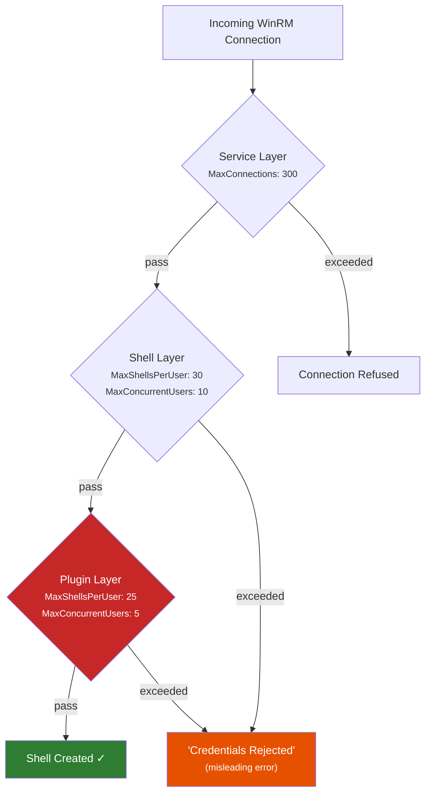
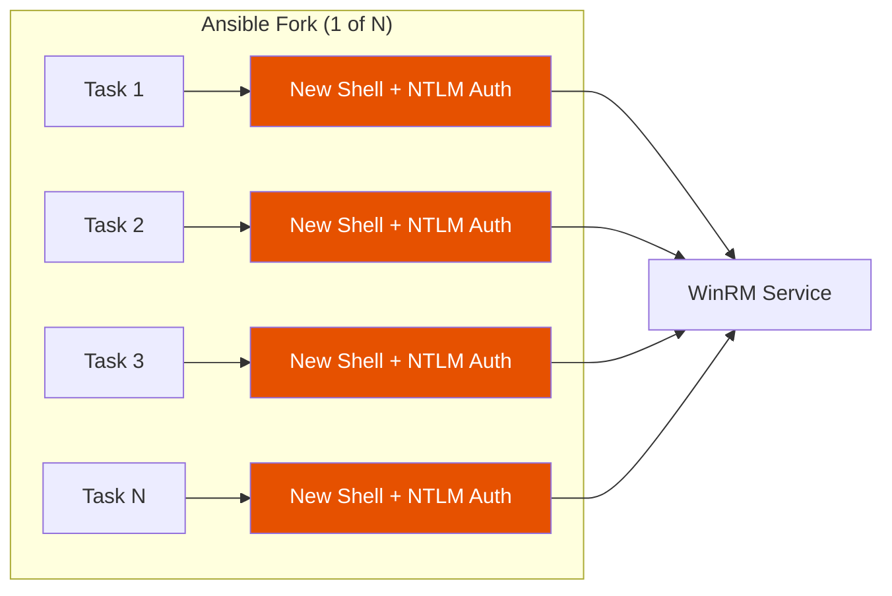

*We accidentally triggered 41 failed AD auth attempts in a single burst. The error said "credentials rejected." The password was fine.*

---

## The setup

Ansible. Windows Server 2022. Molecule. Four roles, a dev box, and a shared Active Directory service account.

We'd been running molecule tests against Windows targets for months with no issues- serial execution, one role at a time, forks=5 (the default). Then we started parallelizing. Four molecule processes, same target host, standard NTLM auth over WinRM HTTPS.

The first run locked us out of every Windows server on campus.

## What "credentials rejected" actually means

The error message Ansible gives you when WinRM quota exhaustion occurs is, frankly, misleading:

```
fatal: [win-target]: UNREACHABLE! => {
    "msg": "Task failed: ntlm: the specified credentials were rejected by the server"
}
```

Your password is fine. Your account isn't disabled. What's actually happening is buried three layers deep in the Windows Remote Management stack- and most of the documentation doesn't even mention the layer that bites you.

## Three layers of WinRM quotas

Here's the thing nobody tells you. WinRM has **three** quota layers, and the effective limit is the **minimum** across all of them.



Most documentation covers the **shell layer** (`winrm/config/winrs`). The defaults have been unchanged since WinRM 2.0 shipped with Server 2008 R2- seventeen years of the same values:

| Setting | Shell Default | Plugin Default | **Effective** |
|---------|:---:|:---:|:---:|
| MaxShellsPerUser | 30 | 25 | **25** |
| MaxConcurrentUsers | 10 | 5 | **5** |
| MaxProcessesPerShell | 25 | 15 | **15** |

That **plugin layer** (`WSMan:\localhost\Plugin\microsoft.powershell\Quotas`) is the hidden one. It has *lower* defaults than the shell layer. You can raise `MaxShellsPerUser` to 100 and still hit the plugin's `MaxConcurrentUsers` of 5.

We didn't know about it. Almost nobody does.

## How parallel molecule creates the forkbomb

Each Ansible task using the default `winrm` connection plugin (pywinrm) creates a **new WinRM shell with a fresh NTLM authentication handshake**. No connection pooling. No session reuse. Every. Single. Task.



The forkbomb formula:

```
parallel_molecule_processes × ansible_forks × tasks_per_role = total_shell_attempts
            4              ×       5        ×       15       = 300 shell attempts
```

Against `MaxConcurrentUsers=5` (the plugin default), you're hitting the wall after the fifth concurrent connection. The remaining 295 attempts get the misleading "credentials rejected" error.

And here's where it gets really bad- **each failed attempt is a failed NTLM authentication against Active Directory**. With a typical lockout threshold of 5 failures in 15 minutes, those 295 failures lock the account instantly. One shared service account across all managed Windows hosts means one lockout = everything locked.

## Reproducing it

We built a [demo repo](https://github.com/Jesssullivan/winrm-molecule-forkbomb-demo) to reproduce this cleanly. The trick is that Ansible's `forks` setting only controls parallelism *across hosts*- with a single target, everything runs serially regardless of your fork count.

To actually create concurrent connections, we used a pressure test inventory- 50 entries all pointing at the same Windows host:

```yaml
# ansible/inventory/pressure-test.yml
pressure_targets:
  hosts:
    pressure-01: {}
    pressure-02: {}
    # ... 48 more entries
    pressure-50: {}
  vars:
    ansible_host: localhost  # via SSH tunnel
    ansible_connection: winrm
    ansible_port: 15986
```

The results with default quotas (`MaxConcurrentUsers=10`):

```bash
$ ansible -i inventory/pressure-test.yml pressure_targets -m win_ping -f 50
```

| Metric | Result |
|--------|--------|
| Total connections | 50 |
| **SUCCESS** | **9** |
| **UNREACHABLE** | **41** |
| Auth failures sent to AD | 41 |
| AD lockout threshold | 5 |

Nine connections got through (roughly matching `MaxConcurrentUsers=10`). Forty-one failed with "credentials rejected." Each failure was a real NTLM auth attempt against AD. That's 8x the lockout threshold in a single burst.

## The fix that's been hiding since 2018

After raising the quotas (which helped- 20/50 succeeded with `MaxConcurrentUsers=25`), we ran the same test with the `psrp` connection plugin:

```bash
$ ansible -i inventory/pressure-test.yml pressure_targets -m win_ping -f 50 \
    -e ansible_connection=psrp -e ansible_psrp_auth=ntlm
```

| Metric | pywinrm | pypsrp |
|--------|:---:|:---:|
| Successes | 9 | 24 |
| UNREACHABLE (auth failure) | 41 | **0** |
| AD lockout risk | **HIGH** | **None** |

Zero authentication failures. PSRP uses a persistent **Runspace Pool**- one authenticated connection per fork, multiplexing all commands over it. No per-task shell creation. No per-task NTLM handshake. The remaining failures were SSH tunnel TCP timeouts (our secondary bottleneck), not auth problems.

The `psrp` connection plugin has been in **`ansible.builtin`** (ansible-core) since [Ansible 2.7](https://github.com/ansible/ansible/pull/41729), released October 2018. Same author as pywinrm ([Jordan Borean](https://github.com/jborean93)). Seven years of availability. It just... isn't the default.

```yaml
# The fix: two lines in your group_vars
windows:
  vars:
    ansible_connection: psrp
    ansible_psrp_auth: ntlm
```

## The footgun we found along the way

While resetting quotas to Windows defaults for our benchmarks, our Ansible handler tried to restart the WinRM service:

```yaml
- name: restart winrm
  ansible.windows.win_service:
    name: WinRM
    state: restarted
```

This killed the WinRM connection we were using to issue the restart (obviously, in retrospect). But the service didn't come back up. `Start-Service WinRM` from RDP also failed- "Cannot open WinRM service on computer '.'." The service was corrupted, not just stopped.

Full OS reboot was the only recovery.

Turns out: **WSMan quota changes take effect immediately on new connections without a restart.** The restart handler was unnecessary and destructive. We [documented this finding](https://transscendsurvival.org/winrm-molecule-forkbomb-demo/benchmark-results/) and removed the handler.

## What we'd recommend

**For any team running Ansible against Windows:**

1. **Switch to PSRP.** Two lines of config. Connection pooling eliminates the auth flood entirely. `pip install pypsrp` and set `ansible_connection: psrp`.

2. **Raise quotas before parallelizing.** The [`winrm_quota_config` role](https://github.com/Jesssullivan/winrm-molecule-forkbomb-demo/tree/main/ansible/roles/winrm_quota_config) in our demo repo does this idempotently- shell level AND plugin level.

3. **Check the plugin layer.** `Get-ChildItem WSMan:\localhost\Plugin\microsoft.powershell\Quotas` will show you the hidden defaults most people miss.

4. **Never restart WinRM over WinRM.** Quota changes don't need it. If you must restart, use a scheduled task with a delay.

5. **Monitor shell counts.** Our [`winrm_monitoring` role](https://github.com/Jesssullivan/winrm-molecule-forkbomb-demo/tree/main/ansible/roles/winrm_monitoring) deploys a Prometheus textfile collector that exposes `winrm_active_shells` and `winrm_quota_max_shells_per_user` as Grafana-ready metrics.

## Resources

Everything we found is documented in the [research repo](https://github.com/Jesssullivan/winrm-molecule-forkbomb-demo) and the [companion documentation site](https://transscendsurvival.org/winrm-molecule-forkbomb-demo/):

- [Forkbomb mechanism analysis](https://transscendsurvival.org/winrm-molecule-forkbomb-demo/forkbomb-mechanism/)
- [WinRM quota research](https://transscendsurvival.org/winrm-molecule-forkbomb-demo/winrm-quota-research/) (defaults by version, GPO behavior, registry paths)
- [pywinrm vs pypsrp comparison](https://transscendsurvival.org/winrm-molecule-forkbomb-demo/pywinrm-vs-pypsrp/) (connection architecture, PSRP history)
- [Plugin quota analysis](https://transscendsurvival.org/winrm-molecule-forkbomb-demo/plugin-quota-analysis/) (the hidden second layer)
- [Benchmark results](https://transscendsurvival.org/winrm-molecule-forkbomb-demo/benchmark-results/) (raw data from all test runs)

### Upstream issues

- [pywinrm#277](https://github.com/diyan/pywinrm/issues/277) — Multi-threaded requests fail (stateful NTLM corruption)
- [molecule#607](https://github.com/ansible/molecule/issues/607) — WinRM connection plugin configuration gaps
- [ansible.windows#597](https://github.com/ansible-collections/ansible.windows/issues/597) — Intermittent WinRM failures at scale
- [ansible#41729](https://github.com/ansible/ansible/pull/41729) — Original PSRP connection plugin PR (August 2018)
- [Microsoft WinRM Quotas](https://learn.microsoft.com/en-us/windows/win32/winrm/quotas) — Official quota documentation
- [ansible.builtin.psrp docs](https://docs.ansible.com/projects/ansible/latest/collections/ansible/builtin/psrp_connection.html) — PSRP connection plugin reference

---

-Jess
