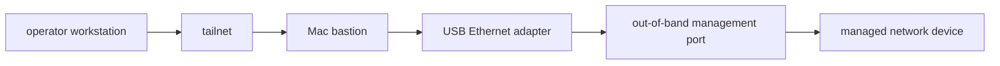
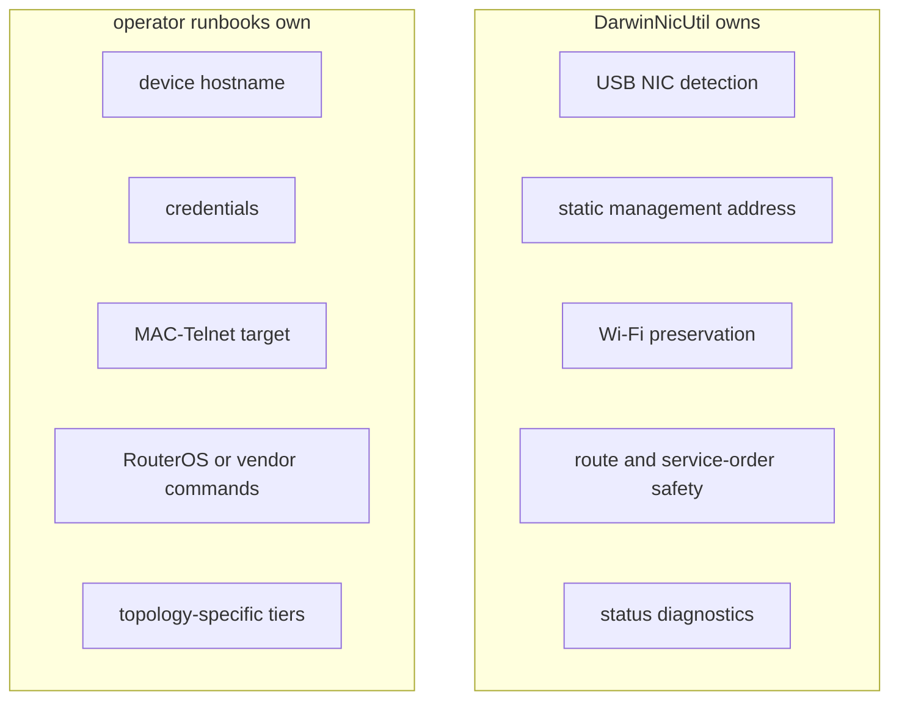
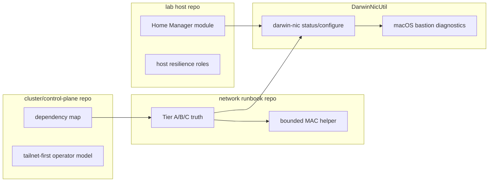
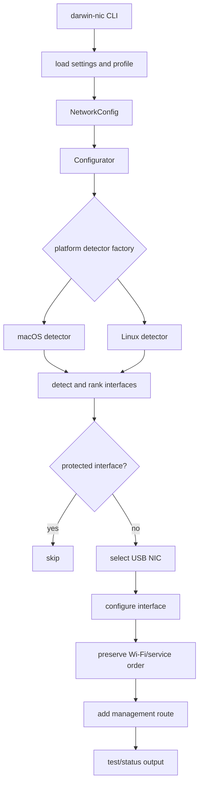
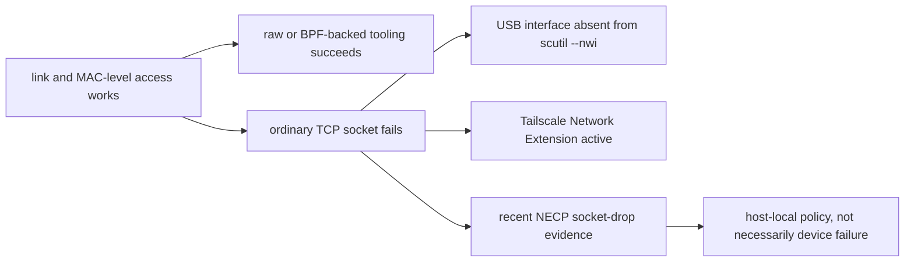
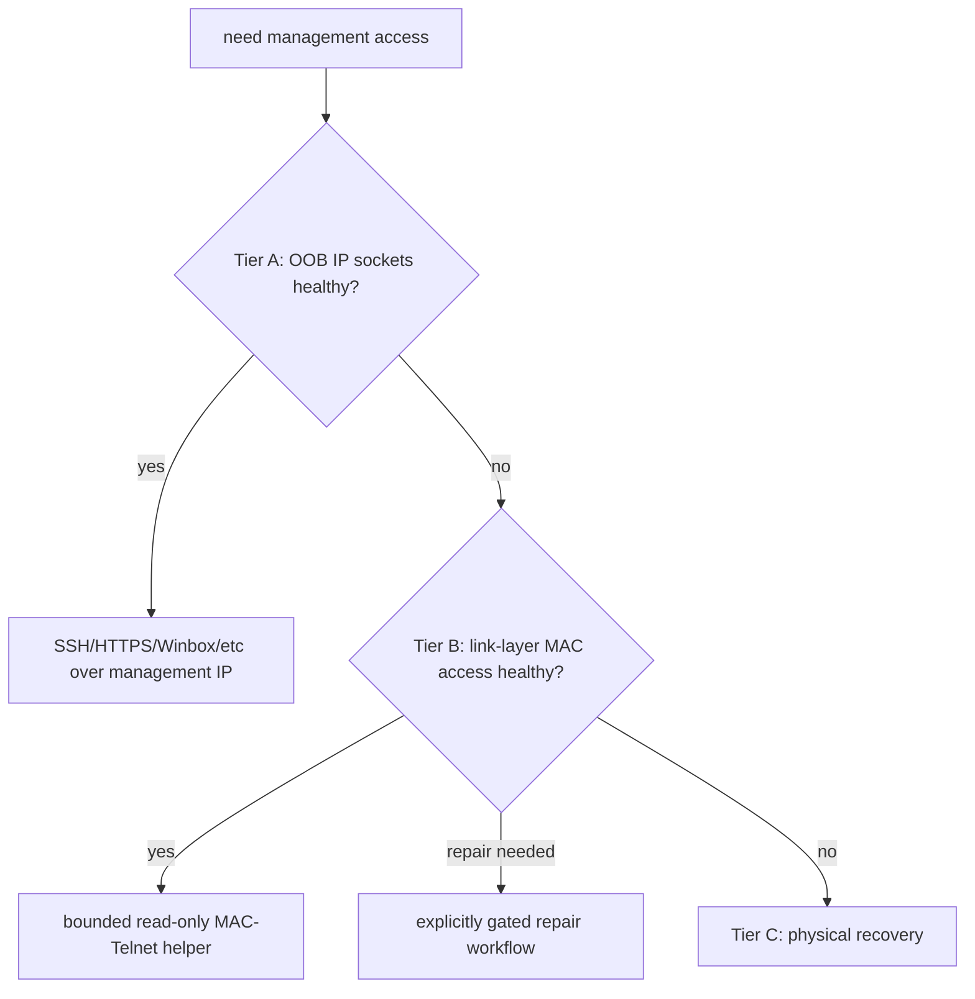
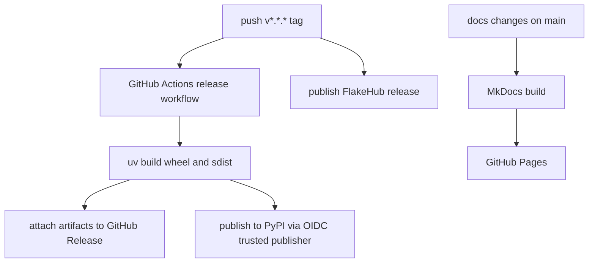
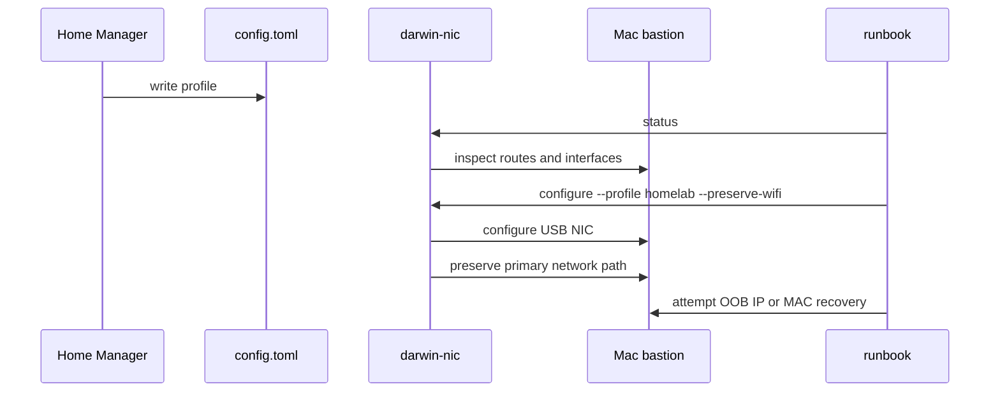

I was doing the silly thing again.

A USB Ethernet adapter. A Mac. A management port on a network device. A perfectly normal tailnet session that needed to stay alive while I changed the shape of the network under it.

This is the kind of task that sounds tiny until endpoint networking, service order, route metrics, Network Extensions, sudo prompts, and switch recovery runbooks all decide to become one problem. Plug in the adapter, assign a management address, keep Wi-Fi as the primary path, do not break the tailnet session you are using to reach the machine, and if ordinary TCP fails, do not immediately blame the switch.

Easy.

Obviously.

So I cleaned up [DarwinNicUtil](https://github.com/Jesssullivan/DarwinNicUtil) until it became something I can actually point people at. It is now public, packaged, documented, and release-shaped enough to use without spelunking through my notes. The current release is `v2.1.2`; it publishes to PyPI through trusted publishing, ships wheel and source artifacts through GitHub Releases, publishes a Nix flake through FlakeHub, and has a MkDocs site at [transscendsurvival.org/DarwinNicUtil](https://transscendsurvival.org/DarwinNicUtil/).

Tiny tool. Annoying problem.

## The actual problem

The recurring workflow is this:



That diagram hides the fun part. The Mac bastion has to keep its ordinary network path alive while it temporarily grows another one. In my case that ordinary path is usually Wi-Fi plus a tailnet. The temporary path is a USB Ethernet adapter pointed at a management subnet. The network device on the other end might be a switch or router, but DarwinNicUtil deliberately does not know the device's identity, credentials, MAC addresses, or policy.

That split matters. The generic tool owns host-side behavior. Downstream runbooks own device-side policy.



I wanted the first box to be boring. I wanted the second box to stay out of this repo.

That boundary is the difference between a reusable management NIC tool and a deeply cursed pile of "my basement switch did something at 2 AM" scripts.

## The supported user flow

The normal install path is PyPI:

```bash
uv tool install darwin-mgmt-nic-configurator
darwin-nic status
darwin-nic init-config
darwin-nic configure --profile homelab --preserve-wifi
```

The stable Nix path is FlakeHub:

```bash
nix run "https://flakehub.com/f/Jesssullivan/DarwinNicUtil/v2.1.2" -- status
```

The profile file is plain TOML:

```
default_profile = "homelab"

[defaults]
preserve_wifi = true

[profiles.homelab]
device_ip = "192.168.88.1"
laptop_ip = "192.168.88.100"
mgmt_network = "192.168.88.0/24"
device_name = "Lab Management Device"
device_type = "network"
```

Those IPs are example management-subnet values. The important part is the shape: `device_ip` is the thing on the other end, `laptop_ip` is the address assigned to the USB NIC, and `mgmt_network` is the route that should exist for that link. The profile can come from `~/.config/darwin-nic/config.toml`, a system config, a local repo override, or environment variables.

There is also a Home Manager pattern in my lab repo that generates this TOML from Nix. It maps camelCase Nix options like `deviceIp`, `laptopIp`, and `mgmtNetwork` into the snake_case TOML fields DarwinNicUtil consumes, installs the package from the flake input, and optionally installs companion network tools.

That makes the bastion config declarative without making the tool topology-specific. Huzzah.

## The sibling-repo contract

This work only made sense once I stopped pretending one repo should know everything.

There are three local surfaces around this tool:

| Repo surface | What it owns | What it should not do |
| --- | --- | --- |
| DarwinNicUtil | generic USB NIC setup, profile semantics, sudo behavior, macOS status diagnostics, packaging | know device credentials, MAC addresses, switch policy, or private topology |
| lab host config | install the tool, generate profiles, keep host provisioning repeatable | reimplement `darwin-nic` interface detection or encode RouterOS recovery commands |
| network runbook repo | topology truth, Tier A/B/C operator paths, device-specific recovery helpers | make the generic tool carry switch identity or secrets |
| cluster/control-plane repo | point at the correct owner when cluster work depends on the physical network | duplicate the switch-management runbook |

That last row is where the broader infrastructure repo fits in. Its integration map treats the local OOB lane as a dependency boundary, not as something the cluster repo owns. If cluster behavior depends on the physical switch path, the answer is not "copy a runbook into the cluster repo". The answer is "start in the network repo and DarwinNicUtil, because those are the surfaces that own the physical truth and the host-side tool behavior."

That sounds bureaucratic.

It is actually liberating. The cluster repo can say "tailnet-first management remains the model" without carrying every detail about a USB adapter plugged into a Mac. The lab repo can install and configure the tool without knowing the switch's recovery MAC. The network repo can be explicit about Tier A, Tier B, and Tier C without turning DarwinNicUtil into a pile of private constants.



The lab repo also has a Linux USB NIC resilience role, and that is a useful contrast. On Linux, the pattern is NetworkManager-oriented: detect USB-backed interfaces under `/sys/class/net`, set DHCP/autoconnect, give USB Ethernet a sane route metric, install a dispatcher script, and restart Tailscale when a new USB path appears. That is a boot-resilience pattern.

DarwinNicUtil is different. It is the Mac bastion pattern: configure a static management link on demand, preserve the primary path, and explain host-local policy when the link looks alive but normal sockets still fail.

Same family. Different animal. Different tool.

## What the code does

At runtime, the path is intentionally small:



The installed console script points at `darwin_mgmt_nic.app:main`. The app-level CLI handles subcommands like `status`, `configure`, `setup`, `dashboard`, `test`, `restore`, `config`, and `profiles`. The configure path resolves a profile into the older backend CLI surface, then the configurator does the host-side work through the platform detector.

macOS is the primary supported path today. Linux exists, but it is explicitly experimental and narrow. That is honest documentation, not false modesty. macOS is where this work got real, because macOS is where the interesting failure happened.

## The Mac-specific wrinkle

The first failure mode is ordinary and boring: a USB NIC can become more important than Wi-Fi. On a Mac, service order and route behavior can make the temporary management adapter steal traffic that should keep going over the primary network. That is exactly the opposite of what I want from a remote bastion.

So `--preserve-wifi` is first-class.

The second failure mode is less obvious: link-layer access can work while ordinary sockets fail.

That was the "sit there for a long moment" part.

The bastion could see enough of the local link for MAC-level tooling. It could emit local discovery traffic. The management switch was alive. The cable was real. The adapter had an address. But TCP clients aimed at the management IP failed with errors like "No route to host". On the Mac, the useful clue was not just the route table. It was the combination of:

- the USB interface missing from `scutil --nwi`;
- Tailscale's system extension being active;
- recent unified-log entries showing outbound drops with `reason: NECP`;
- link-layer tools still succeeding.

That is why `darwin-nic status` now includes bastion diagnostics. It does not claim to defeat endpoint policy. It tells the operator where the weirdness is probably happening.



Ok so this is the big one: when link-layer access works and TCP does not, the switch may not be the liar.

Sometimes the host is.

## Tier A, Tier B, Tier C

The downstream network repo describes the operator contract as tiers. The public-safe version looks like this:



Tier A is the nice path: the tailnet reaches the Mac bastion, the bastion reaches the management subnet over USB Ethernet, and ordinary IP services work.

Tier B is the weird but useful path: the bastion still has link-layer reachability, so a MAC-Telnet helper can interrogate the device even if ordinary IP sockets are dark.

Tier C is the part where you stop pretending this is remote work.

DarwinNicUtil is not the Tier B command runner. It prepares and inspects the host-side USB NIC so the downstream helper has a viable link to stand on. The helper and runbook own the device command allowlist, credentials, prompt handling, and rollback policy.

Boundaries are boring until they save the day.

## The MAC-Telnet pitfalls

MAC-Telnet is a RouterOS link-layer management path. It is incredibly useful when IP is broken, and it is exactly the sort of thing that rewards paranoia.

The helper in the downstream CRS repo uses a few rules that I think are worth writing down:

- Prefer read-only commands first.
- Keep an allowlist, not a denylist.
- Do not put passwords in argv.
- Do not write secrets to temp files.
- Stream the `expect` script through stdin.
- Handle terminal query sequences before assuming the prompt is stable.
- Treat parallel live MAC sessions as interference-prone.
- Make mutating repair workflows require an explicit `--execute` gate.

That last one is not decorative. The first stable MAC path should be boring readback: identity, enabled services, routes, addresses, firewall snippets, and enough state to decide whether the problem is on the host, the cable, or the network device. Mutation belongs behind a runbook and a rollback path.

This is also why I do not want DarwinNicUtil to grow device-specific MAC-Telnet behavior. The second it knows a switch's MAC address, secret path, login suffix, or topology, it stops being the little generic tool I need it to be.

## What changed in the productionization pass

The useful code existed before the release felt usable. That is a very familiar state of affairs, and also a trap. A tool is not really ready just because it works on the machine where it was born.

So the v2.1 productionization pass focused on boring release surfaces:

| Surface | Current state |
| --- | --- |
| Repository | public GitHub repo |
| Python package | PyPI package `darwin-mgmt-nic-configurator` |
| Release artifacts | GitHub Release wheel and source distribution |
| Nix | flake outputs plus FlakeHub `v2.1.2` |
| Docs | MkDocs on GitHub Pages |
| CI | GitHub Actions for tests, docs, release, Nix, and scans |
| Security scanning | Gitleaks and TruffleHog |
| Coverage | coverage gate ratcheted past 50 percent |
| Public contract | README, bastion docs, artifacts docs, project spec, `llms.txt` |

The docs now say what is real:

- PyPI and Nix are supported install paths.
- Standalone binaries are not public release artifacts yet.
- Homebrew is deferred until there is a real tap owner and consumer path.
- Bazel/Bzlmod is not a primary install path unless a downstream consumer needs it.
- Sophos/ABR-style site policy work does not belong in this generic repo.
- Device-specific runbooks stay downstream.

That last section took discipline. It is tempting to cram every local hardening trick into the tool, especially when the tool was born from a hardened environment. But a public release needs a smaller promise than the lab that produced it.

## The artifact shape

I wanted every install path in the README to correspond to something real, current, and tested. No "download the binary" sentence pointing at a release that does not exist. No stale GitLab URL. No Homebrew promise while the tap work is still elsewhere. No Bazel/BCR badge just because I like Bazel and have other repos with cache-backed packaging stories.

The current artifact ladder is:



PyPI was the part I most wanted to get right. The package uses a pending trusted publisher for `darwin-mgmt-nic-configurator`, bound to the GitHub repository, `release.yml`, and the `pypi` environment. That means the release workflow publishes through OIDC. No PyPI token in repo secrets. No long-lived API token sitting around waiting for me to forget why it exists.

The first validated upload after the metadata cleanup was `2.1.2`. I smoke-tested the path with:

```bash
uvx --from darwin-mgmt-nic-configurator==2.1.2 darwin-nic --version
```

and checked that the PyPI project metadata points at the live docs, not an older repo surface. Small thing. Important thing. Package metadata is often the first documentation a stranger sees.

FlakeHub is the stable Nix reference. The direct GitHub flake still works, but the FlakeHub URL is the cleaner "run this release" path. The GitHub Release carries only the wheel and source distribution today. PyInstaller still exists for local smoke builds, but I am not calling standalone binaries public artifacts until CI builds them, checks them, signs or notarizes them as needed, and publishes checksums.

That is the standard I want this repo to have now: fewer surfaces, but honest ones.

## How I use it now

The human flow is intentionally short:

```bash
darwin-nic status
sudo -v
darwin-nic configure --profile homelab --preserve-wifi --dry-run
darwin-nic configure --profile homelab --preserve-wifi
darwin-nic status
```

The Nix-managed flow is even less exciting: the host module writes the profile, the package is on PATH, and the runbook calls `darwin-nic` before trying the downstream management path.



If Tier A IP works, great. If it does not, the status output helps keep me from chasing the wrong layer. That is the whole point.

## What this is and is not

DarwinNicUtil is a management NIC configurator. It is not a switch controller, not a credential manager, not an endpoint-security bypass, and not a general-purpose network automation framework.

It is useful when:

- you manage network gear from a Mac;
- you need a USB Ethernet management link;
- you cannot afford to break Wi-Fi or tailnet reachability;
- you want repeatable profiles instead of one-off shell history;
- you need status output that explains the macOS side of a bastion failure.

It is not enough when:

- the device-side service policy is wrong;
- you need RouterOS-specific commands;
- you need a signed standalone binary;
- you need Linux parity today;
- your environment requires site-specific approval automation.

That is fine. Tiny tools should know where they stop.

## References

- [DarwinNicUtil repository](https://github.com/Jesssullivan/DarwinNicUtil)
- [DarwinNicUtil docs](https://transscendsurvival.org/DarwinNicUtil/)
- [PyPI package](https://pypi.org/project/darwin-mgmt-nic-configurator/)
- [FlakeHub package](https://flakehub.com/f/Jesssullivan/DarwinNicUtil)
- [Tailscale macOS documentation](https://tailscale.com/kb/1065/macos-variants)
- [Apple Network Extension framework](https://developer.apple.com/documentation/networkextension)
- [RouterOS MAC Telnet documentation](https://help.mikrotik.com/docs/spaces/ROS/pages/8978504/Neighbor%2Bdiscovery)

Small enough to understand. Useful enough to keep.

-Jess
