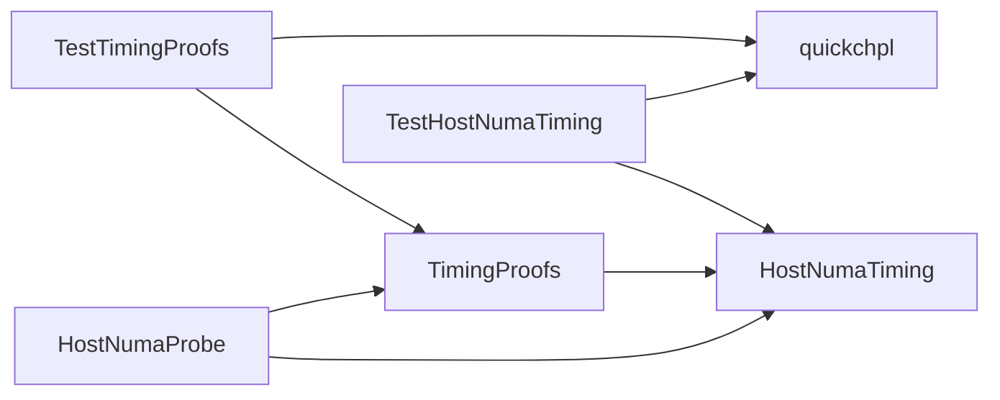
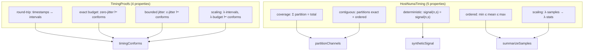
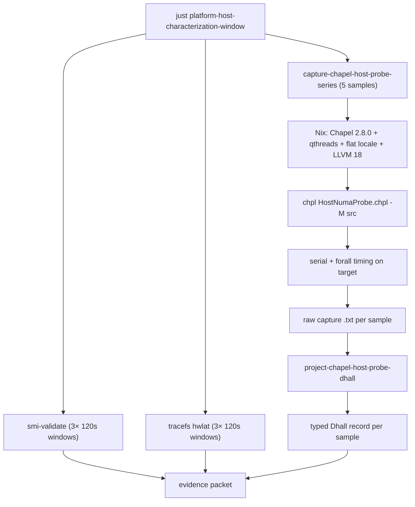

As part of my descent into multiprocessor kernel timing madness and claiming anything about kernel scheduling, I wanted a typed, repeatable characterization of the host's parallel behavior.


The tool choices follow from the problem shape:

- [Chapel](https://chapel-lang.org/) for the probe (first-class `forall` parallelism, NUMA-aware data distribution))
- [quickchpl](https://github.com/jesssullivan/quickchpl) Hey look, this cool person named `Jess Sullivan` wrote this handy library for property-based testing in Chapel language, how else would I structure timing invariants?
- [Dhall](https://dhall-lang.org/) for typed evidence records (go read [Gabby's blog](https://haskellforall.com/))
- [Nix](https://nixos.org/) for hermetic compiler sourcing, of course ^w^




## Probing


[`HostNumaProbe.chpl`](https://github.com/Jesssullivan/Dell-7810/blob/main/analysis/examples/HostNumaProbe.chpl) is ~94 lines. It partitions synthetic channel data across NUMA nodes, then measures serial versus parallel reduction:


```text
use Time;
use HostNumaTiming;
use TimingProofs;

config const numChannels = 100;
config const numSamples = 250 * 10;
config const sampleRateHz = 250;
config const partitions = 2;
```

The `config const` declarations are Chapel's mechanism for runtime-configurable parameters -- compile once, vary at invocation. `250 * 10` samples at 250 Hz gives a 10-second synthetic EEG window.

Data generation uses `forall` to distribute across cores:

```text
var data: [0..<numChannels, 0..<numSamples] real;
forall ch in 0..<numChannels {
  const signal = syntheticSignal(numSamples, ch);
  for s in 0..<numSamples do
    data[ch, s] = signal[s];
}
```

The timing surface is a serial/parallel comparison. Serial is a single-threaded nested loop; parallel distributes the outer loop via `forall`:

```text
var serialTimer = new stopwatch();
serialTimer.start();
var serialTotal: real = 0.0;
for ch in 0..<numChannels {
  for s in 0..<numSamples do
    serialTotal += abs(data[ch, s]);
}
serialTimer.stop();

var parallelTimer = new stopwatch();
parallelTimer.start();
var channelTotals: [0..<numChannels] real;
forall ch in 0..<numChannels {
  var total: real = 0.0;
  for s in 0..<numSamples do
    total += abs(data[ch, s]);
  channelTotals[ch] = total;
}
```

Chapel's `forall` is not `#pragma omp parallel for`. It is a first-class parallel iterator that the compiler can map to the locale model's task layer. Under the flat locale model (`CHPL_LOCALE_MODEL=flat`), all 32 threads share one locale, and `forall` distributes across task-parallel threads. Under a NUMA-aware locale model, channel partitions can be aligned to socket-local memory.

## The type surface

Three modules, ~290 lines total. The core types in [`HostNumaTiming.chpl`](https://github.com/Jesssullivan/Dell-7810/blob/main/analysis/src/HostNumaTiming.chpl):

```text
record Partition {
  var start: int;
  var count: int;
}

record TimingStats {
  var minSeconds: real;
  var maxSeconds: real;
  var meanSeconds: real;
  var samples: int;
}
```

`partitionChannels` distributes channels across partitions with remainder handling:

```text
proc partitionChannels(numChannels: int, partitions: int): [0..<partitions] Partition {
  var parts: [0..<partitions] Partition;
  const base = numChannels / partitions;
  const remainder = numChannels % partitions;
  var offset = 0;
  for i in 0..<partitions {
    const count = base + (if i < remainder then 1 else 0);
    parts[i] = new Partition(start = offset, count = count);
    offset += count;
  }
  return parts;
}
```

The conformance predicate in [`TimingProofs.chpl`](https://github.com/Jesssullivan/Dell-7810/blob/main/analysis/src/TimingProofs.chpl):

```text
record TimingBudget {
  var targetPeriodSeconds: real;
  var maxJitterSeconds: real;
  var maxLatencySeconds: real;
}

proc timingConforms(intervals: list(real), budget: TimingBudget): bool {
  if budget.targetPeriodSeconds < 0.0 then return false;
  if budget.maxJitterSeconds < 0.0 then return false;
  if budget.maxLatencySeconds < 0.0 then return false;
  if intervals.size == 0 then return true;
  return maxAbsDeviation(intervals, budget.targetPeriodSeconds)
           <= budget.maxJitterSeconds + 1e-12
      && worstCase(intervals) <= budget.maxLatencySeconds + 1e-12;
}
```

This is the kind of predicate that benefits from PBT: the `1e-12` epsilon, the edge cases around empty intervals and negative budgets, the interaction between max-deviation and worst-case constraints.

## Property-based testing for greatness

```text
use quickchpl;
use TimingProofs;

var roundTrip = property("monotonic timestamps round-trip to intervals",
  listGen(realGen(0.0, 0.05), 1, 128),
  proc(intervals: list(real)): bool {
    const timestamps = timestampsFromIntervals(intervals);
    const recovered = intervalsFromTimestamps(timestamps);
    if !isMonotonicNondecreasing(timestamps) then return false;
    if recovered.size != intervals.size then return false;
    for i in 0..<intervals.size {
      if !approxEqual(recovered[i], intervals[i]) then return false;
    }
    return true;
  });
var r1 = check(roundTrip, 200);
```

The generator `listGen(realGen(0.0, 0.05), 1, 128)` produces lists of 1-128 non-negative reals -- synthetic inter-sample intervals. The property verifies that `intervalsFromTimestamps` is a left inverse of the timestamp constructor.

The scaling invariant is the most interesting:

```text
var scalingInvariant = property("scaling intervals and budget preserves conformance",
  tupleGen(
    realGen(2.0, 256.0),   // sample count
    realGen(0.004, 0.02),  // period
    realGen(0.0, 1.0),     // jitter fraction
    realGen(0.1, 10.0),    // scale factor
    realGen(0.0, 10000.0)  // seed
  ),
  proc(args: (real, real, real, real, real)): bool {
    // ... generate jittered timestamps, scale both intervals and budget ...
    return timingConforms(intervals, budget)
        && timingConforms(scaledIntervals, scaledBudget);
  });
```

If `timingConforms(intervals, budget)` holds, then scaling both the intervals and the budget by the same positive factor should preserve conformance. This catches unit-conversion bugs and numerical edge cases in the epsilon handling, which is terrific 👍

From [`TestHostNumaTiming.chpl`](https://github.com/Jesssullivan/Dell-7810/blob/main/analysis/test/TestHostNumaTiming.chpl), the partition properties:

```text
var partitionCoverage = property("partition coverage equals channel total",
  tupleGen(
    listGen(realGen(-1.0, 1.0), 0, 512),
    realGen(1.0, 16.0)
  ),
  proc(args: (list(real), real)): bool {
    const (channels, groupApprox) = args;
    const groups = max(1, min(16, groupApprox: int));
    const parts = partitionChannels(channels.size, groups);
    return totalCovered(parts) == channels.size;
  });

var partitionContiguous = property("partitions are contiguous and exact",
  // ... same generator shape ...
  proc(args: (list(real), real)): bool {
    // ...
    return coversExactly(parts, channels.size);
  });
```

`coversExactly` checks that partitions are contiguous, non-negative, and sum to the total. Together with coverage, these two properties establish that `partitionChannels` is a correct partition function for any channel count and group count in range.



## Projection for cleanliness

Each probe run is projected into a typed [Dhall](https://dhall-lang.org/) record via [`ChapelHostProbeRun.dhall`](https://github.com/Jesssullivan/Dell-7810/blob/main/dhall/types/ChapelHostProbeRun.dhall). The type carries metadata (date, host, compiler, kernel), configuration (locale count, channels, samples, sample rate, partitions), results (timing conforms, jitter stats), and performance (serial time, parallel time, speedup ratio). A separate [`KernelValidationRun.dhall`](https://github.com/Jesssullivan/Dell-7810/blob/main/dhall/types/KernelValidationRun.dhall) type covers kernel validation captures.

The pipeline is one command:

```bash
just platform-host-characterization-window \
  target=jess@honey \
  tag=generic-repeat-2026-04-26 \
  expect_lane=generic \
  smi_samples=3 smi_duration=120 \
  hwlat_duration=120 chapel_samples=5
```

This captures SMI counts, tracefs `hwlat` windows, five Chapel probe runs, and projects each into a Dhall record. The Nix derivation for [Chapel 2.8.0](https://github.com/Jesssullivan/Dell-7810/blob/main/nix/packages/chapel.nix) pins the compiler, task model (`qthreads`), locale model (`flat`), and LLVM version (18).




## Measurements; kinda meh but is repeatable; without this

The host runs two kernel lanes from [linux-xr](https://github.com/tinyland-inc/linux-xr) (my Rocky 10 kernel carry with [DRM patches](https://gitlab.freedesktop.org/drm/misc/kernel.git) and a variety of other stuff for the Bigscreen Beyond headset and related toys):

- **Generic**: `6.19.5-7.xr.el10` (`PREEMPT_DYNAMIC`)
- **RT**: `6.19.5-rt1-8.xr.el10` (`PREEMPT_RT`)

Both lanes share the same `isolcpus`, `nohz_full`, `irqaffinity`, and `tsc=nowatchdog` cmdline posture.

### Generic repeat (five samples)

| Metric | Min | Max | Mean | Stdev |
| --- | ---: | ---: | ---: | ---: |
| Serial | 0.021841s | 0.027597s | 0.023822s | 0.002590s |
| Parallel | 0.001768s | 0.002382s | 0.001962s | 0.000249s |
| Ratio | 9.3375x | 14.1814x | 12.2760x | 1.8093x |

SMI: 280, 279, 279 per 120s (~2.3/s). Tracefs `hwlat`: 0 us max across all windows. Load average rose from ~8 to ~18 across samples -- this is characterization under lab load, not an idle benchmark.

### RT repeat (five samples)

| Metric | Min | Max | Mean | Stdev |
| --- | ---: | ---: | ---: | ---: |
| Serial | 0.022144s | 0.023715s | 0.022862s | 0.000690s |
| Parallel | 0.001726s | 0.016977s | 0.005033s | 0.006683s |
| Ratio | 1.3617x | 12.8297x | 9.3204x | 4.6220x |

SMI: 279, 279, 278 per 120s (unchanged). Tracefs `hwlat`: 2, 2, 14 us (one threshold crossing). All five samples conform to the timing predicate, but sample 2 collapsed to 1.3617x -- the parallel path took 16.977ms instead of the typical ~1.8ms.

### Per-sample comparison

```mermaid
xychart-beta
  title "Characterization Ratio (serial / parallel) by Sample"
  x-axis ["S1", "S2", "S3", "S4", "S5"]
  y-axis "Ratio" 0 --> 16
  bar "Generic" [13.18, 14.18, 12.33, 12.35, 9.34]
  bar "RT" [12.24, 1.36, 9.87, 10.30, 12.83]
```



The generic lane holds between 9x and 14x. The RT lane's sample 2 is the story: 1.36x while every other sample is 9x+. That outlier drove the RT parallel mean to 5.033ms (generic: 1.962ms) and inflated stdev from 1.81x to 4.62x.

```mermaid
xychart-beta
  title "Parallel Reduction Time (ms) by Sample"
  x-axis ["S1", "S2", "S3", "S4", "S5"]
  y-axis "Parallel ms" 0 --> 18
  bar "Generic" [1.93, 1.95, 1.78, 1.77, 2.38]
  bar "RT" [1.81, 16.98, 2.35, 2.30, 1.73]
```



Serial times (not shown) are nearly identical across both lanes (~22-27ms). The parallel path is where PREEMPT_RT's sleeping-lock conversion costs show up.

[Raw CSV](https://github.com/Jesssullivan/Dell-7810/blob/main/docs/publication/data/honey-generic-rt-repeat-packet-2026-04-26.csv).

### What the RT result means

PREEMPT_RT converts spinlocks to sleeping mutexes and threads interrupt handlers. The parallel degradation (serial unchanged, parallel slower and more variable) is the expected cost of that conversion on a NUMA-aware `forall` workload. The [RT necessity analysis](https://github.com/Jesssullivan/Dell-7810/blob/main/docs/research/rt-necessity-analysis-2026-04-26.md) in the repo has the full reasoning.

RT is still available as insurance for specific deadline-sensitive paths -- audio buffer underruns at low sample counts, or BCI callback timing if we ever need sub-millisecond guarantees. The [linux-xr](https://github.com/tinyland-inc/linux-xr) kernel carries both lanes, and the host can one-shot boot into RT and return to generic with a validated fallback. But the current evidence says the generic lane with `isolcpus` + `SCHED_FIFO` is the stronger default for a mixed GPU + audio + Chapel + Kubernetes workload.

## What's next for me and the Dell ^w^

- **Targeted isolation**: `SCHED_FIFO` on isolated cores for audio/BCI threads, then measure actual deadline behavior on the generic lane
- **publish and manufacture the Dell hardware mods**: at somepoint I'll get around to this, still cleaning up loose ends
- **Audio/BCI I/O packet**: period, buffer, quantum, xrun evidence -- the real latency-sensitive workload, not a proxy
- **XR frame timing**: `xrWaitFrame` histograms via Monado (this is [XoxDWM](https://github.com/Jesssullivan/XoxdWM)-owned, not Dell)
- **Fresh quickchpl run**: the nine properties need a current pass for paper citation, ofc
- **Fan and enclosure**: the T7810 thermal path is [its own workstream](https://github.com/Jesssullivan/Dell-7810/blob/main/docs/research/t7810-fan-and-airflow-prior-art-2026-04-22.md)

---

The [Dell-7810](https://github.com/Jesssullivan/Dell-7810) repo which may or may not be public at the time of reading contains hardware specifics, as well as my OpenSCAD drawings and measurements for the physical modification work.  To recap, the Dell 7810 itself has two Xeon E5-2630 v3 (Haswell), 32 threads, two NUMA nodes.  It is, as described before, considerably hacked up- (running two power supplies at ~2kw mean draw, an AMD RX 9070 XT, a few hundred channels 96khz AD/DA I/O, a NUT power monitor and an RKE2 cluster) as well as hosting a wide variety of BCI/XR experiments (Open BCI, ganglion, mouth trackers, eye trackers) along with [OpenXR](https://registry.khronos.org/OpenXR/specs/1.1/man/html/XrFrameState.html), BS2e goggles, my special linux-xr kernel iterations, the `xoxdwm` stack, [Monado](https://monado.freedesktop.org/getting-started.html), just silly girlie things. ^w^


Cheers all and merry springtime,
-Jess
