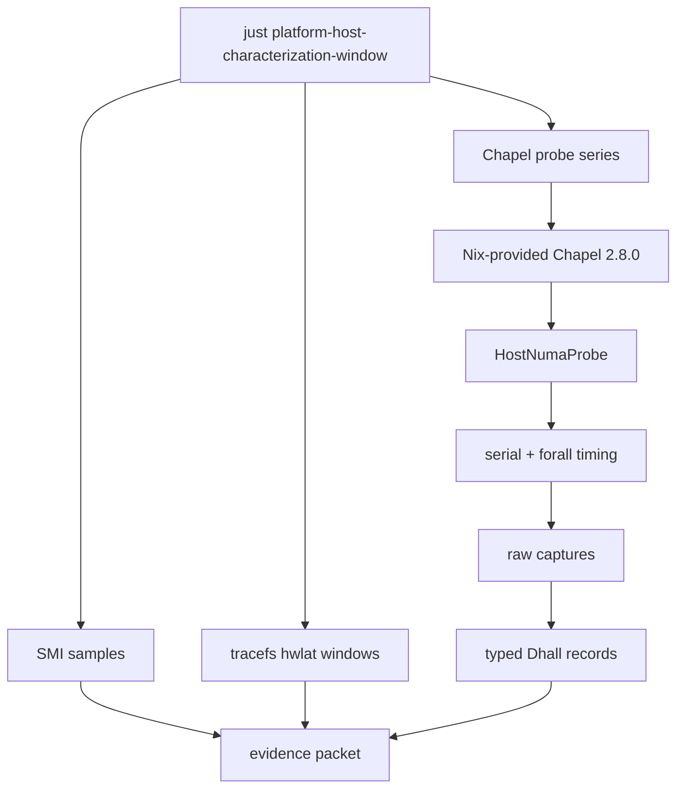
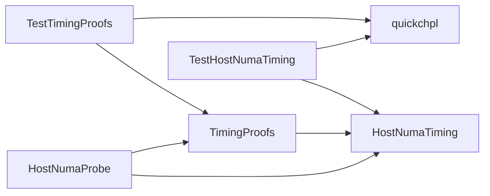

I was trying to make a real-time kernel story behave.

That was probably the first mistake.

The machine is a Dell Precision T7810 that I have been slowly turning into a very strange BCI/XR workstation -- two Xeon E5-2630 v3 CPUs, 32 hardware threads, two NUMA nodes, a too-large GPU, too much audio I/O, a Linux kernel carry for headset work, and enough cabling to make the back of the desk look like a tiny datacenter having a personal crisis.

Useful. Questionable. Mine.

The tempting story was simple: boot the PREEMPT_RT kernel, run the probe, publish the better timing numbers, huzzah.

...and then I measured it.

## The Boring Part That Was Not Boring

Before I can say anything interesting about XR frame timing, audio buffers, BCI callbacks, or "real-time" anything, I need the host itself to stop being folklore. I need the boring characterization packet -- the one with the kernel lane, the SMI counts, the bounded hardware-latency window, the compiler path, the probe output, and the raw numbers sitting somewhere I can point at later without waving my hands.

So I built that.

The probe is written in [Chapel](https://chapel-lang.org/), because Chapel gives me a very direct way to express the thing I care about here: a simple serial reduction beside a `forall` parallel reduction over synthetic channel data. The records are projected through [Dhall](https://dhall-lang.org/) because I wanted typed evidence instead of another pile of heroic text files. [Nix](https://nixos.org/) pins the compiler path. A small Chapel property-based test layer checks the partition and timing predicates.

A lot of machinery for one question.

But that question matters.



The command is not magic. It is intentionally not magic:

```bash
just platform-host-characterization-window \
  target=jess@honey \
  tag=generic-repeat-2026-04-26 \
  expect_lane=generic \
  smi_samples=3 smi_duration=120 \
  hwlat_duration=120 chapel_samples=5
```

That captures three 120-second SMI windows, three 120-second hardware-latency windows, five Chapel probe samples, and a manifest tying the whole packet back to the host and kernel lane.

Dry. Delightful.

## Why Chapel

The core probe is small. The point is not to benchmark every possible thing this workstation can do -- the point is to get one repeatable, typed workload that exercises the host's parallel path in a way I can run on both kernel lanes.

Here is the shape of it:

```text
var serialTotal: real = 0.0;
for ch in 0..<numChannels {
  for s in 0..<numSamples do
    serialTotal += abs(data[ch, s]);
}

var channelTotals: [0..<numChannels] real;
forall ch in 0..<numChannels {
  var total: real = 0.0;
  for s in 0..<numSamples do
    total += abs(data[ch, s]);
  channelTotals[ch] = total;
}
```

Serial pass. Parallel pass.

Same synthetic data. Same number of channels. Same sample window. The interesting part is the ratio between the two paths, and how much that ratio wobbles when the kernel lane changes underneath it.

The support modules are similarly plain. One module partitions channels. One summarizes timing samples. One holds timing predicates. This is the part where I had to resist my natural urge to make the framework too clever (a dubious urge, but a persistent one), because the evidence is more useful when the code is boring enough to audit.



The property tests are there for the annoying edge cases -- empty timing lists, negative budgets, partition remainders, scaling invariants, and all the other little places where "obvious" timing code grows teeth.

For example:

```text
var scalingInvariant = property(
  "scaling intervals and budget preserves conformance",
  tupleGen(
    realGen(2.0, 256.0),
    realGen(0.004, 0.02),
    realGen(0.0, 1.0),
    realGen(0.1, 10.0),
    realGen(0.0, 10000.0)
  ),
  proc(args: (real, real, real, real, real)): bool {
    return timingConforms(intervals, budget)
        && timingConforms(scaledIntervals, scaledBudget);
  });
```

If a timing budget and a set of intervals conform, scaling both by the same positive factor should preserve that relationship. That sounds obvious until a unit conversion bug wanders through wearing a little hat.

Property tests are good for this.

## The Packet

I now have a matched first packet for the generic lane and the RT lane. It is still just one characterization packet, not the grand unified truth of this host, but it is enough to kill the easy story.

The two lanes:

- **Generic** -- `6.19.5-7.xr.el10`, `PREEMPT_DYNAMIC`
- **RT** -- `6.19.5-rt1-8.xr.el10`, `PREEMPT_RT`

Both use the same general isolation posture. Same Chapel probe. Same five-sample shape.

The generic lane looked boring in the best possible way:

| Metric | Min | Max | Mean | Stdev |
| --- | ---: | ---: | ---: | ---: |
| Serial | 0.021841s | 0.027597s | 0.023822s | 0.002590s |
| Parallel | 0.001768s | 0.002382s | 0.001962s | 0.000249s |
| Ratio | 9.3375x | 14.1814x | 12.2760x | 1.8093x |

SMI counts were `280`, `279`, and `279` across the 120-second windows. Tracefs `hwlat` stayed at `0 us`.

The RT lane did not give me the victory lap I was hoping for:

| Metric | Min | Max | Mean | Stdev |
| --- | ---: | ---: | ---: | ---: |
| Serial | 0.022144s | 0.023715s | 0.022862s | 0.000690s |
| Parallel | 0.001726s | 0.016977s | 0.005033s | 0.006683s |
| Ratio | 1.3617x | 12.8297x | 9.3204x | 4.6220x |

SMI counts were basically unchanged: `279`, `279`, and `278`. The `hwlat` windows recorded `2`, `2`, and `14 us`.

The serial path stayed almost identical.

The parallel path got weird.

```mermaid
xychart-beta
  title "Serial / Parallel Ratio by Sample"
  x-axis ["S1", "S2", "S3", "S4", "S5"]
  y-axis "Ratio" 0 --> 16
  bar "Generic" [13.18, 14.18, 12.33, 12.35, 9.34]
  bar "RT" [12.24, 1.36, 9.87, 10.30, 12.83]
```



Sample 2 on RT is the problem child. The parallel reduction took `16.977ms`, which dragged that sample down to `1.3617x` while the other RT samples were back in the expected 9x-12x neighborhood.

One outlier is not a universal law.

It is, however, a very useful thing to find before writing a triumphant post about RT.

```mermaid
xychart-beta
  title "Parallel Reduction Time by Sample"
  x-axis ["S1", "S2", "S3", "S4", "S5"]
  y-axis "Milliseconds" 0 --> 18
  bar "Generic" [1.93, 1.95, 1.78, 1.77, 2.38]
  bar "RT" [1.81, 16.98, 2.35, 2.30, 1.73]
```



That is the useful shape of the result: RT did not improve this Chapel proxy workload in this first matched packet. The RT lane still may be useful for a real deadline-sensitive path -- audio buffers, callback jitter, XR frame pacing, something with an actual deadline attached -- but this packet does not justify treating RT as the better default for the whole mixed workstation.

Tiny little sentence. Huge amount of saved nonsense.

## What I Think It Means

PREEMPT_RT is not a "make computer fast" button. It changes latency behavior by changing kernel preemption rules, threading interrupt handlers, and converting many spinlocks into sleeping locks. That can be exactly what you want for a deadline path, and it can also add overhead or variance to unrelated parallel work.

The Chapel probe is not the final workload.

It is a canary with a clipboard.

So my current read is conservative: the generic lane remains the default operating lane for this machine, and RT stays available as an intentional one-shot boot target when I have a workload that actually needs it. If an audio or BCI packet shows fewer deadline misses under RT, great. I will publish that. If it does not, also great. I would much rather be disappointed by a measurement than comforted by a slogan.

## The Evidence Trail

The public-facing data surface is intentionally boring:

- [summary CSV](https://github.com/Jesssullivan/Dell-7810/blob/main/docs/publication/data/honey-generic-rt-repeat-packet-2026-04-26.csv)
- [generic characterization packet](https://github.com/Jesssullivan/Dell-7810/blob/main/docs/platform/honey-generic-host-characterization-window-2026-04-26.md)
- [RT Chapel repeat packet](https://github.com/Jesssullivan/Dell-7810/blob/main/docs/platform/honey-rt-chapel-repeat-2026-04-26.md)
- [RT benefit decision framework](https://github.com/Jesssullivan/Dell-7810/blob/main/docs/publication/rt-benefit-decision-framework-2026-04-26.md)

The next packet should be the real workload, not a proxy: audio period and buffer evidence, BCI callback timing, or Monado/OpenXR frame timing. Something with a deadline. Something where RT can actually earn its keep.

Until then, the interesting result is the negative one.

I thought I was building a path to justify RT.

Instead I built a path to avoid lying about it.

Good.

-Jess
