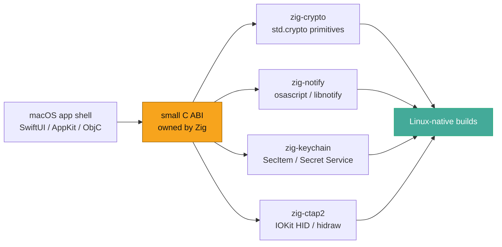
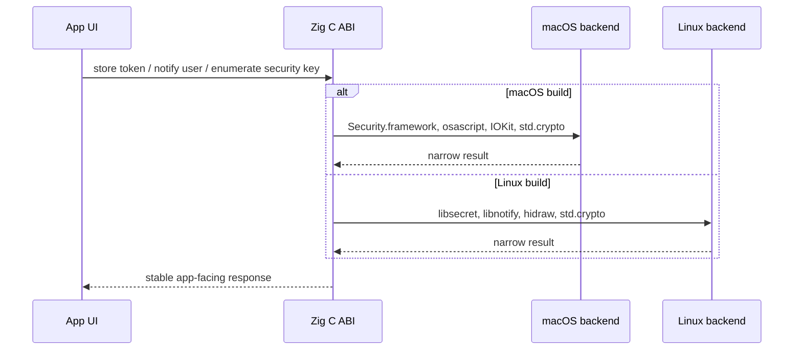

So here's the thing-

I keep running into the same shape of problem while working on macOS-first FOSS application code: the user interface layer is pleasant enough, the Swift/Objective-C bridge is usually tractable, and then one small "native" capability turns into a ball of Apple-specific assumptions that quietly decides where the whole app is allowed to run.

Crypto.

Notifications.

Keychain storage.

Hardware-backed auth.

None of these are the app. They are capabilities the app needs. And yet, if I let those call sites sprawl through the application layer, the Linux port stops being "replace the backend" and becomes "rewrite the software in a new ecosystem because the original one grew a framework-shaped skeleton."

...So I have been making lil Zig libraries.

## The rough idea

The current pattern is intentionally boring: build a small native library in Zig, expose a stable C ABI, keep the SwiftUI/AppKit/UIKit/Cocoa bits as the application shell on macOS, and make the native capability boundary portable enough that a Linux build can call the same conceptual surface without pretending to be an Apple app.

I have been calling this "de-attestation" in my planning notes, which is maybe a spicy phrase for a quiet engineering habit. I do **not** mean bypassing user consent, weakening platform policy, or sneaking around security prompts. I mean removing unnecessary coupling to Apple-only framework, entitlement, provisioning, and ecosystem assumptions when the actual capability can be expressed as a small native contract.

Or, more simply: keep the nice Mac app experience where it is nice, but stop making Linux inherit every Apple-shaped decision.

## The four libraries

| Library | What it owns | Apple-ish analog | Linux / portable path |
| --- | --- | --- | --- |
| [`zig-crypto`](https://github.com/Jesssullivan/zig-crypto) | Hashing, HMAC, AES-CBC, PBKDF2, P-256 ECDH, Ed25519, CSPRNG | CryptoKit, CommonCrypto, `SecRandomCopyBytes` | Zig `std.crypto`, no system crypto dependency |
| [`zig-notify`](https://github.com/Jesssullivan/zig-notify) | Local desktop notifications | `UNUserNotificationCenter`, AppleScript notification calls | libnotify over D-Bus |
| [`zig-keychain`](https://github.com/Jesssullivan/zig-keychain) | Generic secret storage | Keychain Services `SecItemAdd`, `SecItemCopyMatching`, `SecItemDelete` | Secret Service / libsecret |
| [`zig-ctap2`](https://github.com/Jesssullivan/zig-ctap2) | External authenticator CTAP2 over USB HID | AuthenticationServices-adjacent passkey/authenticator flows, IOKit HID access | hidraw and a direct CTAP2 stack |

Docs are live here:

- [`zig-crypto`](https://transscendsurvival.org/zig-crypto/)
- [`zig-notify`](https://transscendsurvival.org/zig-notify/)
- [`zig-keychain`](https://transscendsurvival.org/zig-keychain/)
- [`zig-ctap2`](https://transscendsurvival.org/zig-ctap2/)

The important part is not that Zig is magical. It is that Zig is a very good place to put a tiny, boring, native boundary that can be audited, cross-compiled, documented, and called from nearly anything that understands C.

Which is most things.

## How I use them

In my own application experiments, I am treating these as "do the native thing, but do not leak the ecosystem into the rest of the program" libraries.

The SwiftUI layer can still be SwiftUI. The Linux UI can be GTK, Qt, WebKit, a CLI, or something else entirely. The app code should not have to know that a token came from `SecItemCopyMatching` on one platform and Secret Service on another, or that a notification crossed `UNUserNotificationCenter`-ish territory on macOS and libnotify on Linux.

The app asks for a capability.

The C ABI answers.

The backend does the platform-specific work in one small place.

That is the bit I care about. The capability boundary becomes a thing I can package, test, and explain. The rest of the app gets to stay focused on being the app.

## What this is not

This is not a replacement for SwiftUI, AppKit, UIKit, Cocoa, GTK, Qt, WebKit, or any other application framework.

It is not a passkey policy engine.

It is not an attempt to clone Apple's whole developer experience in Zig, which sounds exhausting and also not especially useful.

It is a way to carve out the pieces that should not have been framework-shaped in the first place: crypto primitives, a notification call, a generic password store, a direct external authenticator path. Small stuff. Sharp stuff. Stuff that gets very annoying when it is smeared across the application.

## The parity gaps are real

This is the part I want to keep honest because it is where contributor work can be genuinely useful.

The libraries are at the "small C ABI is real" stage, not the "Swift developer ergonomics are polished" stage. The common gaps are straightforward:

- SwiftPM/modulemap smoke tests so Swift can import the headers cleanly.
- Objective-C sample code that shows the bridge without hand-waving.
- Header nullability annotations so Swift sees nicer optional boundaries.
- Migration examples from CryptoKit/CommonCrypto, UserNotifications, SecItem, and WebAuthn-ish request shapes.
- Packaging examples for distro-ish Linux environments.

There are good-first issues open across the repos for exactly this stuff:

- [`zig-crypto` good first issues](https://github.com/Jesssullivan/zig-crypto/labels/good%20first%20issue)
- [`zig-notify` good first issues](https://github.com/Jesssullivan/zig-notify/labels/good%20first%20issue)
- [`zig-keychain` good first issues](https://github.com/Jesssullivan/zig-keychain/labels/good%20first%20issue)
- [`zig-ctap2` good first issues](https://github.com/Jesssullivan/zig-ctap2/labels/good%20first%20issue)

The goal is not to claim perfect Swift/ObjC parity today. The goal is to make the missing pieces visible enough that someone can pick one up, make it better, and not need to reverse-engineer the whole direction from a private pile of planning notes.

## Why this matters to me

I want FOSS apps that can be lovely on macOS without becoming trapped there.

That is the whole itch.

The Apple ecosystem has terrific developer affordances, and it also has a way of turning ordinary application capabilities into distribution, entitlement, signing, and framework commitments that follow the code around forever. Sometimes that is the right trade. Sometimes it is just inertia with nice documentation.

For the software I want to build, I want a different default: SwiftUI can be the Mac face, Linux can have a native face, and the native capability layer between them can be small enough to understand.

Zig is a pretty good screwdriver for that.

-Jess
