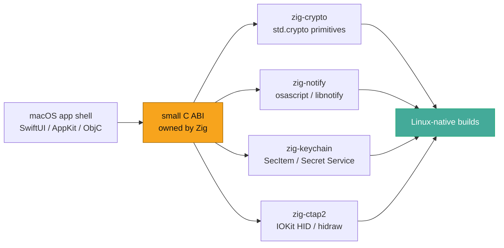
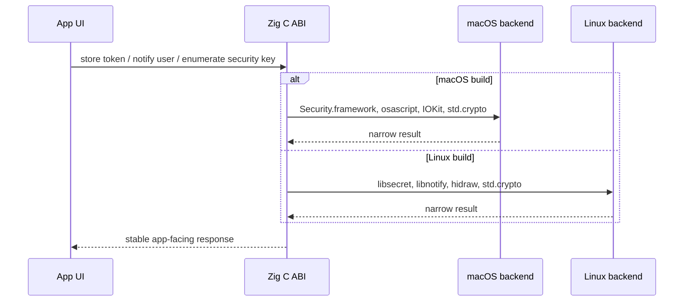

I've bumped into this quandry a few times, most recently in an ongoing side quest to fully port cmux emulator and multiplexer to a wide array of popular Linux distrobutions- [I'd *love* help QAing these for a proper release, much to do](https://github.com/Jesssullivan/cmux/issues?q=is%3Aissue%20state%3Aclosed).  

The pattern is pretty boring, it is more exciting in my head I guess: build a small native library in Zig, expose a stable C ABI, keep the SwiftUI/AppKit/UIKit/Cocoa bits as the application shell on macOS, and make the native capability boundary portable enough that a Linux build can call the same conceptual surface without pretending to be an Apple app.

I have been calling this "de-attestation" work as these 4 libraries represent structures require signed apple attestations to build, package and distribute; by snipping these stuctures out, I can retain the SwitftUI core toolchain and compilation structures for application itself, disabiguating only for target specific operations, such as CTAP2, DE notifications, Crypto etc. This does not mean weakening platform policy, the structures are still signable and attestable using normal GPG signatories. ^w^

| Library | What it owns | Apple-ish analog | Linux / portable path |
| --- | --- | --- | --- |
| [`zig-crypto`](https://github.com/Jesssullivan/zig-crypto) | Hashing, HMAC, AES-CBC, PBKDF2, P-256 ECDH, Ed25519, CSPRNG | CryptoKit, CommonCrypto, `SecRandomCopyBytes` | Zig `std.crypto`, no system crypto dependency |
| [`zig-notify`](https://github.com/Jesssullivan/zig-notify) | Local desktop notifications | `UNUserNotificationCenter`, AppleScript notification calls | libnotify over D-Bus |
| [`zig-keychain`](https://github.com/Jesssullivan/zig-keychain) | Generic secret storage | Keychain Services `SecItemAdd`, `SecItemCopyMatching`, `SecItemDelete` | Secret Service / libsecret |
| [`zig-ctap2`](https://github.com/Jesssullivan/zig-ctap2) | External authenticator CTAP2 over USB HID | AuthenticationServices-adjacent passkey/authenticator flows, IOKit HID access | hidraw and a direct CTAP2 stack |

Docs are live here:

- [`zig-crypto`](https://transscendsurvival.org/zig-crypto/)
- [`zig-notify`](https://transscendsurvival.org/zig-notify/)
- [`zig-keychain`](https://transscendsurvival.org/zig-keychain/)
- [`zig-ctap2`](https://transscendsurvival.org/zig-ctap2/)

Zig not any more suited to this than Rust, C3, Odin or Hare perse, this is just the screwdriver I've adopted for tiny, native boundary code that can be audited, cross-compiled, documented, and called from nearly anything that understands C, which is most things.

#### These are not library / SwitUI ecosystem complete; stuff I have to aide in continued expansion:
- SwiftPM/modulemap smoke tests so Swift can import the headers cleanly.
- Objective-C sample code that shows the bridge without hand-waving.
- Header nullability annotations so Swift sees nicer optional boundaries.
- Migration examples from CryptoKit/CommonCrypto, UserNotifications, SecItem, and WebAuthn-ish request things.
- Packaging examples for distro-ish Linux environments.

Huzzah,
-Jess
