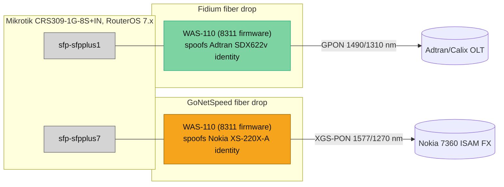
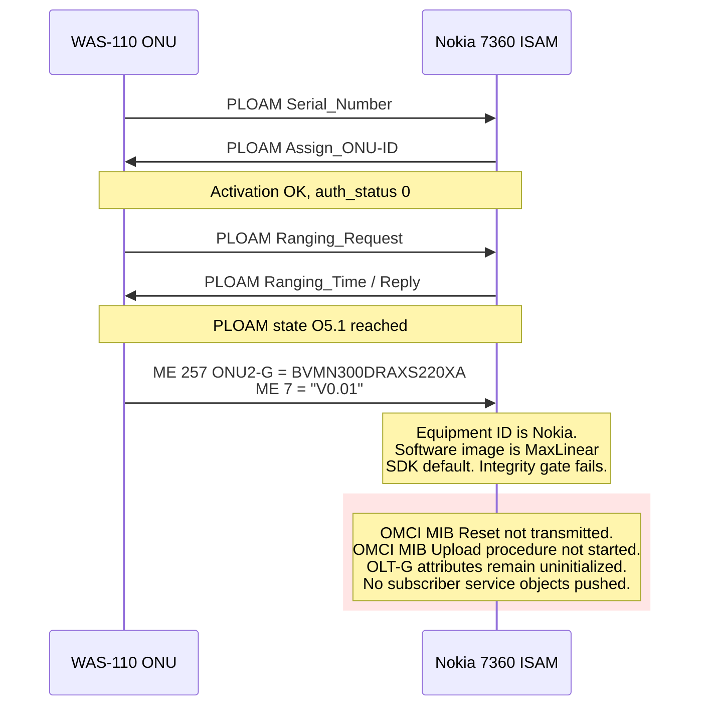
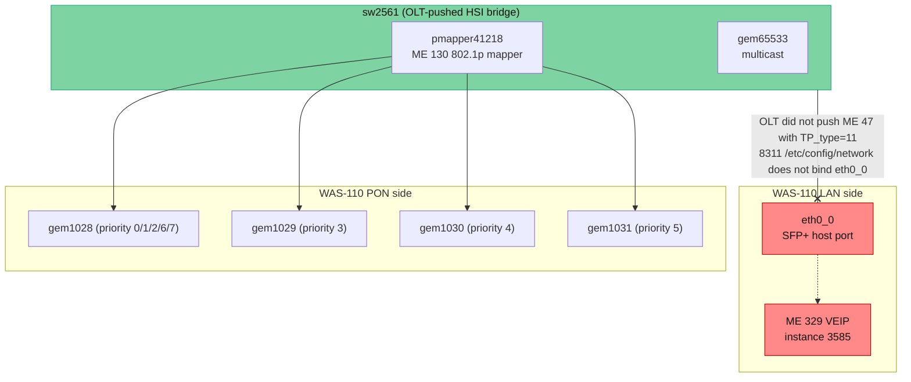

Lets take an adventure in comfort hacking, exploring and ultimately configuring two fiber ISP uplinks — Fidium and GoNetSpeed — through [BFW Solutions WAS-110](https://pon.wiki/xgs-pon/ont/bfw-solutions/was-110/) [\[1\]](#ref-1) XGS-PON SFP+ ONT modules.

## Index

- [Topology](#Topology)
- [Identity](#Identity)
- [GoNetSpeed is fun and interesting](#GoNetSpeed-is-fun-and-interesting)
- [Version seeding & sw string evolution](#sw-version-seeding)
- [VEIP Time](#veip-time)
- [Linux Bridging](Try-bridging)
- [Persistence: `8311_persist_root` and the U-Boot `bootcmd`](#8-persistence-8311_persist_root-and-the-u-boot-bootcmd)
- [Fidium](Fidium-was-a-piece-of-cake)
- [References](#references)

## Topology



Both modules run my local fork of [8311 community firmware](https://github.com/djGrrr/8311-was-110-firmware-builder) [\[2\]](#ref-2), an OpenWrt-derived alternative firmware for the [MaxLinear PRX300](https://www.maxlinear.com/product/optical-data-center-interconnects/optical-fiber-modules/prx300-family) [\[4\]](#ref-4) System-on-Chip inside the WAS-110. The 8311 firmware exposes the OMCI [\[5\]](#ref-5) service-model attributes through U-Boot environment (`fwenv`) variables prefixed `8311_`.


## Identity

Both ISPs authenticate at the PLOAM (Physical Layer OAM) layer using the original ONT's serial number.  I record the serial, MAC, and hardware part number into a SOPS-encrypted [\[7\]](#ref-7) vault, then disconnect the operator ONT and insert the WAS-110 with the recorded identity values. The OLT sees the same PON serial it was provisioned to expect and accepts the new ONT into PLOAM state O5.1 [\[8\]](#ref-8).

The relevant 8311 `fwenv` keys for the identity write:

```yaml
# All values are loaded from a SOPS-encrypted vault at apply time.
gpon_sn:        "{{ vault_pon_serial }}"     # 4-char ASCII vendor + 4 hex bytes
iphost_mac:     "{{ vault_ont_mac }}"        # MAC for the in-ONT IP host (ME 134)
vendor_id:      "ALCL"                        # Alcatel-Lucent / Nokia, or ADTN for Adtran
equipment_id:   "BVMN300DRAXS220XA"           # Per-vendor CLEI + model, or per Adtran QRG
hw_ver:         "3TN00617AAAA"                # Hardware revision string
mib_file:       "/etc/mibs/prx300_1V_bell.ini"
pon_slot:       10
pon_mode:       "xgspon"
fix_vlans:      1
internet_vlan:  0
```

For both ISPs, the SOPS vault stores the values from the original ONT's label.  Ansible roles apply them through a guarded writer that backs up the existing `fwenv`, applies the overlay, syncs the U-Boot environment partition, and reboots. Live MAC drift on a working module is treated as observed-only; the role refuses to rewrite a MAC unless two explicit approval flags are set.

## GoNetSpeed is much more interesting

GoNetSpeed installed a Nokia XS-220X-A ONT [\[9\]](#ref-9) I think.
PLOAM converged to O5.1 in about 60 seconds. Authentication status was 0, FEC was operational both directions, BIP errors were 0, no PON alarms, but also no traffic IO 👀

A read-only baseline OMCI dump made the diagnosis obvious. The first artifact to look at is ME 7 (Software Image), instance 0:

```text
Class ID    = 7 (Software image)
Instance ID = 0
-------------------------------------------------------------------------------
 1 Version                      14b STR  R------P--
   0x56 0x30 0x2e 0x30 0x31 0x00 0x00 0x00 0x00 0x00 0x00 0x00 0x00 0x00
   V0.01\x00\x00\x00\x00\x00\x00\x00\x00\x00
 2 Is committed                  1b UINT R---------
   0x01 (1)
 3 Is active                     1b UINT R---------
   0x01 (1)
```

`V0.01` is the MaxLinear PRX300 SDK default software-image string [\[4\]](#ref-4).

```text
$ fw_printenv | grep '^8311_sw_ver'
## Error: "8311_sw_verA" not defined <-- we need these, actually
## Error: "8311_sw_verB" not defined
```

Without an operator-supplied software-image string, ME 7 reports the SDK default. The corresponding ME 131 (OLT-G) attributes were uniformly empty:

```text
Class ID    = 131 (OLT-G)
Instance ID = 0
-------------------------------------------------------------------------------
 1 OLT vendor id                 4b STR  RW-----P--
   0x20 0x20 0x20 0x20            (four ASCII space characters)
 2 Equipment id                 20b STR  RW-----P--
   0x20 0x20 0x20 0x20 0x20 0x20 0x20 0x20 0x20 0x20 0x20 0x20 0x20
   0x20 0x20 0x20 0x20 0x20 0x20 0x20  (twenty ASCII space characters)
 3 Version                      14b STR  RW-----P--
   0x20 ... (fourteen ASCII space characters)
 4 Time of day information      14b STR  RW--O--P--
   0x00 ... (fourteen null bytes)
```

ME 131 is allocated but uninitialized. The OLT has not yet completed the OMCI MIB Upload procedure. This is the OMCI handshake that did not happen:



**Figure 1.** OMCI handshake that did not occur during the fake-O5 baseline. PLOAM activation succeeds (lower part of the diagram); OMCI MIB initialization never begins because the ONU advertises a MaxLinear default software image inside an otherwise-Nokia identity envelope.

The OMCI-baseline capture script that produced these dumps is below — it builds a single SSH session that emits all the diagnostic MEs with sentinel markers for offline parsing:

<details>
<summary><strong>OMCI baseline capture script</strong> (Python, ~70 lines of relevant logic)</summary>

```python
# Read-only OMCI baseline. Captures the full populated-ME table plus the
# diagnostic MEs called out in the post. Output is written to
# /tmp/omci-<label>-<UTC-stamp>.txt for offline diff against later captures.

OMCI_VENDOR_GATE_ME = 131  # OLT-G; populated only after OMCI MIB Upload

OMCI_MES_OF_INTEREST = (
    ("ONU2-G_SW_IMG_7_BANK_A", 7, 0),     # active firmware image string
    ("ONU2-G_SW_IMG_7_BANK_B", 7, 1),     # alternate bank
    ("CIRCUIT_PACK_6_MAIN", 6, 256),      # vendor / hw_ver / serial
    ("ONU2-G_257", 257, 0),               # equipment_id
    ("ANI_G_263", 263, None),             # PON-side ANI
    ("UNI_G_264", 264, None),             # LAN-side UNI
    ("EXT_VLAN_TAGGING_84", 84, None),    # subscriber service: VLAN filter
    ("VLAN_TAG_FILTER_DATA_171", 171, None),
    ("IPHOST_DATA_134", 134, None),
    ("T_CONT_262", 262, None),
    ("GEM_IW_TP_268", 268, None),         # subscriber service: GEM CTPs
    ("GEM_NCTP_281", 281, None),
)


def me_query_command(class_id: int, instance_id: int | None) -> str:
    if instance_id is None:
        return (f"omci_pipe.sh meg {class_id} 0 2>&1 || "
                f"omcicli mib get {class_id} 2>&1 || true")
    return (f"omci_pipe.sh meg {class_id} {instance_id} 2>&1 || "
            f"omci_pipe.sh meadg {class_id} {instance_id} 1 2>&1 || true")


CAPTURE_SECTIONS = (
    ("OLT_VENDOR_ME_131",
        f"omci_pipe.sh meg {OMCI_VENDOR_GATE_ME} 0 2>&1 || true"),
    ("POPULATED_MES_md", "omci_pipe.sh md 2>&1 || true"),
    *((label, me_query_command(class_id, instance_id))
      for label, class_id, instance_id in OMCI_MES_OF_INTEREST),
    ("EXTVLAN_DECODE_T", "8311-extvlan-decode.sh -t 2>&1 || true"),
    ("PLOAM_STATE", "pon ploam_state_get 2>&1 || true"),
    ("PONTOP_STATUS", "pontop -b -g s 2>&1 || true"),
    ("PONTOP_GEM_STATUS",
        "pontop -b -g 'GEM/XGEM Port Status' 2>&1 || true"),
    ("PONTOP_GEM_COUNTERS",
        "pontop -b -g 'GEM/XGEM Port Counters' 2>&1 || true"),
    ("FWENV_8311", "fw_printenv 2>&1 | grep '^8311_' || true"),
)


def detect_olt_vendor(sections: dict[str, str]) -> str | None:
    """Return ALCL/NOKA/CXNK/ADTN/etc, or '<UNINITIALIZED>' if attribute 1
    is four space characters, or None if no parseable line was found."""
    body = sections.get("OLT_VENDOR_ME_131", "")
    in_attr1 = False
    for line in body.splitlines():
        stripped = line.strip()
        if stripped.startswith("1 OLT vendor id"):
            in_attr1 = True
            continue
        if in_attr1 and stripped.startswith("0x"):
            hex_bytes = [tok for tok in stripped.split() if tok.startswith("0x")]
            if len(hex_bytes) == 4 and all(b in ("0x20", "0x00") for b in hex_bytes):
                return "<UNINITIALIZED>"
        if in_attr1 and stripped:
            for token in ("ALCL", "NOKA", "CXNK", "ADTN", "TIBT", "EDGE"):
                if token in stripped:
                    return token
    return None
```

The full script wraps this in an SSH command with sentinel markers, parses the output back into per-section text, runs the redaction pass on `8311_*` `fwenv` values that contain secrets (PON serial, MAC), and writes the rendered diff baseline to `/tmp`.

</details>

## sw version seeding --> OLT software-download --> sw version evolution

The [pon.wiki Nokia XS-010X-Q masquerade guide](https://pon.wiki/guides/swap-out-the-nokia-xs-010x-q-for-a-small-form-factor-pluggable-was-110/) [\[11\]](#ref-11) names one publicly-confirmed-working software-image string for Nokia ONTs in the `3TN`-prefix family: `3TN00669AOCK59`. The corresponding `8311_fw_match` regex `(3TN[0-9A-Z]{11})$` accepts any 14-character firmware string with the `3TN` prefix.

Three `fwenv` writes plus a reboot:

```bash
fwenv_set -8 sw_verA   '3TN00669AOCK59'
fwenv_set -8 sw_verB   '3TN00669AOCK59'
fwenv_set -8 -b fw_match '(3TN[0-9A-Z]{11})$'
sync && reboot
```

The `-b` flag base64-encodes the regex (which contains `$` and parentheses); the OMCI handler decodes at runtime.

PLOAM came back, ME 7 reported `3TN00669AOCK59` correctly within five minutes, and the OMCI MIB still showed 122 entities and an uninitialized OLT-G. I figured I had the wrong value and started planning more experiments.

At T+15 minutes the second readback recorded **159 populated managed entities**. ME 131 OLT-G now reported vendor identifier `ALCL` (the Alcatel-Lucent/Nokia OMCI identifier) with a binary-encoded Nokia Broadband Devices version string. The new entities included MAC bridge service profiles (ME 45), bridge ports (ME 47 instances 41218 and 41227), VLAN tagging filter data (ME 84), an 802.1p mapper (ME 130 at instance 41218), four unicast Ethernet GEM interworking termination points (ME 266 at GEM IDs 1028, 1029, 1030, 1031), a multicast GEM (266 at 65533), GAL Ethernet (272), multicast operations profile (281, 309), CFM (305), and bridge-port ICMPv6 process objects (348).

Then I checked the `fwenv` to confirm `3TN00669AOCK59` was still set.  It wasn't:

```text
$ fw_printenv | grep '^8311_sw_ver'
8311_sw_verA=3TN00634HJLL88
8311_sw_verB=3TN00634HJLL88
```

The Nokia OLT had performed an OMCI Software Image Download — using the ITU-T G.988 Software Image management entities ME 240 (Software image entity), ME 244 (Software image download), and ME 245 (Software image activate / commit) [\[3\]](#ref-3) — and rewritten both `fwenv` keys to the OLT's planned-image value for this slot. ME 7 instances 0 and 1 both reported the new value:

```text
Class ID    = 7 (Software image)
Instance ID = 0
-------------------------------------------------------------------------------
 1 Version                      14b STR  R------P--
   0x33 0x54 0x4e 0x30 0x30 0x36 0x33 0x34 0x48 0x4a 0x4c 0x4c 0x38 0x38
   3TN00634HJLL88
 2 Is committed                  1b UINT R---------
   0x01 (1)
 3 Is active                     1b UINT R---------
   0x01 (1)
```

| Field | Initial | Operator-written seed | OLT-rewritten |
|---|---|---|---|
| `8311_sw_verA` | (absent) | `3TN00669AOCK59` | `3TN00634HJLL88` |
| `8311_sw_verB` | (absent) | `3TN00669AOCK59` | `3TN00634HJLL88` |
| ME 7 inst 0 attr 1 | `V0.01` (SDK default) | `3TN00669AOCK59` | `3TN00634HJLL88` |
| ME 7 inst 1 attr 1 | (zero-filled) | `3TN00669AOCK59` | `3TN00634HJLL88` |

**Table 1.** Software-image string evolution. The seed value's job was not to be the right value, only to be a syntactically valid `3TN`-family value sufficient to pass the OLT's regex integrity gate. Once the gate passed, the OLT pushed its planned image and the actual value became operator-side trivia.

This is documented Nokia ISAM behavior. The [Nokia 7360 ISAM ONT software-upgrade guide](https://netcamp.ch/guides/nokia/nokia-ont-software-upgrade-isam-7360) [\[12\]](#ref-12) describes the `sw-ver-pland` configuration: the operator pre-stages an ONT software profile per slot, and on registration the OLT triggers an OMCI Software Image Download to align the ONU's reported software version with the planned value. On a vendor-supplied Nokia ONT this manages the inactive flash bank. On the WAS-110 with `8311_override_active=A` and `8311_override_commit=A` keeping bank A stable, the ME 240/244/245 sequence does not produce a flash operation — the firmware persists the OLT-supplied version string into `fwenv` and reports it via OMCI without re-flashing.

I promoted `3TN00634HJLL88` into the reviewed identity profile after the fact, with its provenance recorded as `promoted_olt_revealed`. The seeded value is preserved in the profile's `superseded_attempts` history alongside two earlier failed values (`NOT_REQUIRED` and `3TN00634IJLJ05`).

A bound DHCP lease did not yet appear at this point. The OMCI service objects were live but the Layer-2 path from the LAN side to the OLT was still missing one piece, which is the next section.

## VEIP time

After the above experiment and value evolution, the Linux bridge state on the WAS-110 looked like this:

```text
$ bridge link show
19: pmapper41218@pon0: <BROADCAST,MULTICAST,UP,LOWER_UP,M-DOWN> mtu 1500
    master sw2561 state forwarding priority 32 cost 100 learning_limit -1
24: gem65533@pon0: <BROADCAST,MULTICAST,UP,LOWER_UP,M-DOWN> mtu 1500
    master sw2561 state forwarding priority 32 cost 100 learning_limit -1
```

Two bridge members in `sw2561` (the kernel representation of the OMCI MAC bridge created by ME 45 instance 2561): the 802.1p mapper, and the multicast GEM. The LAN-side Ethernet UNI — the kernel device `eth0_0`, which corresponds to the SFP+ host port physically connected to the CRS309 — was not a member of any bridge:

```text
$ ip -o link show eth0_0
2: eth0_0: <BROADCAST,MULTICAST,UP,LOWER_UP> mtu 1982 qdisc prio
    state UNKNOWN mode DEFAULT group default qlen 1000
    link/ether <REDACTED-WAS110-LAN-MAC> brd ff:ff:ff:ff:ff:ff
```

ITU-T G.988 ME 47 (MAC Bridge Port Configuration Data) attribute 3 ("TP type") is an enumeration that selects the kind of Termination Point a bridge port is associated with [\[3\]](#ref-3). The relevant values:

| TP type | Associated TP class |
|---|---|
| 1 | ME 11 — PPTP Ethernet UNI |
| 3 | ME 130 — 802.1p mapper service profile |
| 5 | ME 266 — GEM interworking TP |
| 6 | ME 281 — Multicast GEM interworking TP |
| 11 | ME 329 — Virtual Ethernet Interface Point (VEIP) |

The OLT-pushed bridge has two ports: ME 47 instance 41218 with TP type 3 (pointing to the 802.1p mapper at ME 130 instance 41218) and ME 47 instance 41227 with TP type 5 (pointing to the multicast GEM at ME 266 instance 65533). It did **not** push a third bridge port with TP type 11 (VEIP). The Virtual Ethernet Interface Point at ME 329 instance 3585 exists in the MIB but is not bridged in:

```text
$ omci_pipe.sh meg 329 3585
Class ID    = 329 (Virtual Eth i/f point)
Instance ID = 3585
-------------------------------------------------------------------------------
 1 Administrative state          1b UINT RW--------
   0x00 (0)
 2 Operational state             1b UINT R--AO---N-
   0x00 (0)
```

VEIP is administratively unlocked and operationally enabled; huzzah! However, nothing reaches it.

The 802.1p mapper itself (ME 130 instance 41218) has a TP pointer attribute that should reference its upstream Termination Point — for a VEIP-style ONT, that would point at ME 329:

```text
$ omci_pipe.sh meg 130 41218 | head -5
Class ID    = 130 (802.1p mapper service pro)
Instance ID = 41218
-------------------------------------------------------------------------------
 1 TP ptr                        2b PTR  RWS-------
   0xffff (65535)
```

`0xffff` is the unset sentinel. Even if a VEIP bridge port existed, the mapper would have no upstream input. The `RWS` flag suggests runtime writability, but the firmware's OMCI handler rejects the obvious runtime fix:

```text
$ omci_pipe.sh meads 130 41218 1 0x0e01
errorcode=-12
```

`-12` is POSIX `EPERM`. The attribute is set-by-create only on this firmware. Only the OLT's MIB-create operation can populate it, and the OLT didn't.

The 8311 firmware compounds the gap. `/etc/config/network` declares `eth0_0` as a `device` but binds no `config interface` to it:

```text
config device 'uni1'
    option name 'eth0_0'
    option macaddr '<REDACTED-WAS110-LAN-MAC>'

config device 'eth0_0_2'
    option name 'eth0_0_2'
    option macaddr '<REDACTED-WAS110-LAN-MAC>'

# (no `config interface` block referencing eth0_0)

config interface 'lct'
    option ifname 'eth0_0_1_lct'
    option proto 'static'
    option ipaddr '192.168.11.1'
```

Only the LCT (Local Craft Terminal) sub-interface is bound to a logical interface. The 8311 firmware's design assumes the customer router will send VLAN-tagged Internet frames matching the configured `INTERNET_VLAN`, and that the corresponding sub-interface (`eth0_0_<N>`) will handle ingress. RouterOS sending plain untagged DHCPDISCOVER doesn't fit that model.

The `/usr/sbin/8311-fix-vlans.sh` script implements the VLAN translation:

```bash
internet_pmap_us_rules() {
    if [ "$INTERNET_VLAN" -ne 0 ]; then
        # Tagged ingress: rewrite VLAN ID to UNICAST_VLAN.
        tc_flower_add dev $INTERNET_PMAP egress handle 0x1 \
            protocol 802.1Q pref 1 flower vlan_id $INTERNET_VLAN \
            skip_sw action vlan modify id $UNICAST_VLAN \
            protocol 802.1Q pass &&
        tc_flower_add dev $INTERNET_PMAP egress handle 0x2 \
            protocol 802.1Q pref 2 flower skip_sw action drop &&
        tc_flower_add dev $INTERNET_PMAP egress handle 0x3 \
            protocol all pref 3 flower skip_sw action drop
    else
        # Untagged ingress: drop tagged; push UNICAST_VLAN onto everything else.
        tc_flower_add dev $INTERNET_PMAP egress handle 0x1 \
            protocol 802.1Q pref 1 flower skip_sw action drop &&
        tc_flower_add dev $INTERNET_PMAP egress handle 0x2 \
            protocol all pref 2 flower skip_sw \
            action vlan push id $UNICAST_VLAN priority 0 \
            protocol 802.1Q pass
    fi
}
```

With `INTERNET_VLAN=0` and the OLT-detected `UNICAST_VLAN=2`, the rules are correct: drop tagged frames egressing the bridge toward the mapper, push VLAN 2 onto untagged frames going the same direction. The traffic just doesn't reach the bridge in the first place because `eth0_0` is not a bridge member.

Forensic confirmation came from a 10-minute GEM port counter time-series during a CRS309 DHCP probe. The per-GEM delta:

| GEM ID | Type | Δ u/s pkts | Δ u/s bytes | Δ d/s pkts | Δ d/s bytes |
|---|---|---|---|---|---|
| 1 | OMCI | +3 | +144 | +2 | +96 |
| 1028 | Ethernet (unicast) | 0 | 0 | 0 | 0 |
| 1029 | Ethernet (unicast) | 0 | 0 | 0 | 0 |
| 1030 | Ethernet (unicast) | 0 | 0 | 0 | 0 |
| 1031 | Ethernet (unicast) | 0 | 0 | 0 | 0 |
| 65533 | Ethernet (multicast, downstream) | 0 | 0 | +1366 | +175388 |

**Table 2.** GEM port counter delta over a 10-minute soak with the CRS309 actively soliciting a DHCP lease. The OMCI management GEM has its bidirectional heartbeat. The multicast GEM accumulates significant downstream broadcast from the BNG (1366 packets in 10 minutes), confirming the OLT and BNG are operational. Zero upstream movement on any unicast Ethernet GEM: no DHCP DISCOVER from the CRS309 reaches the PON.

The intended bridge topology, with the missing edge marked:



**Figure 2.** OLT-pushed bridge topology with the missing LAN-side bridge port. The OLT created the bridge, the mapper, the GEMs, and the VLAN filter — but did not bind the LAN-side UNI to a bridge port. Combined with the 8311 firmware's omission of an `eth0_0` UCI interface binding, no Layer-2 path connects LAN-side ingress to the OLT-pushed bridge.

The GEM-counter monitor that produced Table 2 is below.

<details>
<summary><strong>GEM port counter time-series monitor</strong> (Python, ~50 lines of relevant logic)</summary>

```python
# Polls `pontop -b -g 'GEM/XGEM Port Counters'` over SSH at a fixed interval
# for a fixed duration. Writes a CSV time-series for offline analysis and
# prints a per-GEM start-vs-end delta at exit.

CSV_FIELDS = ("ts", "gem_id", "us_pkts", "us_bytes",
              "ds_pkts", "ds_bytes", "key_errors")

# pontop GEM/XGEM Port Counters row format:
#   GEM Index  GEM ID  u/s packets  u/s bytes  d/s packets  d/s bytes  Key Errors
#   0          1       300          14400      300          14400      0
GEM_ROW_RE = re.compile(
    r"^\s*(\d+)\s+(\d+)\s+(\d+)\s+(\d+)\s+(\d+)\s+(\d+)\s+(\d+)\s*$"
)


def parse_pontop_gem_counters(payload: str) -> list[dict[str, int]]:
    rows: list[dict[str, int]] = []
    for line in payload.splitlines():
        m = GEM_ROW_RE.match(line)
        if not m:
            continue
        idx, gem_id, us_pkts, us_bytes, ds_pkts, ds_bytes, key_errors = m.groups()
        rows.append({
            "gem_index": int(idx),
            "gem_id": int(gem_id),
            "us_pkts": int(us_pkts),
            "us_bytes": int(us_bytes),
            "ds_pkts": int(ds_pkts),
            "ds_bytes": int(ds_bytes),
            "key_errors": int(key_errors),
        })
    return rows


def render_delta_summary(first, last) -> list[str]:
    """Per-GEM (last - first) line-summary — reveals which GEMs moved
    real subscriber traffic during the observation window."""
    by_gem_first = {row["gem_id"]: row for row in first}
    by_gem_last = {row["gem_id"]: row for row in last}
    gem_ids = sorted(set(by_gem_first) | set(by_gem_last))
    lines = ["GEM ID | u/s d-pkts | u/s d-bytes | d/s d-pkts | d/s d-bytes"]
    for gem_id in gem_ids:
        f = by_gem_first.get(gem_id, {})
        l = by_gem_last.get(gem_id, {})
        d_us_pkts = l.get("us_pkts", 0) - f.get("us_pkts", 0)
        d_us_bytes = l.get("us_bytes", 0) - f.get("us_bytes", 0)
        d_ds_pkts = l.get("ds_pkts", 0) - f.get("ds_pkts", 0)
        d_ds_bytes = l.get("ds_bytes", 0) - f.get("ds_bytes", 0)
        lines.append(f"{gem_id:>6} | {d_us_pkts:>10} | {d_us_bytes:>11} | "
                     f"{d_ds_pkts:>10} | {d_ds_bytes:>11}")
    return lines
```

</details>

## Try bridging `eth0_0` directly?

The OMCI-layer write was rejected. The Linux-layer fix bypasses both the OLT-side omission and the 8311 firmware's omission by adding `eth0_0` directly to the OLT-pushed bridge:

```bash
ip link set eth0_0 master sw2561
```

The Linux bridging subsystem accepts the addition. The resulting bridge state:

```text
$ bridge link show
2: eth0_0: <BROADCAST,MULTICAST,UP,LOWER_UP> mtu 1982
    master sw2561 state forwarding priority 32 cost 2 learning_limit -1
19: pmapper41218@pon0: <BROADCAST,MULTICAST,UP,LOWER_UP,M-DOWN> mtu 1500
    master sw2561 state forwarding priority 32 cost 100 learning_limit -1
24: gem65533@pon0: <BROADCAST,MULTICAST,UP,LOWER_UP,M-DOWN> mtu 1500
    master sw2561 state forwarding priority 32 cost 100 learning_limit -1
```

Three bridge members. `eth0_0` is in `forwarding` state. Untagged frames arriving from the CRS309 traverse the bridge to `pmapper41218`, get tagged with VLAN 2 by the existing tc-flower egress rule, and enter the unicast Ethernet GEM corresponding to their 802.1p priority class.

The next 30-second GEM monitor sample, after re-running the CRS309 DHCP probe:

| GEM 1028 (unicast Ethernet) | T+0 | T+30s | Δ |
|---|---|---|---|
| Upstream packets | 24 | 27 | +3 |
| Upstream bytes | 2752 | 3802 | +1050 |
| Downstream packets | 0 | 3 | +3 |
| Downstream bytes | 0 | 1050 | +1050 |

**Table 3.** GEM 1028 counter delta across the bridge-add operation. Upstream byte count (1050 bytes / 3 packets ≈ 350 bytes/packet) is consistent with DHCP DISCOVER, REQUEST, and a follow-on ARP. Downstream is consistent with DHCP OFFER, ACK, and an ARP reply.

The CRS309 lease state:

```text
status=bound
address=ipv4/20
gateway=ipv4
dhcp-server=ipv4
primary-dns=8.8.8.8
secondary-dns=8.8.4.4
expires-after=8m30s
```

A separate proof had previously been captured by attaching the operator-supplied Nokia ONT directly to a different CRS309 SFP+ port and observing its DHCP handoff. The lease parameters — /20 prefix, gateway `<ipv4>`, DHCP server `<ipv4>` — match exactly. The WAS-110 with the bridge addition produces a customer-side handoff indistinguishable from the operator-supplied ONT.

## Persistence: `8311_persist_root` and the U-Boot `bootcmd`

`ip link set eth0_0 master sw2561` is a runtime kernel state change. It does not survive a reboot. The natural persistence location is `/etc/rc.local`, sourced by `/etc/init.d/done` at boot stage 95.

The first attempt wrote a sentinel-guarded snippet to `/etc/rc.local`. After a reboot the snippet was gone. `/overlay/upper/etc/rc.local` did not exist; the visible `/etc/rc.local` was the read-only `/rom/etc/rc.local` from the squashfs root partition. Something during boot reverted the overlay.

The mechanism is in `/lib/8311.sh`:

```bash
_8311_check_persistent_root() {
    PERSIST_ROOT=$(fwenv_get_8311 "persist_root")
    if ! { [ "$PERSIST_ROOT" -eq "1" ] 2>/dev/null; }; then
        BOOTCMD=$(fwenv_get "bootcmd")
        if ! echo "$BOOTCMD" | grep -Eq \
            '^\s*run\s+ubi_init\s*;\s*ubi\s+remove\s+rootfs_data\s*;\s*run\s+flash_flash\s*$'; then
            fwenv_set bootcmd "run ubi_init; ubi remove rootfs_data; run flash_flash"
            sync
            reboot
            return 1
        fi
    fi
}
```

When `8311_persist_root` is unset or not `1`, the function ensures the U-Boot `bootcmd` contains the destructive sequence `run ubi_init; ubi remove rootfs_data; run flash_flash`. The `ubi remove rootfs_data` step deletes the UBIFS volume backing `/overlay`, so any overlay edits — `/etc/rc.local`, `/etc/config/*`, anything written under `/` that isn't part of `/rom` — are lost. This is intentional. The 8311 firmware design treats squashfs `/rom` content as authoritative.

The escape hatch is documented inline:

```text
set fwenv 8311_persist_root=1 to avoid this
```

`8311_persist_root=1` causes the function to skip the `bootcmd` enforcement, but it does not change the `bootcmd` itself. The operator must additionally rewrite the `bootcmd` to a non-destructive form:

```bash
fw_printenv bootcmd
# bootcmd=run ubi_init; ubi remove rootfs_data; run flash_flash

fwenv_set -8 persist_root 1
fwenv_set bootcmd "run ubi_init; run flash_flash"
sync
```

After both writes (and after the next reboot) `/overlay/upper` survives across boots, and overlay modifications to `/etc` persist. The U-Boot environment itself persists independently of the overlay because it lives in a dedicated MTD partition outside the rootfs UBIFS volume.

The sentinel-guarded snippet that gets installed in `/etc/rc.local` polls for the OLT-pushed bridge to appear, then adds `eth0_0` to it. Polling window is bounded at 30 minutes (900 iterations × 2 seconds) because the OLT's service-push delay after PLOAM reassociation has been observed to range from 3 to 15 minutes — well past any reasonable boot-time hot-plug window.

```bash
# === 8311-X-FIX BEGIN ===
# Bridge LAN UNI (eth0_0) into the OLT-pushed HSI bridge.
# Required because the Nokia 7360 ISAM pushes an incomplete VEIP service
# config (no LAN-UNI bridge port) and the 8311 firmware does not auto-bridge
# eth0_0. Polls for up to 30 minutes (900 * 2 s) to cover the observed
# 3-15 minute OLT service-push delay after PLOAM reassociation.
( for _i in $(seq 1 900); do
      if ip -o link show eth0_0 2>/dev/null | grep -q "master "; then
          break
      fi
      _BR=$(bridge link show 2>/dev/null \
              | grep -oE 'pmapper[0-9]+.*master sw[0-9]+' \
              | grep -oE 'sw[0-9]+' | head -1)
      if [ -n "$_BR" ]; then
          ip link set eth0_0 master "$_BR" \
              && logger -t 8311-x "bridged eth0_0 into $_BR after $((_i * 2))s"
          break
      fi
      sleep 2
  done ) &
# === 8311-X-FIX END ===
```

After installation and a cold reboot, the snippet runs in the background, logs to `logread` when it succeeds, and the CRS309 DHCP lease survives the reboot via the standard renewal cycle:

```text
$ logread | grep 8311-x
... user.notice 8311-x: bridged eth0_0 into sw2561 after 24s
```

The installer that writes this snippet into `/etc/rc.local` is below — sentinel-guarded so it's idempotent, atomic via temp-file + `mv`, and `sync`-aware because UBIFS lazy-writes were lost in earlier attempts where the SSH session was severed by the immediately-following reboot.

<details>
<summary><strong>rc.local installer</strong> (Python, ~80 lines of relevant logic)</summary>

```python
SENTINEL_BEGIN = "# === 8311-X-FIX BEGIN ==="
SENTINEL_END   = "# === 8311-X-FIX END ==="

# (snippet body as shown inline above)
SNIPPET = f"""{SENTINEL_BEGIN}
( for _i in $(seq 1 900); do
      if ip -o link show eth0_0 2>/dev/null | grep -q "master "; then
          break
      fi
      _BR=$(bridge link show 2>/dev/null \\
              | grep -oE 'pmapper[0-9]+.*master sw[0-9]+' \\
              | grep -oE 'sw[0-9]+' | head -1)
      if [ -n "$_BR" ]; then
          ip link set eth0_0 master "$_BR" \\
              && logger -t 8311-x "bridged eth0_0 into $_BR after $((_i * 2))s"
          break
      fi
      sleep 2
  done ) &
{SENTINEL_END}"""


def render_apply_script() -> str:
    """Insert the sentinel-guarded snippet into /etc/rc.local before
    the trailing `exit 0`. Idempotent; atomic via tmp+mv; sync after."""
    snippet_b64 = (SNIPPET + "\n").encode().hex()
    return (
        f"set -e; "
        f"RC=/etc/rc.local; "
        f"if grep -qF {shlex.quote(SENTINEL_BEGIN)} \"$RC\"; then "
        f"  echo INSTALL_STATUS=already_present; exit 0; "
        f"fi; "
        f"TMP=\"$RC.new.$$\"; "
        f"SNIPPET=$(printf '%s' {shlex.quote(snippet_b64)} | xxd -r -p); "
        f"awk -v snip=\"$SNIPPET\" "
        f"  '/^exit 0[[:space:]]*$/ {{ print snip; print \"\"; print; next }} "
        f"   {{ print }}' \"$RC\" > \"$TMP\"; "
        f"if ! grep -qF {shlex.quote(SENTINEL_BEGIN)} \"$TMP\"; then "
        f"  rm -f \"$TMP\"; echo INSTALL_STATUS=no_exit_0_found; exit 1; "
        f"fi; "
        f"chmod 0755 \"$TMP\"; mv \"$TMP\" \"$RC\"; sync; sync; "
        f"echo INSTALL_STATUS=installed; "
        f"echo --- post-install rc.local ---; "
        f"cat \"$RC\""
    )


def render_rollback_script() -> str:
    """Remove the sentinel-guarded block from /etc/rc.local."""
    return (
        f"set -e; "
        f"RC=/etc/rc.local; "
        f"if ! grep -qF {shlex.quote(SENTINEL_BEGIN)} \"$RC\"; then "
        f"  echo ROLLBACK_STATUS=not_present; exit 0; "
        f"fi; "
        f"TMP=\"$RC.new.$$\"; "
        f"awk '/{SENTINEL_BEGIN}/ {{ skipping=1; next }} "
        f"     /{SENTINEL_END}/ {{ skipping=0; next }} "
        f"     skipping {{ next }} {{ print }}' \"$RC\" > \"$TMP\"; "
        f"chmod 0755 \"$TMP\"; mv \"$TMP\" \"$RC\"; sync; sync; "
        f"echo ROLLBACK_STATUS=removed"
    )
```

</details>


## Fidium was a piece of cake, comparatively

Fidium runs on Adtran/Calix-vendor OLT equipment, in my case terminating a static IPv4 lease at the Layer-3 edge of the ONT-CRS309 boundary.

Fidium's host-vars profile is small and conservative:

```yaml
model: WAS-110
firmware_version: "8311-1811"
isp: fidium_fiber
connected_to: crs309-main
connected_port: sfp-sfpplus1
xgspon_ip: <ipv4>
wan_static_ip: "<ipv4>"
wan_netmask: "255.255.255.0"
wan_gateway: "<ipv4>"
pon_mode: "xgspon"
ssh_password_auth_enabled: false
was110_manage_mac_addr: false        # observed-only
was110_mac_addr_write_approved: false # explicit two-flag gate
```

Notably absent: `sw_verA`, `sw_verB`, `fw_match`, `vault_pon_password`. The Adtran OLT does not require any of those. The PON serial alone is sufficient for PLOAM, and the OLT's OMCI service profile push happens within seconds of activation. RouterOS picks up the static IP at the WAN side.


## References

<span id="ref-1"></span>**[1]** BFW Solutions, "WAS-110 XGS-PON SFP+ ONT — community reference," PON.wiki. [https://pon.wiki/xgs-pon/ont/bfw-solutions/was-110/](https://pon.wiki/xgs-pon/ont/bfw-solutions/was-110/). Accessed 2026-05-03.

<span id="ref-2"></span>**[2]** djGrrr, "8311 community firmware builder for the WAS-110," GitHub. [https://github.com/djGrrr/8311-was-110-firmware-builder](https://github.com/djGrrr/8311-was-110-firmware-builder). Accessed 2026-05-03.

<span id="ref-3"></span>**[3]** ITU-T, "Recommendation G.988 (11/2017) — ONU management and control interface (OMCI) specification (with amendments)," International Telecommunication Union. [https://www.itu.int/rec/T-REC-G.988](https://www.itu.int/rec/T-REC-G.988). Accessed 2026-05-03.

<span id="ref-4"></span>**[4]** MaxLinear Inc., "PRX300 family — passive optical network terminal SoC," product page. [https://www.maxlinear.com/product/optical-data-center-interconnects/optical-fiber-modules/prx300-family](https://www.maxlinear.com/product/optical-data-center-interconnects/optical-fiber-modules/prx300-family). Accessed 2026-05-03.

<span id="ref-5"></span>**[5]** Hack-GPON, "OMCI MIB reference," community wiki. [https://hack-gpon.org/mib/](https://hack-gpon.org/mib/). Accessed 2026-05-03.

<span id="ref-6"></span>**[6]** Mikrotik, "CRS309-1G-8S+IN — product page." [https://mikrotik.com/product/crs309_1g_8s_in](https://mikrotik.com/product/crs309_1g_8s_in). Accessed 2026-05-03.

<span id="ref-7"></span>**[7]** Mozilla, "SOPS — Secrets OPerationS," GitHub. [https://github.com/getsops/sops](https://github.com/getsops/sops). Accessed 2026-05-03.

<span id="ref-8"></span>**[8]** ITU-T, "Recommendation G.9807.1 (06/2016) — 10-Gigabit-capable symmetric passive optical network (XGS-PON)." [https://www.itu.int/rec/T-REC-G.9807.1](https://www.itu.int/rec/T-REC-G.9807.1). Accessed 2026-05-03.

<span id="ref-9"></span>**[9]** Nokia Corporation, "ONT XS-220X-A — quick reference guide (document 3TN-00617-AAAA-TCZZB)." [https://www.nokia.com/asset/i/214059/](https://www.nokia.com/asset/i/214059/). Accessed 2026-05-03.

<span id="ref-10"></span>**[10]** PON.wiki, "Troubleshoot connectivity issues with the WAS-110 or X-ONU-SFPP." [https://pon.wiki/guides/troubleshoot-connectivity-issues-with-the-was-110-or-x-onu-sfpp/](https://pon.wiki/guides/troubleshoot-connectivity-issues-with-the-was-110-or-x-onu-sfpp/). Accessed 2026-05-03.

<span id="ref-11"></span>**[11]** PON.wiki, "Swap out the Nokia XS-010X-Q for a Small Form-factor Pluggable WAS-110." [https://pon.wiki/guides/swap-out-the-nokia-xs-010x-q-for-a-small-form-factor-pluggable-was-110/](https://pon.wiki/guides/swap-out-the-nokia-xs-010x-q-for-a-small-form-factor-pluggable-was-110/). Accessed 2026-05-03.

<span id="ref-12"></span>**[12]** Netcamp, "Nokia ONT software upgrade on ISAM 7360," operator guide. [https://netcamp.ch/guides/nokia/nokia-ont-software-upgrade-isam-7360](https://netcamp.ch/guides/nokia/nokia-ont-software-upgrade-isam-7360). Accessed 2026-05-03.

<span id="ref-13"></span>**[13]** Nokia Corporation, "7360 ISAM Fixed Access — product page." [https://www.nokia.com/networks/fixed-networks/7360-isam-fx/](https://www.nokia.com/networks/fixed-networks/7360-isam-fx/). Accessed 2026-05-03.

<span id="ref-14"></span>**[14]** PON.wiki, "Install the 8311 community firmware on the WAS-110." [https://pon.wiki/guides/install-the-8311-community-firmware-on-the-was-110/](https://pon.wiki/guides/install-the-8311-community-firmware-on-the-was-110/). Accessed 2026-05-03.

<span id="ref-15"></span>**[15]** PON.wiki, "Masquerade as the Nokia XS-2426G-A with the WAS-110." [https://pon.wiki/guides/masquerade-as-the-nokia-xs-2426g-a-with-the-was-110/](https://pon.wiki/guides/masquerade-as-the-nokia-xs-2426g-a-with-the-was-110/). Accessed 2026-05-03.

<span id="ref-16"></span>**[16]** PON.wiki, "Masquerade as the Nokia XS-250X-A with the WAS-110." [https://pon.wiki/guides/masquerade-as-the-nokia-xs-250x-a-with-the-was-110/](https://pon.wiki/guides/masquerade-as-the-nokia-xs-250x-a-with-the-was-110/). Accessed 2026-05-03.

<span id="ref-17"></span>**[17]** PON.wiki, "Masquerade as the BCE Inc. Giga Hub with the WAS-110." [https://pon.wiki/guides/masquerade-as-the-bce-inc-giga-hub-with-the-was-110/](https://pon.wiki/guides/masquerade-as-the-bce-inc-giga-hub-with-the-was-110/). Accessed 2026-05-03.

<span id="ref-18"></span>**[18]** Mikrotik, "RouterOS DHCP — manual." [https://help.mikrotik.com/docs/display/ROS/DHCP](https://help.mikrotik.com/docs/display/ROS/DHCP). Accessed 2026-05-03.

<span id="ref-19"></span>**[19]** Mikrotik, "RouterOS Policy Routing — manual." [https://help.mikrotik.com/docs/spaces/ROS/pages/59965508/Policy%20Routing](https://help.mikrotik.com/docs/spaces/ROS/pages/59965508/Policy%20Routing). Accessed 2026-05-03.

<span id="ref-20"></span>**[20]** Mikrotik, "RouterOS NAT — manual." [https://help.mikrotik.com/docs/spaces/ROS/pages/3211299/NAT](https://help.mikrotik.com/docs/spaces/ROS/pages/3211299/NAT). Accessed 2026-05-03.

<span id="ref-21"></span>**[21]** Mikrotik, "RouterOS Packet Flow — manual." [https://help.mikrotik.com/docs/spaces/ROS/pages/328227/Packet%2BFlow%2BIn%2BRouterOS](https://help.mikrotik.com/docs/spaces/ROS/pages/328227/Packet%2BFlow%2BIn%2BRouterOS). Accessed 2026-05-03.

<span id="ref-22"></span>**[22]** OpenWrt Project, "UCI — Unified Configuration Interface." [https://openwrt.org/docs/guide-user/base-system/uci](https://openwrt.org/docs/guide-user/base-system/uci). Accessed 2026-05-03.

<span id="ref-23"></span>**[23]** Linux kernel project, "tc(8) — Linux Traffic Control utility." [https://man7.org/linux/man-pages/man8/tc.8.html](https://man7.org/linux/man-pages/man8/tc.8.html). Accessed 2026-05-03.

<span id="ref-24"></span>**[24]** IEEE, "IEEE Std 802.1Q-2018 — Bridges and Bridged Networks (VLAN)." [https://standards.ieee.org/ieee/802.1Q/6844/](https://standards.ieee.org/ieee/802.1Q/6844/). Accessed 2026-05-03.

<span id="ref-25"></span>**[25]** GoNetSpeed, "ONT Overview and Troubleshooting (PDF)." [https://www.gonetspeed.com/wp-content/uploads/ONT-Overview-and-Troubleshooting.pdf](https://www.gonetspeed.com/wp-content/uploads/ONT-Overview-and-Troubleshooting.pdf). Accessed 2026-05-03.

<span id="ref-26"></span>**[26]** Consolidated Communications, "Fidium Fiber — service overview." [https://www.fidiumfiber.com/](https://www.fidiumfiber.com/). Accessed 2026-05-03.

---

Cheers,
-Jess
