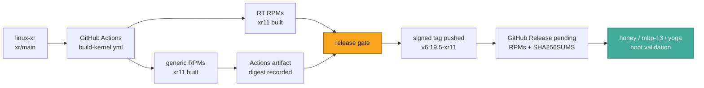
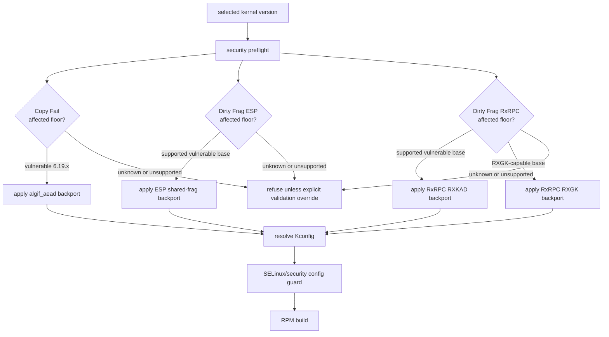
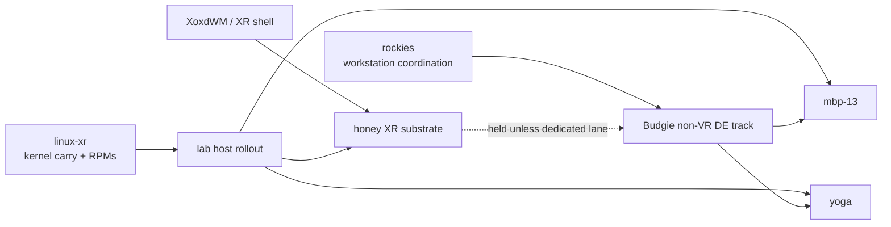

So here's the thing-

I built my own kernel.

Not in the "I toggled a config option once and now I am very mysterious" sense. I mean an actual Rocky Linux 10 RPM-producing kernel lane, under [`tinyland-inc/linux-xr`](https://github.com/tinyland-inc/linux-xr), carrying the XR display patches I need for the Bigscreen Beyond 2e, the security backports I need for the lab, and enough build automation that I can say exactly which artifact has which patch.

That last bit matters.

Because the past few weeks have been full of the very specific kind of kernel work where the dangerous sentence is "eh, it is probably fixed upstream somewhere." Nope. Not enough. I need the patch. I need the commit. I need the affected floors. I need the build gate. I need the artifact digest. I need to know whether `honey` is actually booted into it, not just whether GitHub Actions had a good afternoon.

Tiny kernel bureaucracy.

Necessary kernel bureaucracy.

## The current shape

As of May 9, 2026, my authoritative kernel repo is:

| Surface | Current state |
| --- | --- |
| Repo | [`tinyland-inc/linux-xr`](https://github.com/tinyland-inc/linux-xr) |
| Latest published secured lab release | [`v6.19.5-xr10`](https://github.com/tinyland-inc/linux-xr/releases/tag/v6.19.5-xr10) |
| Current release candidate | signed tag `v6.19.5-xr11` at `e25a1a77baa38e116fd122c18ddef32ba2dc3e6c`; prior workflow-dispatch RPM proof passed at `3b55106dd8bc387577d0ebd1cafaa556b87eb95a` |
| Candidate build run | [`25609434372`](https://github.com/tinyland-inc/linux-xr/actions/runs/25609434372) |
| Candidate generic artifact | `kernel-xr-rpms-generic`, artifact `6898954811`, digest `sha256:75de15d276d423f45a14b78e5324559cf34333ca2f3732bc97998c6d1d95fd4b` |
| Candidate RT artifact | `kernel-xr-rpms-rt`, artifact `6899481732`, digest `sha256:8589948911cb14527ad75c96dff046eceda91a916cf45cef2c8e74433e0dee4d` |
| Lab boot evidence | `v6.19.5-xr10` generic is boot-proven on `mbp-13` and `honey`; `xr11` is not the rollout default until its exact RPMs are artifacted, published, and booted |

That distinction is the whole post, really.

`xr10` is the latest published secured lab release. `xr11` is the signed Dirty Frag RXGK release candidate with successful generic and RT workflow-dispatch RPM artifacts. It should become the next lab release after the tag-backed release workflow publishes durable RPMs and I boot-validate the exact `6.19.5-11.xr.el10` package on the target machines.

No vibes.

Evidence.



## What is actually patched

There are two patch families here.

First, the XR work. This is the older, hardware-driven carry: VESA DisplayID DSC bits-per-pixel parsing, QP/RC table handling for the specific 8bpc 4:4:4 at 8 BPP path I need, and a Bigscreen Beyond EDID non-desktop quirk. That is the "make the headset path stop being weird" work.

Second, the security work. This is the part that got exciting fast.

| Vulnerability | Public state | linux-xr state |
| --- | --- | --- |
| [`CVE-2026-31431`](https://nvd.nist.gov/vuln/detail/CVE-2026-31431) / [Copy Fail](https://copy.fail/) | AF_ALG `algif_aead` local privilege escalation; Red Hat tracks the issue in [`RHSB-2026-02`](https://access.redhat.com/security/vulnerabilities/RHSB-2026-02), and CISA KEV tracks exploitation | Patched in `v6.19.5-xr9`; carried in `xr10`; still carried in `xr11` |
| [`CVE-2026-43284`](https://nvd.nist.gov/vuln/detail/CVE-2026-43284) / Dirty Frag ESP | xfrm/ESP page-cache write issue, mainline/netdev fix [`f4c50a4034e6`](https://git.kernel.org/pub/scm/linux/kernel/git/netdev/net.git/commit/?id=f4c50a4034e6) | Backported in `v6.19.5-xr10`; carried in `xr11` |
| [`CVE-2026-43500`](https://security-tracker.debian.org/tracker/CVE-2026-43500) / Dirty Frag RxRPC | RxRPC page-cache write issue tracked by Debian; public patch route discussed on lore | `xr10` carried RXKAD hardening; `xr11` adds RXGK DATA/RESPONSE hardening |

The patch files live where I can point at them:

```text
xr/security/cve-2026-31431-algif-aead.patch
xr/security/dirtyfrag-esp-shared-frag.patch
xr/security/dirtyfrag-rxrpc-linearize.patch
xr/security/dirtyfrag-rxrpc-rxgk-linearize.patch
```

The build script does not just "include a patch directory" and hope. It decides whether a selected base is known-good, vulnerable-with-a-supported-backport, or unknown, and it refuses the scary routes unless I set an explicit validation override.

Tiny policy engine. In bash.

I know.

## The security gate is the point

The lab base is still `6.19.5` for the current compatibility lane, and `6.19.y` is EOL. That is not a thing to hand-wave away. It means the only defensible way to keep using this line is to make the patch route boringly explicit while I prepare the maintained-base rebase.

The no-build preflight looks like this:

```bash
./xr/scripts/build-rpm.sh \
  --kernel-version 6.19.5 \
  --xr-release 11 \
  --security-preflight-only
```

The release build route then stages the security patches before the XR carry patches and before the RPM build. The resolved config is checked too:

```bash
./xr/scripts/check-security-config.sh xr/config/base.config
nix flake check --system x86_64-linux
```

The SELinux contract is deliberately RHEL-ish: SELinux built in, SELinux selected as the default LSM, audit and filesystem labels available, and the surrounding security posture kept alive with lockdown, Yama, Landlock, BPF LSM, IMA, EVM, module signatures, and the existing hardening defaults.

That is the part I want to preserve while doing weird XR kernel work. The headset patches can be strange. The security posture should be boring.



## The fast part

Copy Fail landed first for me. `xr9` picked it up, and `xr10` carried it forward.

Then Dirty Frag changed the queue.

The ESP side had a public mainline/netdev fix, so the route was relatively clean: backport the `f4c50a4034e6` mitigation, teach the gate which maintained floors are natively fixed, and make the old `6.19.5` lab base apply the repo-managed patch.

The RxRPC side was more awkward. `xr10` carried the first RXKAD route. Then I had to come back for RXGK because the "same bug class" answer was not just one file and a happy little checkmark. `xr11` is the candidate that carries both RXKAD and RXGK hardening on the old lab base.

That is a pretty fast loop for a tiny lab kernel:

| Step | What happened |
| --- | --- |
| `xr9` | Copy Fail backport became part of the lab kernel line |
| `xr10` | Copy Fail carried forward; Dirty Frag ESP and RxRPC RXKAD entered the published secured release |
| `xr11` | Dirty Frag RxRPC RXGK entered the signed release-candidate route; workflow-dispatch generic and RT RPM artifacts built and digests recorded; tag-backed durable release is queued |

I am not claiming this is magic.

I am claiming the response loop is legible. The repo has the patches, the README links the CVEs, the build gate knows the affected floors, and the artifact tells me what I can install. That is the difference between "patched quickly" and "I think I pasted something into a tree once."

## The GPU and timing side is still why this kernel exists

Security is the urgent part, but the original reason this kernel exists is still XR hardware.

The Dell `honey` host is a Precision 7810 with a Navi 48 / RDNA4 AMD GPU and a Bigscreen Beyond 2e. That headset path needs Display Stream Compression, sane DisplayID handling, and correct non-desktop behavior. `linux-xr` carries:

| Patch | Why I care |
| --- | --- |
| `0007-vesa-dsc-bpp.patch` | VESA DisplayID DSC BPP parser and related 8 BPP handling |
| `bigscreen-beyond-edid.patch` | marks the Beyond EDID as non-desktop for the compositor stack |
| `patch-6.19.3-rt1.patch` | optional PREEMPT_RT lane for measured timing experiments |

The RT part is intentionally conservative. I have booted RT before and verified realtime semantics, but I am not treating RT as automatically better for the workstation. The actual question is whether it improves something measurable: BCI server deadlines, audio periods, compositor frame timing, IRQ behavior, or some other concrete path.

That work belongs in host evidence repos and downstream consumers, not in a README sentence that says "fast" because it feels nice.

I like fast.

I like measured fast more.

## The source-sync debt

Here is the uncomfortable bit.

The repo branch is ahead of and behind upstream. A lot. GitHub reports the kernel tree as local commits ahead and many thousands of commits behind `torvalds/linux:master`.

That sounds worse than it is, but it is still real debt.

The RPM workflow does **not** build the checked-out source tree directly. It downloads the selected kernel.org tarball, applies linux-xr config, spec material, security backports, XR carry patches, and optional RT material, then builds RPMs. So the ahead/behind number is not proof that my published RPM skipped 16k commits. It is proof that the checked-out source tree needs a dedicated source-sync lane.

The current source-sync candidates are:

| Target | Role |
| --- | --- |
| `6.19.14` | bounded EOL compatibility proof only |
| `6.18.28` | maintained longterm generic candidate |
| `7.0.5` | maintained stable generic candidate |
| `6.12.87` | fallback watch, but only after an RPM proof preserves the Rocky/systemd boot contract |
| `7.0.1 + patch-7.0.1-rt2` | RT floor candidate, separate from the generic SOTA target |

So the `7.x` story is very specific: `7.0.5` is the generic SOTA candidate I
want to source-sync toward, while `7.0.1-rt2` is only the newest RT floor I can
preflight today. I am not claiming the lab is already running `7.x`, and I am
not claiming the RT lane has caught up to `7.0.5`. Those are two separate
tracks until the RT patchset and the generic stable target converge.

The actual source-sync runbook is simple and intentionally strict: start from the selected maintained stable or longterm base, replay the linux-xr overlay, run carry and security preflights, build generic RPMs, and keep RT separate unless the same-base RT route is proven.

```bash
./xr/scripts/check-kernel-carry.sh --kernel-version 7.0.5
./xr/scripts/build-rpm.sh --kernel-version 7.0.5 --xr-release 1 --security-preflight-only

./xr/scripts/check-kernel-carry.sh --kernel-version 6.18.28
./xr/scripts/build-rpm.sh --kernel-version 6.18.28 --xr-release 1 --security-preflight-only

./xr/scripts/check-kernel-carry.sh --kernel-version 7.0.1 --rt-version 7.0.1-rt2
./xr/scripts/build-rpm.sh --kernel-version 7.0.1 --xr-release 1 --rt-version 7.0.1-rt2 --security-preflight-only
```

So yes, there is a lot to ingest.

But there is a path.

## How it ties back to Rockies and Budgie

The kernel is the substrate. It is not the whole workstation.

The `rockies` repo is coordinating the broader Rocky Linux workstation shape: Budgie as the native non-VR desktop track, the lab host rollout order, package-source gates, and the separation between XR shell work and ordinary desktop work.

The current Budgie host order is:

| Host | Role |
| --- | --- |
| `mbp-13` | first Budgie candidate after no-install DNF transaction proof |
| `yoga` | second, only after SSH/read-only baseline recovery |
| `honey` | kernel/XR substrate host, not a Budgie claim unless I intentionally open that lane |

That matters because `honey` being booted into a secured `linux-xr` kernel does not make it a Budgie host. And a Budgie VM proof does not mean the XR headset path is solved. These are adjacent tracks, not the same milestone wearing different hats.



The next practical kernel move is `xr11`: let the tag-backed release workflow publish durable artifacts from the now-built candidate route, then boot-validate the exact package. The next practical Budgie move is still the boring one: prove the package transaction before tearing down a working desktop.

Boring gates save weekends.

Ask me how I know.

## What I am not claiming

This is important.

- I am not claiming `v6.19.5-xr11` is the latest published release until the tag-backed release workflow finishes and the RPM assets are visible.
- I am not claiming `xr11` is host-validated until the exact kernel is booted and captured on the target hosts.
- I am not claiming Actions artifacts are a durable install surface. The `workflow_dispatch` run built generic and RT RPM artifacts, but the release job was skipped because it was not a tag push.
- I am not claiming EOL `6.19.5` is a good long-lived base. It is a compatibility lane with explicit backports while the maintained-base rebase happens.
- I am not claiming the RxRPC fix has a public kernel.org fixed floor yet. I am carrying the repo route until that floor is proven.
- I am not claiming RT improves XR or BCI timing until the downstream timing evidence says it does.
- I am not claiming Budgie is installed on `honey`, `mbp-13`, or `yoga` just because the repo has Budgie control-plane docs.

Kernel work punishes sloppy tense.

"Built" is not "released." "Released" is not "booted." "Booted" is not "validated." "Validated once" is not "safe forever."

Annoying.

Correct.

## The receipts

The main public references I am tracking:

- [`linux-xr` repo](https://github.com/tinyland-inc/linux-xr)
- [`v6.19.5-xr10` release](https://github.com/tinyland-inc/linux-xr/releases/tag/v6.19.5-xr10)
- [`xr11` workflow-dispatch build run](https://github.com/tinyland-inc/linux-xr/actions/runs/25609434372)
- [`xr11` tag-backed release run](https://github.com/tinyland-inc/linux-xr/actions/runs/25615643270)
- [`CVE-2026-31431` at NVD](https://nvd.nist.gov/vuln/detail/CVE-2026-31431)
- [Red Hat `RHSB-2026-02`](https://access.redhat.com/security/vulnerabilities/RHSB-2026-02)
- [Copy Fail](https://copy.fail/)
- [`CVE-2026-43284` at NVD](https://nvd.nist.gov/vuln/detail/CVE-2026-43284)
- [`f4c50a4034e6` ESP fix in netdev/net](https://git.kernel.org/pub/scm/linux/kernel/git/netdev/net.git/commit/?id=f4c50a4034e6)
- [`CVE-2026-43500` Debian tracker](https://security-tracker.debian.org/tracker/CVE-2026-43500)
- [Dirty Frag research repo](https://github.com/Jesssullivan/dirtyfrag)

And the local test surfaces:

```bash
nix flake check --system x86_64-linux
./xr/scripts/build-rpm.sh --kernel-version 6.19.5 --xr-release 11 --security-preflight-only
./xr/scripts/check-security-config.sh xr/config/base.config
./xr/scripts/check-kernel-carry.sh --kernel-version 7.0.5
gh run view 25609434372 --repo tinyland-inc/linux-xr
gh api repos/tinyland-inc/linux-xr/actions/runs/25609434372/artifacts
```

I still have a lot to do.

I need the maintained-base source-sync. I need the durable `xr11` release surface to finish cleanly. I need host boot evidence. I need the Budgie package lane to move from control-plane proof to a real first-host transaction. I need to keep separating "cool kernel work" from "workstation actually ready."

But the shape is better than it was.

The lab kernel patched fast, and more importantly, it now knows how to prove why.

-Jess
