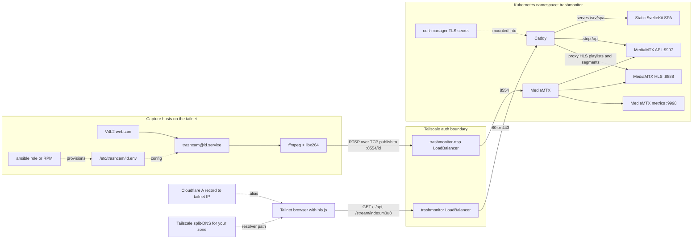

So here's the thing-

I keep leaving my desk while hardware is doing hardware things, and sometimes I still want one quick glance at the bench.

XR goggles warming up. Dev boards blinking. The hardware pile doing its quiet little "am I fine or am I about to waste your afternoon" routine.

So I made [`tailnet-trashmonitor`](https://github.com/Jesssullivan/tailnet-trashmonitor): a tiny tailnet-only webcam monitor for the lab bench. Capture host pushes H.264-over-RTSP, MediaMTX turns it into HLS, Caddy serves the static SvelteKit page, and my browser gets a couple of live tiles.

Not a product. Not a camera platform. Just a lil window.

| The bench view | The stream view |
| --- | --- |
|  |  |

## The shape

The whole architecture is basically "push video into the cluster, watch HLS from the tailnet."

That is enough.

The capture side is deliberately plain: `trashcam@<id>.service` loads `/etc/trashcam/<id>.env`, runs `/usr/bin/ffmpeg`, reads `/dev/video*`, transcodes MJPEG to H.264 with `libx264`, and publishes RTSP over TCP to the cluster. No wrapper daemon. No web server on the capture host. Just systemd and `ffmpeg`.

| Piece | Job |
| --- | --- |
| `capture/bin/trashcam-ffmpeg` | read V4L2, encode H.264, publish RTSP |
| `capture/systemd/trashcam@.service` | supervise each camera path |
| `server/mediamtx.yml` | accept RTSP publishes, emit HLS, expose API and metrics |
| `server/Caddyfile` | route SPA, API, and HLS over the tailnet viewer service |
| `spa/` | static SvelteKit tiles using `hls.js` |
| `server/k8s/service.yaml` | expose separate Tailscale LoadBalancers for viewers and RTSP ingest |

The separate RTSP hostname is the one bit of extra ceremony I like: `trashmonitor` is the viewer surface, `trashmonitor-rtsp` is the publisher surface.

Same workload. Different tailnet doors.

## Auth boundary

MediaMTX allows anonymous publish, read, API, metrics, and playback.

That sounds spicy until the important part: the services are exposed through the Tailscale Kubernetes operator, and the reachable surface is tailnet-only. Tailnet membership is the auth boundary. The public DNS alias, if I use one, is just an A record to the Tailscale CGNAT address so my own devices get a friendly name.

Publicly resolvable. Not publicly routable.

Good enough for a single-tenant bench camera.

## The useful part

The requirements stayed small:

- H.264/HLS for browser playback.
- RTSP-TCP from capture hosts so cluster restarts are survivable.
- Static SPA, because this does not need a Node runtime in the cluster.
- MediaMTX, because the previous go2rtc route hit a codec typing bug with the RTP payloads I was producing.
- Full `ffmpeg` on capture hosts, because HLS wants H.264 and distro `ffmpeg-free` builds are not always allowed to carry `libx264`.

This lets me walk away from the desk and still keep the goggles, boards, and blinking bench weirdness in view. If a board reboots, I can see it. If a display goes dark, I can see it. If everything is behaving, I can stop hovering.

That is enough.

Huzzah for tiny infrastructure.

-Jess
