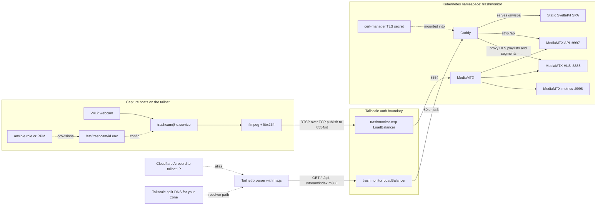

How to oggle my goggles and behold my blinkenlights while away from the basement?   Here is my Sunday's afternoon capture host project.  TrashMonitor pushes H.264-over-RTSP via MediaMTX, served through a local Caddy proxy into a simple SvelteKit SPA running from one of the basement clusters. 

Find the repo here: [`tailnet-trashmonitor`](https://github.com/Jesssullivan/tailnet-trashmonitor) 

| The bench view | The stream view |
| --- | --- |
|  |  |

The whole architecture is basically "push video into the cluster, watch HLS from the tailnet."

| Piece | Job |
| --- | --- |
| `capture/bin/trashcam-ffmpeg` | read V4L2, encode H.264, publish RTSP |
| `capture/systemd/trashcam@.service` | supervise each camera path |
| `server/mediamtx.yml` | accept RTSP publishes, emit HLS, expose API and metrics |
| `server/Caddyfile` | route SPA, API, and HLS over the tailnet viewer service |
| `spa/` | static SvelteKit tiles using `hls.js` |
| `server/k8s/service.yaml` | expose separate Tailscale LoadBalancers for viewers and RTSP ingest |

MediaMTX allows anonymous publish, read, API, metrics, and playback; the services are exposed through the Tailscale Kubernetes operator, and the reachable surface is tailnet-only. Tailnet membership is the auth boundary. The public DNS alias, if I use one, is just an A record to the Tailscale CGNAT address so my own devices get a friendly name.

This lets me walk away from the desk and still keep the goggles, boards, and ***blinkenlights*** bench weirdness in view. If a board reboots, I can see it. If a display goes dark, I can see it.   :eyes:
Huzzah!

-Jess
