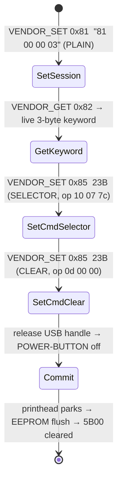

## Introduction


Everything here is implemented in the open-source
[canon-megatank-reset](https://github.com/Jesssullivan/canon-megatank-reset) (zlib code; CC-BY-4.0 [docs available in mkdocs here](https://transscendsurvival.org/canon-megatank-reset)).


> Note, I am finalizing a proper paper I hope to present later this year on this misadventure

If you own a Canon MegaTank consumer inkjet printer there is a fair chance you will one day power it on and find it dead, stricken with error **5B00**.


5B00 is not a hardware failure; it is a counter
in EEPROM crossing a threshold and firmware refusing to print until that counter is reset.  Manipulating this soft buffer is a
service-mode only operation Canon's field tools perform and the consumer firmware hides. On this
printer generation, the classic in-firmware reset combo was *removed*: the printer enters service
mode but accepts and ignores the clear.

I went about clearing the buffer and error a different way.  figure out what (and where) the maintenance lock actually *is*, recover the
protocol, and clear it myself - on Linux, over `libusb`. This post ideally serves as a fairly complete technical reference for that work. It covers the service-mode USB device, the `usbprint` vendor-control transport, the four-step reset session and the
per-session keyword-bound write cipher.  

> I corroborated findings against WICReset's binary payload (sorry mate, couldn't help myself to some friendly decompilation).


### When You Need This

- Your G-series MegaTank is stuck on **5B00** ("ink absorber full" / "support code 5B00")
- You have installed (or are installing) a fresh waste-ink absorber kit or choose to throw caution to the wind


### Prerequisites

- **Linux** with `libusb`/`pyusb`
- user membership in a group your udev rule grants `04a9` device access
- A G-series MegaTank in **service mode** (see below) - it enumerates as a *different* USB device

---

## The Lock: Two Devices, One Printer

A MegaTank presents **two completely different USB identities** depending on mode:

| Mode | USB ID | Interfaces | The maintenance lane |
|---|---|---|---|
| Normal | `04a9:1865` | 6 (print, scan, `usbscan` iface 4, …) | iface 4, bulk `0x03`/`0x86` |
| **Service** | `04a9:12fe` | 1 printer-class iface (EP `0x01` OUT / `0x82` IN) | **vendor control transfers** |

Service mode is entered with the Canon button dance: power off, hold **ON**, tap **Stop/Resume
five times**, release. The LCD goes to a flat block-color field and the printer re-enumerates as
`04a9:12fe`. That `12fe` device is where the waste-counter reset lives - and it speaks a protocol
that does *not* look like the normal-mode `usbscan` lane at all.

---

## usbprint and cracking open Canon's tooling

AFAICT, on Windows Canon's tooling talks to the printer
through `usbprint.sys`, and its IOCTL frames map onto **USB control transfers**. Decompiling
`usbprint.sys` and correlating it against a `usbmon` capture of the genuine tool pinned the exact
mapping:

| Direction | `bmRequestType` | `bRequest` | `wValue` | data stage |
|---|---|---|---|---|
| **VENDOR_SET** (write) | `0x41` (OUT, vendor, interface) | frame byte 0 (the command) | `(frame[1] << 8) \| frame[2]` | the **entire** frame, verbatim |
| **VENDOR_GET** (read) | `0xC1` (IN, vendor, interface) | the command byte | - | response bytes |

So a maintenance "frame" like `81 00 00 03` becomes a control-OUT with `bRequest=0x81`,
`wValue=0x0000`, carrying `81 00 00 03` as its data stage. The reply to a read command comes back
on the **control-IN** pipe (`0xC1`), never on bulk-IN. Once I moved reads from bulk `0x82` to
control-IN `0xC1`, the device started answering.


---

The reset is a short, ordered, **keyed** session. Three frames go out, one value comes back, and
the whole thing commits on a clean power-off:



1. **`set_session`** - send `81 00 00 03` **in the clear**. The device length-validates the `0x81`
   command; an *enciphered* `set_session` (a longer frame) STALLs. This frame is the only one that
   stays plaintext.
2. **`get_keyword`** - `VENDOR_GET(0x82)` returns a **live, per-session 3-byte keyword**. Pad it to
   four bytes and "bind" it; this value seeds the cipher for the rest of the session, which is why
   the reset is device-bound and cannot be replayed as a static byte string.
3. **`set_command`** - two 23-byte frames, `85 00 00 || payload(20)`. The first selects the target
   (operand `10 07 7c`); the second is the actual `waste:common` clear (operand `0d 00 00`). The
   20-byte payload is enciphered (next section).
4. **`get_command`** (`0x86`) returns **empty** - and that is correct, not a failure. There is no
   "finalize" command in this protocol. **Do not gate on a `0x86` reply.**
5. **Commit.** Release the host USB handle (exit the process), then perform a **clean
   power-button shutdown**. You will hear the printhead park - that mechanical settle *is* the
   EEPROM flush. Power back on and 5B00 is gone; the printer re-enumerates as `04a9:1865`.

---

## The Write Cipher

The reset payload is not sent in the clear, and getting the encoding right was the last missing
piece. The genuine `set_command` is a two-layer construction:

- An inner **functor-3 envelope**: a deterministic 20-byte structure, `00 12 01 <op>` followed by
  16 fixed bytes from an MSVC `rand()` stream seeded at `0x12345678`. This is template data - the
  G6000-series "CANON-SR5" maintenance family uses functor/method 3.
- An outer **functor-2 transform** with the buffer roles **swapped** from the obvious reading: the
  *subject* is the 20-byte functor-3 envelope, and the *seed* is the 4-byte **bound keyword** from
  step 2. (An earlier pass had subject and seed reversed, which only ever emits 4 bytes and silently
  fails.)

The wire frame is `85 00 00 || functor2(envelope3(85 00 00 || op), bound_keyword)` - 23 bytes
total. Validated **23/23** against ground truth captured from the genuine tool: e.g. for the
SELECTOR operand `10 07 7c` with a known keyword, the encoder reproduces
`85 00 00 db bb 00 67 59 a1 b0 1f 84 2f d5 83 04 4a 3a c3 51 d2 b1 ef` byte-for-byte. The full
keystream tables (`command.index`, `command.codes`, the operator-VM `command.shift` programs) live
in the repo's own SSOT (`printers/canon-g6020/maintenance.yaml`) - recovered once, then ours; the
tool never reads `devices.xml` or the vendor binary at runtime. This post gives the shape, the repo
gives every byte.


## Exploiting `0x8c` read back

Service mode answers two status reads, `0x84` and `0x8c`, both obfuscated with the per-session
keyword. To find the waste counter I captured ~550 **read-only** sessions (open session → read
keyword → read both registers; no writes) against the locked G6020, then looked for the register
whose decoded plaintext stays constant while the keyword churns.

`0x84`  Not it, a linear keyword-XOR stream over a fixed 20-byte device descriptor. Decoded, it
is byte-identical every session - clearly *not* the counter.


`0x8c` changes every single session.  What if `0x8c` isn't a *new* cipher at all, but the printer echoing
its **own write keystream**? I ran our `functor2_transform` over a 20-byte **zero** plaintext, keyed
by the same bound session keyword the writes use- and it reproduced `0x8c` byte-for-byte. **540
sessions in-sample with zero conflicts, then 16 fresh sessions predicted *before* I read them.**

So `0x8c` carries no counter. It is a keyed keystream echo over zeros, and its per-session
"variation" is just the keyword moving.


#### This is exploitable. 

A register that echoes our write keystream is a pretty damn good way to weasel in. Those ~550 live
responses independently confirm the write cipher I shipped is byte-exact against the real printer
across hundreds of keywords - the strongest validation of the clear path short of re-running the
clear hundreds of times. (The real counter is read through the template's `query.normal` *select*
path, `[10 07 7C][15]`, not a bare register read.)


---

## The Recovery Procedure

```bash
# 0. Install a fresh waste-ink pad kit FIRST. The counter is not lying about its job.

# 1. Enter service mode: power off → hold ON → tap Stop/Resume x5 → release.
#    The printer re-enumerates as 04a9:12fe (flat block-color LCD).

# 2. Dry run (default). Reads the live keyword, builds the enciphered frames,
#    prints exactly what it WOULD send - and writes nothing.
canon-megatank reset-native            # dry-run is the default

# 3. Execute, behind the gates (test-unit UUID, EEPROM pre-dump, write budget, lockfile):
canon-megatank reset-native --execute

# 4. Release the handle (the command exits) and POWER-BUTTON the printer off.
#    Listen for the printhead to park - that is the EEPROM flush.

# 5. Power on. 5B00 is gone; the printer comes back as 04a9:1865 and prints.
```

The tool refuses to write unless the printer's IPP UUID matches the configured test unit, an EEPROM
pre-dump succeeds, the write budget is intact, and a lockfile is held. None of those gates protect
Canon; they protect *you* from running a destructive EEPROM write against the wrong unit.

---


## My favorite things, a RE trifecta.


`usbmon` shows the bytes; Frida shows the application frame *before* it is enciphered and handed to
the driver; Ghidra explains why. Trace, decompile, correlate, repeat - until all three agree on the
same story. They eventually did, and the story was reproducible enough to rebuild from scratch.

> Correlating payloads by cracking commercial software followed by rubbing your hands together while saying "I'm in" is highly recommended and you should tell all your friends to do it too


---

## Security & Right-to-Repair Considerations

- **The "lock" is a policy, shipped as firmware.** 5B00 is a counter and a threshold, not a broken
  part. On this printer generation the in-firmware reset was deliberately removed and pushed to
  paid, cloud-licensed tooling.
- **This is interoperability on owned hardware.** The native tool resets a waste-ink counter on a
  printer you own, after you have installed fresh pads. It does not circumvent a content-protection
  scheme and it does not pirate the commercial tool - it reimplements the protocol.
- **Install the pads first and/or buy / build a continuous drain kit.** The one genuinely destructive failure mode here is resetting a *truly*
  full absorber and spilling ink. Respect the counter's actual job.
- **The device bytes are local.** The cloud in the commercial path is a licensing gate, not a
  signing oracle; the per-model template is bundled and zero-key "encrypted." Offline reset is
  therefore computable without a key.  Not that I am saying this is sanctioned, but I am saying I did it and it helped speed things along :eyes:
  
---

## References & Credits

- **[leecher1337/pixma](https://github.com/leecher1337/pixma)** - the Canon firmware-unpack lineage
  (`pixma_decrypt`, `pixma_unpack`), built on the Context Information Security 2016 talk *"Hacking
  Canon PIXMA Printers - Doomed Encryption."* The firmware-decrypt cross-check builds on this work.
- **Context IS, "Hacking Canon PIXMA Printers - Doomed Encryption" (2016)** - the original public
  analysis of Canon's firmware obfuscation; the zero-key pattern rhymes with what `APP.BIN` from WICReset uses.
- **OctoInkjet / Printer Potty** - the waste-ink absorber kits that make a reset safe to perform,
  and public documentation of the MegaTank waste-counter problem.
- **Frida, Ghidra, Wireshark/`usbmon`, pyusb/`libusb`** - the reverse-engineering and reset toolchain.
- **[canon-megatank-reset](https://github.com/Jesssullivan/canon-megatank-reset)** - this work: the
  native tool, the protocol spec, the full RE trail, the diagrams, and the paper. Code is zlib;
  docs/paper are CC-BY-4.0.  

---

## Appendix: Quick Reference Card

### Service-mode entry
```
power off → hold ON → tap Stop/Resume x5 → release   (LCD = flat block color, USB = 04a9:12fe)
```

### Control-transfer mapping (usbprint)
```
VENDOR_SET (write):  bmRequestType=0x41  bRequest=frame[0]  wValue=(frame[1]<<8)|frame[2]  data=whole frame
VENDOR_GET (read):   bmRequestType=0xC1  bRequest=cmd                                       → response bytes
```

### The session
```
1. set_session   VENDOR_SET 0x81   data = 81 00 00 03            (PLAINTEXT)
2. get_keyword   VENDOR_GET 0x82   → live 3-byte keyword → pad to 4, bind
3. set_command   VENDOR_SET 0x85   data = 85 00 00 || payload(20)   SELECTOR  (op 10 07 7c)
4. set_command   VENDOR_SET 0x85   data = 85 00 00 || payload(20)   CLEAR     (op 0d 00 00)
5. get_command   VENDOR_GET 0x86   → empty (by design; do not gate on it)
6. commit        release USB handle → clean POWER-BUTTON shutdown → power on
```

### Write cipher
```
inner: envelope3 = 00 12 01 <op> + 16 fixed LCG bytes (MSVC rand, seed 0x12345678)   [functor/method 3]
outer: payload   = functor2(subject = envelope3, seed = bound 4-byte keyword)         [buffer roles swapped]
wire:  85 00 00 || payload(20)   = 23 bytes   (validated 23/23 vs ground truth)
```

### Template recovery with commercial payload sniffing
```
APP.BIN (PE resource) --3DES-EDE3-CBC, zero key, zero IV--> ZIP --> devices.srs --(same)--> devices.xml
"Canon G6000 Series"  class=canon.printer.std.standard  specs=CANON-SR5
```
