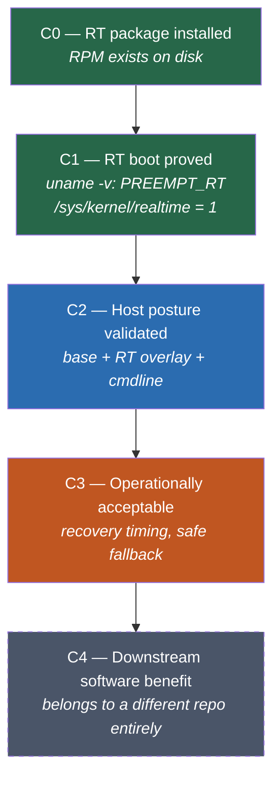
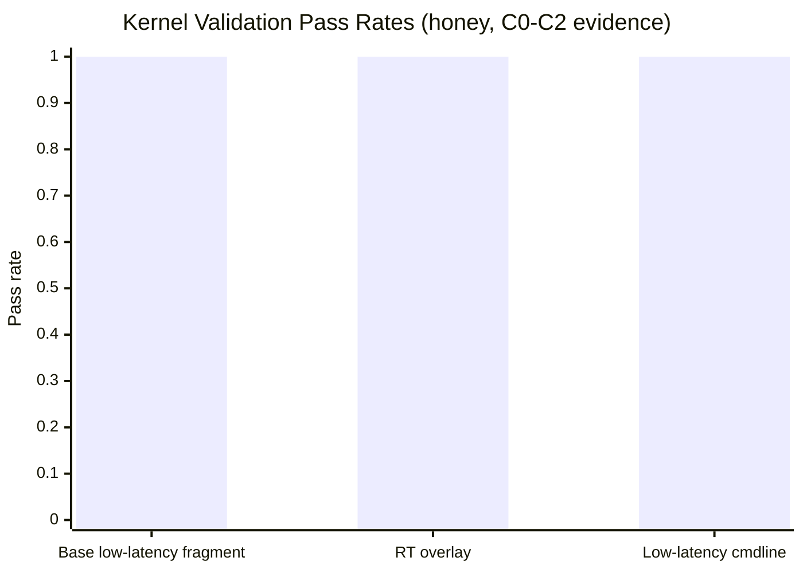
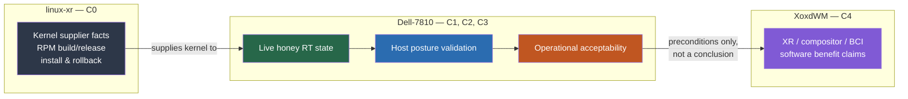

Ok so here's a confession- I almost shipped three claims about a PREEMPT_RT kernel that I could not actually back up. Not lies, exactly. Just... enthusiasm getting ahead of evidence. The RPM was installed, the machine felt snappier in some vague unmeasured way, and I really wanted to write the sentence "RT makes this better."

I did not have the receipts for that sentence. Twice more, actually, before I built a system that would stop me from writing sentences like it.

This is about `honey`- a dual-socket Dell Precision T7810 that's been my primary workstation-slash-research-host for a while now- and the low-latency kernel work happening across three separate repos on top of it. And it's about the thing that saved me from myself: a claim ladder.

## The setup: one machine, at least four different questions

Here's the trap. "Is RT good on this machine" sounds like one question. It is not. It's at least four, stacked on top of each other, and they do not all live in the same repo:

1. **Shipped kernel semantics**- does an RT-patched kernel exist, and does it build/install/rollback cleanly? (`linux-xr` owns this.)
2. **Live host validation**- does the machine I'm typing on right now actually boot that kernel, and does it behave the way the shipped semantics say it should? (`Dell-7810` owns this.)
3. **Workstation operational acceptability**- is running RT day-to-day actually *fine*, or does it quietly cost me something (slower recovery, weirder failure modes)? (Also `Dell-7810`.)
4. **Downstream software benefit**- does anything I actually run- a compositor, a BCI pipeline, an XR runtime- get measurably better under RT? (`XoxdWM` owns this, and only this.)

Collapse those four into one claim and you get exactly the kind of overconfident sentence I kept almost writing. So I built a ladder instead- C0 through C4, each rung requiring its own measured evidence before the next rung gets to exist.

Green means proved. Blue means proved-with-a-caveat. Orange means "partial, and the partial part is the whole story." Dashed grey means "not here, don't even reach for it from this repo."

The rule that makes this work isn't the ladder shape- it's that **each rung has to cite its own measured evidence**, from its own canonical repo, before the next rung is allowed to exist as a claim. No skipping. No borrowing evidence from a sibling repo and calling it yours.

## Claim one: "RT is the default lane"

I wanted to say this on the strength of C0 alone. The package was installed! `rpm -q` said so! Surely that means something!

It means the RPM exists on disk. That's it. That's the whole claim C0 supports. Whether the machine actually *boots* that kernel, whether `/sys/kernel/realtime` says `1`, whether `uname -v` even mentions `PREEMPT_RT`- none of that is C0's business, and I had not checked any of it yet when I first wanted to write "RT is the default lane."

C1 exists specifically to stop this. C1 says: boot the thing, read `/sys/kernel/realtime`, read `uname -v`, and only then do you get to talk about the kernel actually running. On `honey`, C1 is proved- clean PREEMPT_RT boot, flag reads `1`, no ambiguity. Good. But "the kernel boots" and "this should be the default lane" are still two different sentences, and the second one needed C2 and C3, which at the time did not exist yet.

## Claim two: "the host is optimized"

This one got further before I caught it, because by the time I wanted to say it, C1 *and* C2 were both proved. Base low-latency fragment: validated. RT overlay against shipped kernel semantics: validated. Low-latency cmdline: validated. Two green rungs! Surely "optimized" is a fair word here!

Except C3- operational acceptability- was sitting at "partial," and the partial part was not a rounding error. RT recovery on `honey` runs around 120 seconds. Generic recovery runs around 55 seconds. That is not a subtle regression- that's more than double the recovery time, on the exact operational dimension that "optimized" is supposed to describe. Repeated SMI counts under RT are not better than generic either, and one `hwlat` sample came back at 14 microseconds, worse than I'd have wanted for a "this is dialed in" claim.

*(30/30 base fragment checks, 3/3 RT overlay checks, 19/19 cmdline checks- all green. This chart is exactly why claim two felt so tempting. Every box I could see was checked. The boxes I hadn't built yet- C3's recovery-timing and SMI/hwlat evidence- were the ones that actually mattered for the word "optimized," and they said something closer to "workable, with a real cost.")*

So the honest C3 status on `honey` is: cautionary, partial. RT boots, RT validates, and RT is *usable*- but it is operationally heavier than generic, and nothing in the current evidence says that cost is worth paying yet. "Optimized" was the wrong word. "Available, at a measured cost" is the right one.

## Claim three: "downstream software benefits"

This is the claim I most wanted to write, and the one the ladder blocked hardest, because it isn't even Dell-7810's claim to make. C4- does an XR compositor, a BCI pipeline, anything downstream- actually run better under RT- belongs entirely to `XoxdWM`. Not "mostly." Not "we can gesture at it here and let XoxdWM confirm later." Entirely.

Dell-7810 can hand over preconditions: here's a machine that boots RT cleanly, here's what it costs you operationally, here's the SMI/hwlat baseline. That's it. The moment a sentence tries to conclude "...and so the compositor benefits," that sentence has crossed a repo boundary it has no authority to cross, and it needs to go live in `XoxdWM`'s evidence tree instead, backed by `XoxdWM`'s own measurements.

As of this writing, C4 hasn't even been attempted- no downstream workload has demonstrated a specific deadline failure on the generic kernel that RT would need to fix. Which means the honest thing to do isn't to write a cautious version of claim three. It's to not write it at all, and say so plainly: *not established here, and not this repo's job to establish.*

## What the ladder actually bought me

None of this evidence is exotic. It's `uname -v` output, `/sys/kernel/realtime` reads, timed recovery runs, SMI/hwlat samples, and a pile of pass/fail checks against shipped kernel semantics. Nothing here required exotic tooling. What it required was a rule that made premature aggregation *visible* before it shipped- a rung I couldn't skip, and a repo boundary I couldn't quietly reach across.

The current state on `honey`, plainly:

| Level | Status | Evidence |
| --- | --- | --- |
| C0 | Proved | `linux-xr` RPM, confirmed via `rpm -q` |
| C1 | Proved | `uname -v` shows PREEMPT_RT, `/sys/kernel/realtime` = 1 |
| C2 | Proved | base fragment 30/30, RT overlay 3/3, cmdline 19/19 |
| C3 | Partial | RT recovery ~120s vs. generic ~55s; SMI count not improved; one `hwlat` sample at 14μs |
| C4 | Not attempted here | Belongs to `XoxdWM`, no downstream deadline case made yet |

The operational upshot: generic stays the default on `honey`. RT is real, RT boots, RT is available if a future C4 investigation on the `XoxdWM` side turns up an actual deadline that generic can't hit- but nothing today justifies flipping the default, and the ladder is exactly the thing that stopped me from claiming otherwise three separate times before I'd earned it.

Sometimes the most useful research artifact isn't the result. It's the thing that keeps you honest about not having one yet.

-Jess
